```r
library(tidyverse) #used for visualization, summarization, and basic wrangling
library(ggridges) #used for making density ridge plots
library(broom) #used for "prettier" and easier to work with model output
library(fivethirtyeight) #datasets
```

# Bechdel Test

Before we jump into the statistics, take time to read this [fivethirtyeight](https://fivethirtyeight.com/features/the-dollar-and-cents-case-against-hollywoods-exclusion-of-women/) article. We are going to be using more or less the same data they used in that article. The cartoon by Alison Bechdel that test comes from is shown here:


Throughout the analysis, you should use the *bechdel_1990up* dataset that removes missing values and only includes movies that were made in 1990 or later.


```r
bechdel_1990up <-
  bechdel %>% 
  filter(year>1989, 
         !is.na(budget_2013), 
         !is.na(intgross_2013)) 
```

# Exploratory Work

(@) The code below summarizes the percentage of films that pass for each of the 24 years that we have data. It also counts the number of films by year. Use this code and pipe into a *ggplot* to create a graph of *pass_pct* by year. Represent it as both a point and a line and size the points by *n*. (HINT: remember the *size* aesthetic). Describe the trend you observe. (Remove the `eval=FALSE` piece if you want this to run when you knit it)


```r
bechdel_1990up %>% 
  group_by(year) %>% 
  summarize(pass.pct = mean(binary=="PASS"),
            n = n()) %>% 
  ggplot(aes(x=year, y=pass.pct)) +
  geom_point(aes(size=n)) +
  geom_line()
```

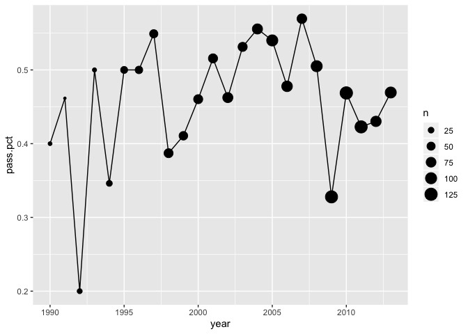<!-- -->

(@) Create a graph that shows the distribution of *intgross_2013*, the film's international gross in 2013 inflation adjusted US dollars. Describe the distribution.


```r
bechdel_1990up %>% 
  ggplot(aes(x=intgross_2013)) +
  geom_histogram(bins=40)
```

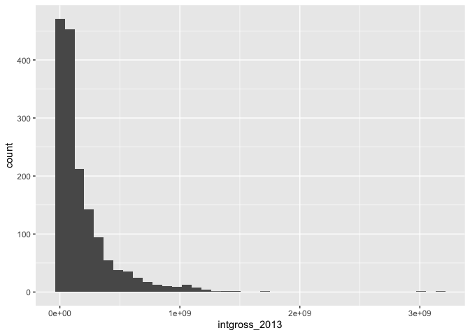<!-- -->

The distribution is heavily right skewed. In order to examine the center and spread better, we can  look at the distribution on the log scale.


```r
bechdel_1990up %>% 
  ggplot(aes(x=intgross_2013)) +
  geom_histogram(bins=40) +
  scale_x_log10()
```

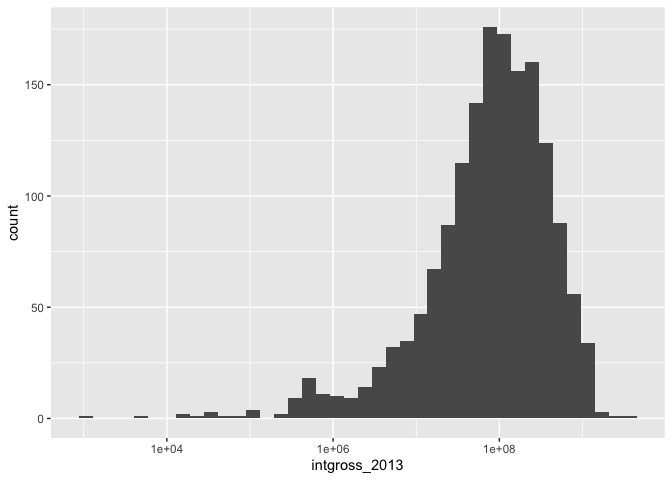<!-- -->

The center (median) intgross_2013 is just under 100 million. The bulk of the intgross_2013 are between 10 million and 1 billion.


```r
bechdel_1990up %>% 
  summarize(med_gross = median(intgross_2013),
            iqr_gross = IQR(intgross_2013))
```

<div data-pagedtable="false">
  <script data-pagedtable-source type="application/json">
{"columns":[{"label":["med_gross"],"name":[1],"type":["dbl"],"align":["right"]},{"label":["iqr_gross"],"name":[2],"type":["dbl"],"align":["right"]}],"data":[{"1":"93523336","2":"200575530"}],"options":{"columns":{"min":{},"max":[10]},"rows":{"min":[10],"max":[10]},"pages":{}}}
  </script>
</div>

(@) Now compare the distribution of *intgross_2013* by *binary* (PASS if the film passed the test and FAIL if it did not). Describe the differences, if any.


```r
bechdel_1990up %>% 
  ggplot(aes(y=intgross_2013, x=binary)) +
  geom_boxplot()
```

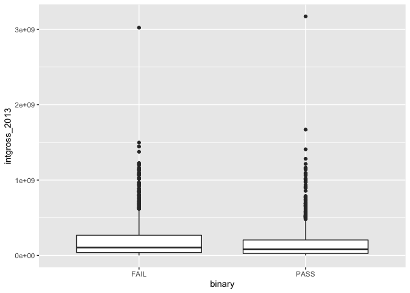<!-- -->

Those that fail the Bechdel test have slightly larger intgross_2013 on average. The boxplots still show a lot of overlap though. Changing to log scale helps see the smaller values of intgross_2013. The boxes still appear to overlap quite a bit with the failing movies having slightly larger gross.


```r
bechdel_1990up %>% 
  ggplot(aes(y=intgross_2013, x=binary)) +
  geom_boxplot() +
  scale_y_log10()
```

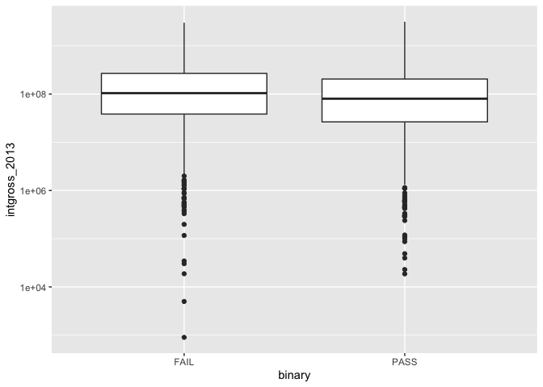<!-- -->


You could also look at density plots.


```r
bechdel_1990up %>% 
  ggplot(aes(x=intgross_2013, fill=binary, color=binary)) +
  geom_density(alpha = .5)
```

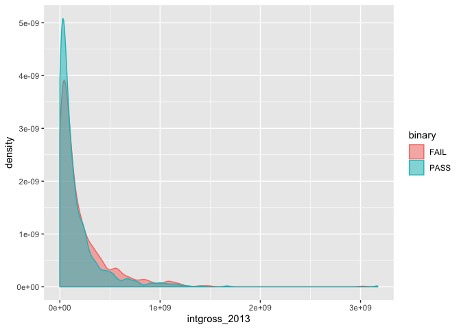<!-- -->


(@) Also create a graph that compares the distribution of *budget_2013*, the film's budget in 2013 inflation adjusted US dollars, by *binary*. Describe the differences, if any.


```r
bechdel_1990up %>% 
  ggplot(aes(y=budget_2013, x=binary)) +
  geom_boxplot()
```

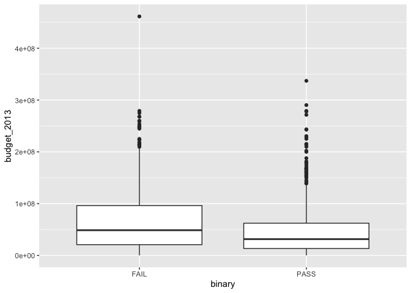<!-- -->


```r
bechdel_1990up %>% 
  ggplot(aes(x=budget_2013, fill=binary, color=binary)) +
  geom_density(alpha = .5)
```

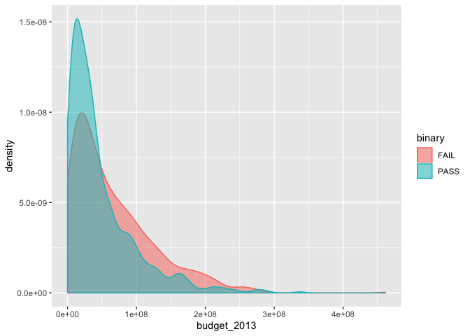<!-- -->

The films that fail the bechdel test appear to have larger budgets, on average. The 75th percentile budget for the films that pass is just a little larger than the median budget of the films that fail.

(@) Create a plot that examines the relationship between *budget_2013* and *intgross_2013* (use *intgross_2013* as the response variable). Color the points by *binary*. Describe what you observe.


```r
bechdel_1990up %>% 
  ggplot(aes(x=budget_2013, y=intgross_2013, color=binary)) +
  geom_point()
```

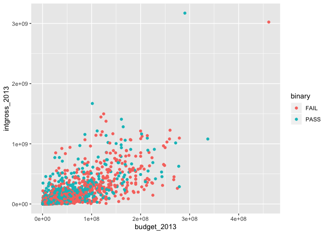<!-- -->

There looks to be a weak-moderate positive linear relationship between budget and gross. There is no obvious distinction by whether the film passes or fails. 


(You didn't have to do this part). The relationship on the log scale appears more clear and linear.


```r
bechdel_1990up %>% 
  ggplot(aes(x=budget_2013, y=intgross_2013, color=binary)) +
  geom_point() +
  scale_x_log10() +
  scale_y_log10()
```

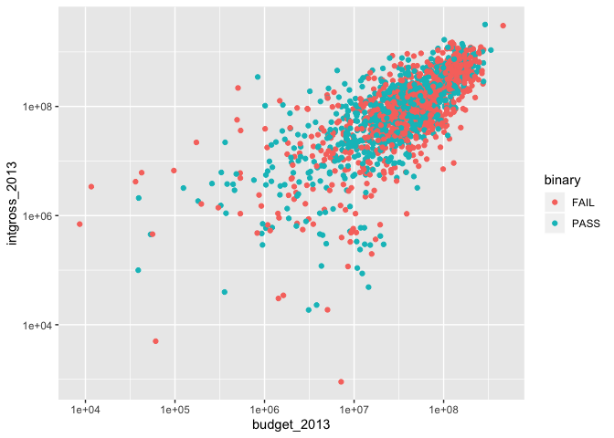<!-- -->

## Fitting and Interpreting Models

According to the *fivethirtyeight* article, there is a perception in Hollywood that "films featuring women do worse at the box office". We aim to investigate this using the *bechdel_1990up* data. We have already started this investigation in the previous section with some exploratory work. Now we will fit some models to help solidify our observations. 

(@) Fit a model that uses *budget_2013* to explain *intgross_2013*. Interpret both coefficients in the context of the data.


```r
mod_budget <- lm(intgross_2013 ~ budget_2013, 
                 data=bechdel_1990up)
tidy(mod_budget)
```

<div data-pagedtable="false">
  <script data-pagedtable-source type="application/json">
{"columns":[{"label":["term"],"name":[1],"type":["chr"],"align":["left"]},{"label":["estimate"],"name":[2],"type":["dbl"],"align":["right"]},{"label":["std.error"],"name":[3],"type":["dbl"],"align":["right"]},{"label":["statistic"],"name":[4],"type":["dbl"],"align":["right"]},{"label":["p.value"],"name":[5],"type":["dbl"],"align":["right"]}],"data":[{"1":"(Intercept)","2":"3.167802e+06","3":"6.636866e+06","4":"0.477304","5":"6.332107e-01"},{"1":"budget_2013","2":"3.200114e+00","3":"8.286048e-02","4":"38.620509","5":"2.643714e-231"}],"options":{"columns":{"min":{},"max":[10]},"rows":{"min":[10],"max":[10]},"pages":{}}}
  </script>
</div>

The intercept of ~\$3.1  million means that films that have a \$0 budget, gross about $3.1 million, on average. The intercept means that movies that differ in budget by \$1, differ in gross by \$3.20, on average. Since budgets are mostly in the millions, it might be more helpful to say that movies that differ in budget by \$1 million, differ in gross by \$3.2 million, on average. In summary, bigger budget means bigger gross, on average.


(@) Use the model to find the fitted value and the residual for the movie "Cloudy with a Chance of Meatballs".


```r
bechdel_1990up %>% 
  augment(mod_budget, data = .) %>% 
  filter(title == "Cloudy with a Chance of Meatballs") %>% 
  select(.fitted, .resid)
```

<div data-pagedtable="false">
  <script data-pagedtable-source type="application/json">
{"columns":[{"label":[".fitted"],"name":[1],"type":["dbl"],"align":["right"]},{"label":[".resid"],"name":[2],"type":["dbl"],"align":["right"]}],"data":[{"1":"350614288","2":"-93482996"}],"options":{"columns":{"min":{},"max":[10]},"rows":{"min":[10],"max":[10]},"pages":{}}}
  </script>
</div>


(@) Test if *budget_2013* has a linear relationship with *intgross_2013*. 


```r
tidy(mod_budget)
```

<div data-pagedtable="false">
  <script data-pagedtable-source type="application/json">
{"columns":[{"label":["term"],"name":[1],"type":["chr"],"align":["left"]},{"label":["estimate"],"name":[2],"type":["dbl"],"align":["right"]},{"label":["std.error"],"name":[3],"type":["dbl"],"align":["right"]},{"label":["statistic"],"name":[4],"type":["dbl"],"align":["right"]},{"label":["p.value"],"name":[5],"type":["dbl"],"align":["right"]}],"data":[{"1":"(Intercept)","2":"3.167802e+06","3":"6.636866e+06","4":"0.477304","5":"6.332107e-01"},{"1":"budget_2013","2":"3.200114e+00","3":"8.286048e-02","4":"38.620509","5":"2.643714e-231"}],"options":{"columns":{"min":{},"max":[10]},"rows":{"min":[10],"max":[10]},"pages":{}}}
  </script>
</div>

The p-value is almost zero, giving us evidence that there is a linear relationship between *budget_2013* and *intgross_2013*.

(@) Fit a model that uses just the *binary* bechdel test results to explain *intgross_2013*. Interpret both coefficients in the context of the data.


```r
mod_binary <- lm(intgross_2013 ~ binary, data=bechdel_1990up)
tidy(mod_binary)
```

<div data-pagedtable="false">
  <script data-pagedtable-source type="application/json">
{"columns":[{"label":["term"],"name":[1],"type":["chr"],"align":["left"]},{"label":["estimate"],"name":[2],"type":["dbl"],"align":["right"]},{"label":["std.error"],"name":[3],"type":["dbl"],"align":["right"]},{"label":["statistic"],"name":[4],"type":["dbl"],"align":["right"]},{"label":["p.value"],"name":[5],"type":["dbl"],"align":["right"]}],"data":[{"1":"(Intercept)","2":"205584255","3":"8787358","4":"23.395458","5":"2.124227e-104"},{"1":"binaryPASS","2":"-41141817","3":"12879987","4":"-3.194244","5":"1.429200e-03"}],"options":{"columns":{"min":{},"max":[10]},"rows":{"min":[10],"max":[10]},"pages":{}}}
  </script>
</div>

The intercept, \$205,584,255, is the average intgross_2013 for a film that fails the bechdel test. The slope is the difference between average intgross_2013 for movies that pass and average intgross_2013 for movies that fail.


(@) Use the model to find the fitted value and the residual for the movie "Cloudy with a Chance of Meatballs".


```r
bechdel_1990up %>% 
  augment(mod_binary, data = .) %>% 
  filter(title == "Cloudy with a Chance of Meatballs") %>% 
  select(.fitted, .resid)
```

<div data-pagedtable="false">
  <script data-pagedtable-source type="application/json">
{"columns":[{"label":[".fitted"],"name":[1],"type":["dbl"],"align":["right"]},{"label":[".resid"],"name":[2],"type":["dbl"],"align":["right"]}],"data":[{"1":"205584255","2":"51547037"}],"options":{"columns":{"min":{},"max":[10]},"rows":{"min":[10],"max":[10]},"pages":{}}}
  </script>
</div>

(@) What is the hypothesis test actually testing in the *binaryPASS* row of the model table? So, what do you conclude?

It is testing if the *binaryPASS* coefficient is 0. Since that coefficient is interpreted as the average gross for movies that pass minus the average gross for movies that don't pass, it is testing if those averages are the same. Since the p-value is small, we would conclude that there is evidence that they are different. 

(@) Fit another model that uses both *budget_2013* AND *binary* to predict *intgross_2013*. 


```r
mod_binbudg <- lm(intgross_2013 ~ binary + budget_2013, data=bechdel_1990up)
tidy(mod_binbudg)
```

<div data-pagedtable="false">
  <script data-pagedtable-source type="application/json">
{"columns":[{"label":["term"],"name":[1],"type":["chr"],"align":["left"]},{"label":["estimate"],"name":[2],"type":["dbl"],"align":["right"]},{"label":["std.error"],"name":[3],"type":["dbl"],"align":["right"]},{"label":["statistic"],"name":[4],"type":["dbl"],"align":["right"]},{"label":["p.value"],"name":[5],"type":["dbl"],"align":["right"]}],"data":[{"1":"(Intercept)","2":"-7846766.4390","3":"8.424739e+06","4":"-0.9313958","5":"3.517890e-01"},{"1":"binaryPASS","2":"19974252.3499","3":"9.427058e+06","4":"2.1188215","5":"3.425889e-02"},{"1":"budget_2013","2":"3.2301","3":"8.397175e-02","4":"38.4665124","5":"6.303552e-230"}],"options":{"columns":{"min":{},"max":[10]},"rows":{"min":[10],"max":[10]},"pages":{}}}
  </script>
</div>

(@) Interpret all three coefficients in the context of the data. How does the `binaryPASS` coefficient in this model compare to its coefficient in the model with only that variable? Explain why.

The intercept is the average intgross_2013 for movies with \$0 budget that didn’t pass the bechdel test. The binaryPASS coefficient means that movies that Pass the test make about 19.97 million more intgross_2013 than those that don’t pass the test, for a fixed budget. The budget_2013 coefficient means that, regardless of the result on the bechdel test, an increase of \$1 in the budget corresponds to an increase of \$3.23 in gross, on average.


(@) Represent the previous model on a graph with *intgross_2013* on the y-axis and *budget_2013* on the x-axis.


```r
augment(mod_binbudg, data=bechdel_1990up) %>% 
  ggplot(aes(x=budget_2013, y=intgross_2013, color=binary)) +
  geom_point(size=.5, alpha=.2) +
  geom_line(aes(y=.fitted))
```

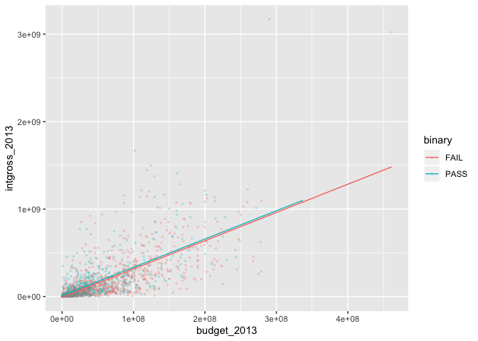<!-- -->

(@) Use the **anova** method to test if *binary* is useful in the model that already includes *budget_2013*.


```r
anova(mod_budget, mod_binbudg)
```

<div data-pagedtable="false">
  <script data-pagedtable-source type="application/json">
{"columns":[{"label":[""],"name":["_rn_"],"type":[""],"align":["left"]},{"label":["Res.Df"],"name":[1],"type":["dbl"],"align":["right"]},{"label":["RSS"],"name":[2],"type":["dbl"],"align":["right"]},{"label":["Df"],"name":[3],"type":["dbl"],"align":["right"]},{"label":["Sum of Sq"],"name":[4],"type":["dbl"],"align":["right"]},{"label":["F"],"name":[5],"type":["dbl"],"align":["right"]},{"label":["Pr(>F)"],"name":[6],"type":["dbl"],"align":["right"]}],"data":[{"1":"1605","2":"5.553090e+19","3":"NA","4":"NA","5":"NA","6":"NA","_rn_":"1"},{"1":"1604","2":"5.537591e+19","3":"1","4":"1.549906e+17","5":"4.489405","6":"0.03425889","_rn_":"2"}],"options":{"columns":{"min":{},"max":[10]},"rows":{"min":[10],"max":[10]},"pages":{}}}
  </script>
</div>

The p-value is just under .05. We can reject $H_0$ but do not have extremely strong evidence that *binary* is useful in the model that already includes *budget_2013*.

(@) Find the fitted value and the residual for the movie "Cloudy with a Chance of Meatballs". 


```r
augment(mod_binbudg, data=bechdel_1990up) %>% 
  filter(title == "Cloudy with a Chance of Meatballs") %>% 
  select(.fitted, .resid)
```

<div data-pagedtable="false">
  <script data-pagedtable-source type="application/json">
{"columns":[{"label":[".fitted"],"name":[1],"type":["dbl"],"align":["right"]},{"label":[".resid"],"name":[2],"type":["dbl"],"align":["right"]}],"data":[{"1":"342855435","2":"-85724143"}],"options":{"columns":{"min":{},"max":[10]},"rows":{"min":[10],"max":[10]},"pages":{}}}
  </script>
</div>

(@) Try building other models that use more variables. Can you find any more useful variables?


