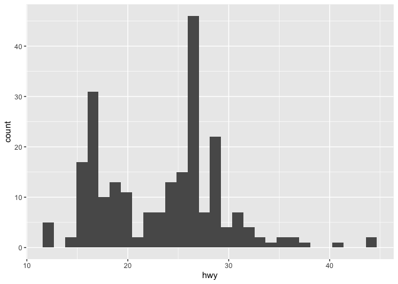
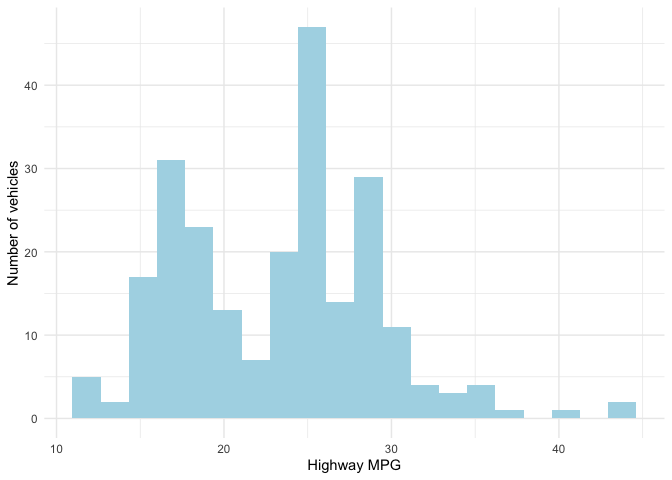

```r
library(tidyverse) #used for visualization, summarization, and basic wrangling
library(broom) #used for "prettier" and easier to work with model output
library(fivethirtyeight) #datasets
```


# Data Visualization

Usually one of the first things we want to do with new data is visualize it. If you haven't wanted to do this in the past, you'll want to do it now because it's going to be so easy! We will use functions from a package called `ggplot2` to create  our visualizations. This package is based on a visualization framework called the ["Grammar of Graphics"](https://www.amazon.com/Grammar-Graphics-Statistics-Computing/dp/0387245448). We will ony discuss a few key details of the framework: data, geometric objects, and aesthetic attributes. The main idea is that "A statistical graphic is a mapping of data variables to aesthetic attributes of geometric objects."

1. Data: Our data set that contains variables (the columns) with many observations (the rows).  
2. Geometric objects: What we observe on our plot - points, lines, bars, etc. 
3. Aesthetic attributes: parts of the geometric object that we observe: x/y position, color, shape, size, etc.

In general, a basic plot can be created using the following template, where everything between the `<>` would be modified to fit your needs.

```
ggplot(data = <DATA>) +
  <GEOM_FUNCTION>(mapping = aes(<MAPPINGS>))
```

The ggplot2 [cheatsheet](https://www.rstudio.com/resources/cheatsheets/) is a good reference that I would encourage you to have open as we go through examples. 

We will also be doing some basic data summaries using the `dplyr` package. Both `dplyr` and `ggplot2` are part of the `tidyverse` package, which is a collection of packages that are useful in data visualization and manipulation. 

If you haven't done so already, you need to install the `tidyverse` package. You only need to do this once. You can either go to the Packages tab and click Install. Type `tidyverse` and follow the prompts. Or else, *in the console*, type `install.packages("tidyverse")`. 

Then you load the library by running a `library()` statement as shown above. You need to do this in every markdown file where you use functions from this package. I recommend putting these at the very top of your documents. Also note that I've added `warning=FALSE, message=FALSE` to the code chunk options, next to the `r`. This will prevent messages and warnings from being printed out.

Once you have done that, we can begin exploring the data. We will use the `mpg` data throughout. Before we get started, take a moment to explore that data and see what is there.


```r
data(mpg)
summary(mpg)
```

```
##  manufacturer          model               displ            year     
##  Length:234         Length:234         Min.   :1.600   Min.   :1999  
##  Class :character   Class :character   1st Qu.:2.400   1st Qu.:1999  
##  Mode  :character   Mode  :character   Median :3.300   Median :2004  
##                                        Mean   :3.472   Mean   :2004  
##                                        3rd Qu.:4.600   3rd Qu.:2008  
##                                        Max.   :7.000   Max.   :2008  
##       cyl           trans               drv                 cty       
##  Min.   :4.000   Length:234         Length:234         Min.   : 9.00  
##  1st Qu.:4.000   Class :character   Class :character   1st Qu.:14.00  
##  Median :6.000   Mode  :character   Mode  :character   Median :17.00  
##  Mean   :5.889                                         Mean   :16.86  
##  3rd Qu.:8.000                                         3rd Qu.:19.00  
##  Max.   :8.000                                         Max.   :35.00  
##       hwy             fl               class          
##  Min.   :12.00   Length:234         Length:234        
##  1st Qu.:18.00   Class :character   Class :character  
##  Median :24.00   Mode  :character   Mode  :character  
##  Mean   :23.44                                        
##  3rd Qu.:27.00                                        
##  Max.   :44.00
```


## Univariate visualization/summarization of quantitative variables

**Research questions:** What is the range of highway miles per gallon (`hwy`)? What are typical highway mpg? Are highway mpg's variable across vehicles?

As you visualize quantitative variables, keep in mind:

- **Center**: Where is the center of the distribution? What is a typical value of the variable?
- **Variability**: How spread out are the values? A lot or a little?
- **Shape**: How are values distributed along the observed range? Is the distribution symmetric, right-skewed (tail is longer on the right, pulled further out to the right), left-skewed, bimodal, or uniform (flat)?
- **Outliers**: Are there any outliers, i.e. values that are unusually large/small relative to the bulk of other values?
- **Context**: In the context of your research, what do you learn from the plot or table? How would you describe your findings to a broad audience?

We will often talk about the *distribution* of a variable. This is the values the variables take and how often. You should incorporate the answers to the questions above in your description of a distribution. You should also use numerical summaries, which we'll talk about shortly. Think about trying to describe the distribution to someone who doesn't have the picture in front of them.

### Histograms

Histograms are constructed by (1) dividing up the observed range of the variable into "bins" of equal width and (2) counting up the number of cases that fall into each bin. Try out the code below. Notice a couple things. First, it has removed missing values. Second, it's telling you that it has chosen the number of bins for you: 30. 


```r
ggplot(data = mpg) +
  geom_histogram(aes(x = hwy))
```

<!-- -->

We can customize plots in various ways, like I did below, but the most important part is creating a plot that allows us to see the distribution of our variable of interest, `hwy` in this case.  


```r
ggplot(data = mpg) +
  geom_histogram(aes(x = hwy), bins = 20, fill = "lightblue") +
  labs(x = "Highway MPG", y = "Number of vehicles") +
  theme_minimal() 
```

<!-- -->

### Measures of Center and Spread

Numerical measures of the center and spread can help us better understand the distribution of a quantitative variable. Try the following code to compute the mean, median, standard deviation (SD), and IQR of `hwy`. With these additional statistics, how would you describe the distribution of `hwy`?


```r
mpg %>%
  summarize(
    mean_hwy = mean(hwy),
    median_hwy = median(hwy),
    sd_hwy = sd(hwy),
    IQR_hwy = IQR(hwy)
  )
```

<div data-pagedtable="false">
  <script data-pagedtable-source type="application/json">
{"columns":[{"label":["mean_hwy"],"name":[1],"type":["dbl"],"align":["right"]},{"label":["median_hwy"],"name":[2],"type":["dbl"],"align":["right"]},{"label":["sd_hwy"],"name":[3],"type":["dbl"],"align":["right"]},{"label":["IQR_hwy"],"name":[4],"type":["dbl"],"align":["right"]}],"data":[{"1":"23.44017","2":"24","3":"5.954643","4":"9"}],"options":{"columns":{"min":{},"max":[10]},"rows":{"min":[10],"max":[10]},"pages":{}}}
  </script>
</div>


### YOUR TURN (have a problem for them to try on their own)


## Multivariate visualization/summarization

We noticed that there was variability across vehicles but didn't investigate *why*. Are there other variables that might explain some of the variation? Which variables might have stronger or weaker relationships? How can we visualize these relationships?

We're interested in the relationship between:

**Response/dependent/outcome variable**: the variable whose variability we would like to explain (education or income)

**Predictors/explanatory variables/independent variables/covariates**: variables that might explain some of the variability in the response 


Our goal is to construct visualizations that allow us to examine the following features of the relationships among these variables:

- Relationship *trends* (form and direction of the relationship, eg. positive and linear)   
- Relationship *strength* (degree of variability from the trend or how tight the points are around the envisioned trend)    

- *Outliers* in the relationship

### Quantitative vs. quantitative: scatterplots

Examine the following plot that shows the relationshiop between `hwy` and `displ` (engine displacement). Comment on:
        
* the form of the relationship (line/curve/other)
* the strength of the relationship (weak/moderate/strong)
* the direction of the relationship (positive/negative)
* outliers 


```r
ggplot(data = mpg) +
  geom_point(aes(x = displ, y = hwy)) +
  labs(x = "Engine Displacement", y = "Highway MPG") +
  theme_minimal()
```

<!-- -->

The strength of the *linear* relationship between two quantitative variables is measured by the **correlation coefficient**. The code below will compute this.


```r
mpg %>% 
  summarize(corr = cor(displ, hwy))
```

<div data-pagedtable="false">
  <script data-pagedtable-source type="application/json">
{"columns":[{"label":["corr"],"name":[1],"type":["dbl"],"align":["right"]}],"data":[{"1":"-0.76602"}],"options":{"columns":{"min":{},"max":[10]},"rows":{"min":[10],"max":[10]},"pages":{}}}
  </script>
</div>


### YOUR TURN!!

### More complex scatterplots

Jitter or alpha to unhide points, making size smaller with large datasets

Color or facet


# Simple Linear Regression (SLR): Creating models, interpreting models, point prediction


# Hypothesis test for SLR


# Multiple Linear Regression: Creating models, interpreting models, point prediction


# Comparing models using basic model selection techniques
