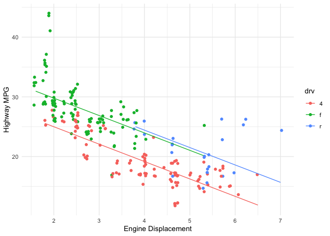

```r
library(tidyverse) #used for visualization, summarization, and basic wrangling
library(ggridges) #used for making density ridge plots
library(broom) #used for "prettier" and easier to work with model output
library(fivethirtyeight) #datasets
```


# Data Visualization

Usually one of the first things we want to do with new data is visualize it. If you haven't wanted to do this in the past, you'll want to do it now because it's going to be so easy! We will use functions from a package called `ggplot2` to create  our visualizations. This package is based on a visualization framework called the ["Grammar of Graphics"](https://www.amazon.com/Grammar-Graphics-Statistics-Computing/dp/0387245448). We will only discuss a few key details of the framework: data, geometric objects, and aesthetic attributes. The main idea is that "A statistical graphic is a mapping of data variables to aesthetic attributes of geometric objects."

1. Data: Our data set that contains variables (the columns) with many observations (the rows).  
2. Geometric objects: What we observe on our plot - points, lines, bars, etc. 
3. Aesthetic attributes: parts of the geometric object that we observe: x/y position, color, shape, size, etc.

In general, a basic plot can be created using the following template, where everything between the `<>` would be modified to fit your needs.

```
ggplot(data = <DATA>) +
  <GEOM_FUNCTION>(mapping = aes(<MAPPINGS>))
```

The ggplot2 [cheatsheet](https://www.rstudio.com/resources/cheatsheets/) is a good reference that I would encourage you to have open as we go through examples. 

We will also be doing some basic data summaries using the `dplyr` package. Both `dplyr` and `ggplot2` are part of the `tidyverse` package, which is a collection of packages that are useful in data visualization and manipulation. 

If you haven't done so already, you need to install the `tidyverse` package. You only need to do this once. You can either go to the Packages tab and click Install. Type `tidyverse` and follow the prompts. Or else, *in the console*, type `install.packages("tidyverse")`. 

Then you load the library by running a `library()` statement as shown above. You need to do this in every markdown file where you use functions from this package. I recommend putting these at the very top of your documents. Also note that I've added `warning=FALSE, message=FALSE` to the code chunk options, next to the `r`. This will prevent messages and warnings from being printed out.

Once you have done that, we can begin exploring the data. We will use the `mpg` data throughout. Before we get started, take a moment to explore that data and see what is there.


```r
data(mpg)
summary(mpg)
```

```
##  manufacturer          model               displ            year     
##  Length:234         Length:234         Min.   :1.600   Min.   :1999  
##  Class :character   Class :character   1st Qu.:2.400   1st Qu.:1999  
##  Mode  :character   Mode  :character   Median :3.300   Median :2004  
##                                        Mean   :3.472   Mean   :2004  
##                                        3rd Qu.:4.600   3rd Qu.:2008  
##                                        Max.   :7.000   Max.   :2008  
##       cyl           trans               drv                 cty       
##  Min.   :4.000   Length:234         Length:234         Min.   : 9.00  
##  1st Qu.:4.000   Class :character   Class :character   1st Qu.:14.00  
##  Median :6.000   Mode  :character   Mode  :character   Median :17.00  
##  Mean   :5.889                                         Mean   :16.86  
##  3rd Qu.:8.000                                         3rd Qu.:19.00  
##  Max.   :8.000                                         Max.   :35.00  
##       hwy             fl               class          
##  Min.   :12.00   Length:234         Length:234        
##  1st Qu.:18.00   Class :character   Class :character  
##  Median :24.00   Mode  :character   Mode  :character  
##  Mean   :23.44                                        
##  3rd Qu.:27.00                                        
##  Max.   :44.00
```


## Univariate visualization/summarization of quantitative variables

**Research questions:** What is the range of highway miles per gallon (`hwy`)? What are typical highway mpg? Are highway mpg's variable across vehicles?

As you visualize quantitative variables, keep in mind:

- **Center**: Where is the center of the distribution? What is a typical value of the variable?
- **Variability**: How spread out are the values? A lot or a little?
- **Shape**: How are values distributed along the observed range? Is the distribution symmetric, right-skewed (tail is longer on the right, pulled further out to the right), left-skewed, bimodal, or uniform (flat)?
- **Outliers**: Are there any outliers, i.e. values that are unusually large/small relative to the bulk of other values?
- **Context**: In the context of your research, what do you learn from the plot or table? How would you describe your findings to a broad audience?

We will often talk about the *distribution* of a variable. This is the values the variables take and how often. You should incorporate the answers to the questions above in your description of a distribution. You should also use numerical summaries, which we'll talk about shortly. Think about trying to describe the distribution to someone who doesn't have the picture in front of them.

### Histograms

Histograms are constructed by (1) dividing up the observed range of the variable into "bins" of equal width and (2) counting up the number of cases that fall into each bin. Try out the code below. Notice a couple things. First, it has removed missing values. Second, it's telling you that it has chosen the number of bins for you: 30. 


```r
ggplot(data = mpg) +
  geom_histogram(aes(x = hwy))
```

<!-- -->

We can customize plots in various ways, like I did below, but the most important part is creating a plot that allows us to see the distribution of our variable of interest, `hwy` in this case.  


```r
ggplot(data = mpg) +
  geom_histogram(aes(x = hwy), bins = 20, fill = "lightblue") +
  labs(x = "Highway MPG", y = "Number of vehicles") +
  theme_minimal() 
```

<!-- -->

### Measures of Center and Spread

Numerical measures of the center and spread can help us better understand the distribution of a quantitative variable. Try the following code to compute the mean, median, standard deviation (SD), and IQR of `hwy`. With these additional statistics, how would you describe the distribution of `hwy`?


```r
mpg %>%
  summarize(
    mean_hwy = mean(hwy),
    median_hwy = median(hwy),
    sd_hwy = sd(hwy),
    IQR_hwy = IQR(hwy)
  )
```

<div data-pagedtable="false">
  <script data-pagedtable-source type="application/json">
{"columns":[{"label":["mean_hwy"],"name":[1],"type":["dbl"],"align":["right"]},{"label":["median_hwy"],"name":[2],"type":["dbl"],"align":["right"]},{"label":["sd_hwy"],"name":[3],"type":["dbl"],"align":["right"]},{"label":["IQR_hwy"],"name":[4],"type":["dbl"],"align":["right"]}],"data":[{"1":"23.44017","2":"24","3":"5.954643","4":"9"}],"options":{"columns":{"min":{},"max":[10]},"rows":{"min":[10],"max":[10]},"pages":{}}}
  </script>
</div>


### Your turn!

1. Create a plot that shows the distribution of city miles per gallon, *cty*. How would you describe the distribution using words and statistics?  
2. Create a plot that shows the distribution of engine displacement, *displ*. How would you describe the distribution using words and statistics? 


## Multivariate visualization/summarization

We noticed that there was variability across vehicles but didn't investigate *why*. Are there other variables that might explain some of the variation? Which variables might have stronger or weaker relationships? How can we visualize these relationships?

We're interested in the relationship between:

**Response/dependent/outcome variable**: the variable whose variability we would like to explain (education or income)

**Predictors/explanatory variables/independent variables/covariates**: variables that might explain some of the variability in the response 


Our goal is to construct visualizations that allow us to examine the following features of the relationships among these variables:

- Relationship *trends* (form and direction of the relationship, eg. positive and linear)   
- Relationship *strength* (degree of variability from the trend or how tight the points are around the envisioned trend)    

- *Outliers* in the relationship

### Quantitative vs. quantitative: scatterplots

Examine the following plot that shows the relationship between `hwy` and `displ` (engine displacement). Comment on:
        
* the form of the relationship (line/curve/other)
* the strength of the relationship (weak/moderate/strong)
* the direction of the relationship (positive/negative)
* outliers 


```r
ggplot(data = mpg) +
  geom_point(aes(x = displ, y = hwy)) +
  labs(x = "Engine Displacement", y = "Highway MPG") +
  theme_minimal()
```

<!-- -->

The strength of the *linear* relationship between two quantitative variables is measured by the **correlation coefficient**. The code below will compute this.


```r
mpg %>% 
  summarize(corr = cor(displ, hwy))
```

<div data-pagedtable="false">
  <script data-pagedtable-source type="application/json">
{"columns":[{"label":["corr"],"name":[1],"type":["dbl"],"align":["right"]}],"data":[{"1":"-0.76602"}],"options":{"columns":{"min":{},"max":[10]},"rows":{"min":[10],"max":[10]},"pages":{}}}
  </script>
</div>


### Your turn!

1. Create a scatterplot of *hwy* vs. *cty* miles per gallon. How would you describe the relationship?  
2. Compute the correlation between *hwy* and *cty*.

### More complex scatterplots

We can jitter the points, adding a little bit of noise to each point, in order to see if they are overplotted. Do you prefer this plot?


```r
ggplot(data = mpg) +
  geom_jitter(aes(x = displ, y = hwy)) + #noice the code change here
  labs(x = "Engine Displacement", y = "Highway MPG") +
  theme_minimal()
```

<!-- -->

We can add an `alpha` argument, which controls the transparency of points. This can help if points are overplotted or if there is an overwhelming amount of data. 


```r
ggplot(data = mpg) +
  geom_point(aes(x = displ, y = hwy), alpha = .2) +
  labs(x = "Engine Displacement", y = "Highway MPG") +
  theme_minimal()
```

<!-- -->

We can make the points smaller in size. This can also help when there is a large amount of data. 


```r
ggplot(data = mpg) +
  geom_point(aes(x = displ, y = hwy), size = .5) +
  labs(x = "Engine Displacement", y = "Highway MPG") +
  theme_minimal()
```

<!-- -->

Sometimes you may want to use a combination of these options


```r
ggplot(data = diamonds) +
  geom_jitter(aes(x = carat, y = price), alpha = .2, size = .5) +
  labs(x = "Carats", y = "Price ($)") +
  theme_minimal()
```

<!-- -->

We also might be interested in the affect of a third variable while still wanting to look at the relationship between the two quantitative variables. If the third variable is categorical, we have a couple options. 

We can color the points by that variable.


```r
ggplot(data = mpg) +
  geom_jitter(aes(x = displ, y = hwy, color = drv)) +
  labs(x = "Engine Displacement", y = "Highway MPG", color = "Drive") +
  theme_minimal()
```

<!-- -->

Or we can facet by that variable.


```r
ggplot(data = mpg) +
  geom_jitter(aes(x = displ, y = hwy)) +
  facet_wrap(vars(drv)) +
  labs(x = "Engine Displacement", y = "Highway MPG") +
  theme_minimal()
```

<!-- -->

### Your turn!

Create 2-3 more complex plots that examine how some variables we have not investigated yet affect *hwy*. 

### Quantitative vs. categorical: side-by-side boxplots and density "ridge" plots

Examine the side-by-side boxplot below. What are some observations you would make?


```r
ggplot(data = mpg) +
  geom_boxplot(aes(x = drv, y = hwy)) +
  labs(x = "Drive", y = "Highway MPG") +
  theme_minimal()
```

<!-- -->

We could also examine this relationship using density plots. Notice that the x and y axis are the opposite of what they were in the boxplot. What do you observe here? Anything you didn't observe in the boxplot?


```r
ggplot(data = mpg) +
  geom_density_ridges(aes(x = hwy, y = drv)) +
  labs(x = "Highway MPG", y = "Drive") +
  theme_minimal()
```

<!-- -->

### Your turn! 

Examine the effect of *class* on *hwy*.


# Simple Linear Regression (SLR): Creating models, interpreting models, point prediction

We are going to discuss different types of linear models, their notation in R, how to interpret the model coefficients, and how to use them for prediction.

What does it mean to fit a model to data? We are looking for a mathematical equation to represent the "general" relationship between a *response variable* and *explanatory variables*. We know it won't be perfect, but we would like something useful. In this course, we focus on linear models. They take the form:

$$
\hat{y} = \hat{\beta}_0 + \hat{\beta}_1 x_1 + \hat{\beta}_2 x_2 + ... + \hat{\beta}_p x_p.
$$

The "hats" on top of the $y$ and the $\beta$s are to indicate that those quantities are estimates obtained from data. The $\beta$s will be numbers. The above is just a more complex version of the traditional equation of a line:

$$
y = mx + b
$$

The resulting model equation has many different names: model equation (or specifically linear model equation or just model), fitted model, least squares regression line, multiple regression line, estimated line, etc. These all mean the same thing.

The model has two main uses:

1. Prediction: to find the *predicted value* (also called *predicted response*, *fitted value*, *model value*, and a few other things) which is the value the response variable takes when you plug in the values of the explanatory variables. Or to predict values of $y$ when it is unknown.

2. Explanation: to explain the relationship between the explanatory variables and the response variable, ie. how $y$ relates to each of $x_1$, $x_2$, ...,$x_p$. The coefficients ($\hat{\beta}_1$, $\hat{\beta}_2$, ..., $\hat{\beta}_p$) tell us about that. 

We will use the `lm` function (which stands for linear model) to fit models. This function requires two arguments: the model equation and the data. The model equation is written in the form `y ~ x1 + x2`, where `y` is the response and `x1` and `x2` are the explanatory variables. More variables can be added by using the `+` sign to separate them. Here is a generic example


```r
lm(y ~ x1 + x2, data=the_data)
```

## Linear regression with one quantitative explanatory variable

Let's look at an example.


```r
lm_displ <- lm(hwy ~ displ, data=mpg)

lm_displ
```

```
## 
## Call:
## lm(formula = hwy ~ displ, data = mpg)
## 
## Coefficients:
## (Intercept)        displ  
##      35.698       -3.531
```

Notice a couple things:

1. I have saved this model to an object named `lm_displ`.  
2. The output gives us the intercept, $\hat{\beta}_0$ and the slope  or coefficient for the `displ` term, $\hat{\beta}_1$.


We can obtain more output (which we'll want when we start doing inference), using the `tidy()` function.


```r
tidy(lm_displ)
```

<div data-pagedtable="false">
  <script data-pagedtable-source type="application/json">
{"columns":[{"label":["term"],"name":[1],"type":["chr"],"align":["left"]},{"label":["estimate"],"name":[2],"type":["dbl"],"align":["right"]},{"label":["std.error"],"name":[3],"type":["dbl"],"align":["right"]},{"label":["statistic"],"name":[4],"type":["dbl"],"align":["right"]},{"label":["p.value"],"name":[5],"type":["dbl"],"align":["right"]}],"data":[{"1":"(Intercept)","2":"35.697651","3":"0.7203676","4":"49.55477","5":"2.123519e-125"},{"1":"displ","2":"-3.530589","3":"0.1945137","4":"-18.15085","5":"2.038974e-46"}],"options":{"columns":{"min":{},"max":[10]},"rows":{"min":[10],"max":[10]},"pages":{}}}
  </script>
</div>

For now, we are just interested in the *term* and *estimate* columns. The *term* column is the term/variable in the model equation. The column titled *estimate* gives the estimated coefficients of the variables/terms (ie. the $\hat{\beta}$s. 

We could write out the equation above as:

$$
\hat{hwy} = 35.70 - 3.53 displ
$$

### Explanation

1. How do you interpret the intercept, 35.70?  
2. How do you interpret the slope, -3.53?


\
\
\
\
\
\
\
\
\
\
\
\
\
\
\
\
\

In general, in a simple linear regression with one quantitative explanatory variable, the intercept is the *average* response when the explanatory variable(s) is equal to zero. The slope is the *average* change in the response variable for a one unit increase in the explanatory variable. 

### Prediction

How would you find the predicted highway miles per gallon for a vehicle with an engine displacement of 4.5 litres?

\
\
\
\
\
\
\
\
\
\
\
\
\
\
\
\

We can use the `augment()` function to help us do this, too.

We an use it to find the predicted responses for all the data used to fit this model. Below I just show the first 10 rows.


```r
aug_displ <- augment(lm_displ)

aug_displ %>% 
  slice(1:10)
```

<div data-pagedtable="false">
  <script data-pagedtable-source type="application/json">
{"columns":[{"label":["hwy"],"name":[1],"type":["int"],"align":["right"]},{"label":["displ"],"name":[2],"type":["dbl"],"align":["right"]},{"label":[".fitted"],"name":[3],"type":["dbl"],"align":["right"]},{"label":[".se.fit"],"name":[4],"type":["dbl"],"align":["right"]},{"label":[".resid"],"name":[5],"type":["dbl"],"align":["right"]},{"label":[".hat"],"name":[6],"type":["dbl"],"align":["right"]},{"label":[".sigma"],"name":[7],"type":["dbl"],"align":["right"]},{"label":[".cooksd"],"name":[8],"type":["dbl"],"align":["right"]},{"label":[".std.resid"],"name":[9],"type":["dbl"],"align":["right"]}],"data":[{"1":"29","2":"1.8","3":"29.34259","4":"0.4106462","5":"-0.3425912","6":"0.011459924","7":"3.844212","8":"4.676940e-05","9":"-0.08982602"},{"1":"29","2":"1.8","3":"29.34259","4":"0.4106462","5":"-0.3425912","6":"0.011459924","7":"3.844212","8":"4.676940e-05","9":"-0.08982602"},{"1":"31","2":"2.0","3":"28.63647","4":"0.3805816","5":"2.3635266","6":"0.009843324","7":"3.841101","8":"1.905773e-03","9":"0.61920098"},{"1":"30","2":"2.0","3":"28.63647","4":"0.3805816","5":"1.3635266","6":"0.009843324","7":"3.843222","8":"6.342747e-04","9":"0.35721917"},{"1":"26","2":"2.8","3":"25.81200","4":"0.2827706","5":"0.1879976","6":"0.005433937","7":"3.844259","8":"6.597330e-06","9":"0.04914265"},{"1":"26","2":"2.8","3":"25.81200","4":"0.2827706","5":"0.1879976","6":"0.005433937","7":"3.844259","8":"6.597330e-06","9":"0.04914265"},{"1":"27","2":"3.1","3":"24.75283","4":"0.2609861","5":"2.2471742","6":"0.004628934","7":"3.841421","8":"8.016793e-04","9":"0.58717473"},{"1":"26","2":"1.8","3":"29.34259","4":"0.4106462","5":"-3.3425912","6":"0.011459924","7":"3.837910","8":"4.452213e-03","9":"-0.87641386"},{"1":"25","2":"1.8","3":"29.34259","4":"0.4106462","5":"-4.3425912","6":"0.011459924","7":"3.833523","8":"7.514625e-03","9":"-1.13860980"},{"1":"28","2":"2.0","3":"28.63647","4":"0.3805816","5":"-0.6364734","6":"0.009843324","7":"3.844049","8":"1.382009e-04","9":"-0.16674447"}],"options":{"columns":{"min":{},"max":[10]},"rows":{"min":[10],"max":[10]},"pages":{}}}
  </script>
</div>

This dataset contains the response variable, all explanatory variables, and some additional information. One piece of additional information is the variable *.fitted*. These are the predicted (fitted) values. 

Sometimes we want all the variables in our original dataset, plus these new variables. We can get that, by adding a `data = ` argument to the `augment()` function. 


```r
augment(lm_displ, data = mpg) %>% 
  slice(1:10)
```

<div data-pagedtable="false">
  <script data-pagedtable-source type="application/json">
{"columns":[{"label":["manufacturer"],"name":[1],"type":["chr"],"align":["left"]},{"label":["model"],"name":[2],"type":["chr"],"align":["left"]},{"label":["displ"],"name":[3],"type":["dbl"],"align":["right"]},{"label":["year"],"name":[4],"type":["int"],"align":["right"]},{"label":["cyl"],"name":[5],"type":["int"],"align":["right"]},{"label":["trans"],"name":[6],"type":["chr"],"align":["left"]},{"label":["drv"],"name":[7],"type":["chr"],"align":["left"]},{"label":["cty"],"name":[8],"type":["int"],"align":["right"]},{"label":["hwy"],"name":[9],"type":["int"],"align":["right"]},{"label":["fl"],"name":[10],"type":["chr"],"align":["left"]},{"label":["class"],"name":[11],"type":["chr"],"align":["left"]},{"label":[".fitted"],"name":[12],"type":["dbl"],"align":["right"]},{"label":[".se.fit"],"name":[13],"type":["dbl"],"align":["right"]},{"label":[".resid"],"name":[14],"type":["dbl"],"align":["right"]},{"label":[".hat"],"name":[15],"type":["dbl"],"align":["right"]},{"label":[".sigma"],"name":[16],"type":["dbl"],"align":["right"]},{"label":[".cooksd"],"name":[17],"type":["dbl"],"align":["right"]},{"label":[".std.resid"],"name":[18],"type":["dbl"],"align":["right"]}],"data":[{"1":"audi","2":"a4","3":"1.8","4":"1999","5":"4","6":"auto(l5)","7":"f","8":"18","9":"29","10":"p","11":"compact","12":"29.34259","13":"0.4106462","14":"-0.3425912","15":"0.011459924","16":"3.844212","17":"4.676940e-05","18":"-0.08982602"},{"1":"audi","2":"a4","3":"1.8","4":"1999","5":"4","6":"manual(m5)","7":"f","8":"21","9":"29","10":"p","11":"compact","12":"29.34259","13":"0.4106462","14":"-0.3425912","15":"0.011459924","16":"3.844212","17":"4.676940e-05","18":"-0.08982602"},{"1":"audi","2":"a4","3":"2.0","4":"2008","5":"4","6":"manual(m6)","7":"f","8":"20","9":"31","10":"p","11":"compact","12":"28.63647","13":"0.3805816","14":"2.3635266","15":"0.009843324","16":"3.841101","17":"1.905773e-03","18":"0.61920098"},{"1":"audi","2":"a4","3":"2.0","4":"2008","5":"4","6":"auto(av)","7":"f","8":"21","9":"30","10":"p","11":"compact","12":"28.63647","13":"0.3805816","14":"1.3635266","15":"0.009843324","16":"3.843222","17":"6.342747e-04","18":"0.35721917"},{"1":"audi","2":"a4","3":"2.8","4":"1999","5":"6","6":"auto(l5)","7":"f","8":"16","9":"26","10":"p","11":"compact","12":"25.81200","13":"0.2827706","14":"0.1879976","15":"0.005433937","16":"3.844259","17":"6.597330e-06","18":"0.04914265"},{"1":"audi","2":"a4","3":"2.8","4":"1999","5":"6","6":"manual(m5)","7":"f","8":"18","9":"26","10":"p","11":"compact","12":"25.81200","13":"0.2827706","14":"0.1879976","15":"0.005433937","16":"3.844259","17":"6.597330e-06","18":"0.04914265"},{"1":"audi","2":"a4","3":"3.1","4":"2008","5":"6","6":"auto(av)","7":"f","8":"18","9":"27","10":"p","11":"compact","12":"24.75283","13":"0.2609861","14":"2.2471742","15":"0.004628934","16":"3.841421","17":"8.016793e-04","18":"0.58717473"},{"1":"audi","2":"a4 quattro","3":"1.8","4":"1999","5":"4","6":"manual(m5)","7":"4","8":"18","9":"26","10":"p","11":"compact","12":"29.34259","13":"0.4106462","14":"-3.3425912","15":"0.011459924","16":"3.837910","17":"4.452213e-03","18":"-0.87641386"},{"1":"audi","2":"a4 quattro","3":"1.8","4":"1999","5":"4","6":"auto(l5)","7":"4","8":"16","9":"25","10":"p","11":"compact","12":"29.34259","13":"0.4106462","14":"-4.3425912","15":"0.011459924","16":"3.833523","17":"7.514625e-03","18":"-1.13860980"},{"1":"audi","2":"a4 quattro","3":"2.0","4":"2008","5":"4","6":"manual(m6)","7":"4","8":"20","9":"28","10":"p","11":"compact","12":"28.63647","13":"0.3805816","14":"-0.6364734","15":"0.009843324","16":"3.844049","17":"1.382009e-04","18":"-0.16674447"}],"options":{"columns":{"min":{},"max":[10]},"rows":{"min":[10],"max":[10]},"pages":{}}}
  </script>
</div>

We can also use `augment() ` to predict unknown or future values, like predicting the highway MPG for a displacement of 4.5. We need to add a `newdata = ` argument to the function and give it a dataset as an argument. Because there is just one value, we can create the dataset "on the fly." The `tibble()` function can be used to create a dataset. If we wanted multiple predictions, we separate them with commas inside the `c()`. Be sure the variable is named EXACTLY as the variable name appears in the original dataset.


```r
augment(lm_displ, 
        newdata = tibble(displ = c(4.5)))
```

<div data-pagedtable="false">
  <script data-pagedtable-source type="application/json">
{"columns":[{"label":["displ"],"name":[1],"type":["dbl"],"align":["right"]},{"label":[".fitted"],"name":[2],"type":["dbl"],"align":["right"]},{"label":[".se.fit"],"name":[3],"type":["dbl"],"align":["right"]}],"data":[{"1":"4.5","2":"19.81","3":"0.3207548"}],"options":{"columns":{"min":{},"max":[10]},"rows":{"min":[10],"max":[10]},"pages":{}}}
  </script>
</div>

```r
#example of more than one prediction
augment(lm_displ, 
        newdata = tibble(displ = c(3, 3.5, 4.0, 4.5, 5.0, 5.5)))
```

<div data-pagedtable="false">
  <script data-pagedtable-source type="application/json">
{"columns":[{"label":["displ"],"name":[1],"type":["dbl"],"align":["right"]},{"label":[".fitted"],"name":[2],"type":["dbl"],"align":["right"]},{"label":[".se.fit"],"name":[3],"type":["dbl"],"align":["right"]}],"data":[{"1":"3.0","2":"25.10588","3":"0.2670309"},{"1":"3.5","2":"23.34059","3":"0.2508262"},{"1":"4.0","2":"21.57530","3":"0.2709978"},{"1":"4.5","2":"19.81000","3":"0.3207548"},{"1":"5.0","2":"18.04471","3":"0.3889027"},{"1":"5.5","2":"16.27941","3":"0.4674663"}],"options":{"columns":{"min":{},"max":[10]},"rows":{"min":[10],"max":[10]},"pages":{}}}
  </script>
</div>

We can also use this to plot our fitted line on the plot of the original data.


```r
#The pipe, %>%, allows us to pass data to the next function. It is read, "and then."
augment(lm_displ, data = mpg) %>% 
  ggplot() +
  geom_jitter(aes(x = displ, y = hwy)) + 
  geom_line(aes(x = displ, y = .fitted), color = "blue") + #the fitted line
  labs(x = "Engine Displacement", y = "Highway MPG") +
  theme_minimal()
```

<!-- -->

### Your turn!

1. Fit a model that used *cty* to explain *hwy*. Write down the model equation.  
2. Interpret the intercept and slope from the model.  
3. Plot the line on top of a scatterplot of the data.  
4. Use the model to predict the highway MPG, *hwy*,  for a car that gets 24 MPG in the city and for a car that gets 65 MPG in the city. Do you trust both of these predictions?

## Linear regression with one categorical (factor) variable

Now, let's examine a model that uses a categorical (factor) explanatory variable. 


```r
lm_drv <- lm(hwy ~ drv,
                 data=mpg)
tidy(lm_drv)
```

<div data-pagedtable="false">
  <script data-pagedtable-source type="application/json">
{"columns":[{"label":["term"],"name":[1],"type":["chr"],"align":["left"]},{"label":["estimate"],"name":[2],"type":["dbl"],"align":["right"]},{"label":["std.error"],"name":[3],"type":["dbl"],"align":["right"]},{"label":["statistic"],"name":[4],"type":["dbl"],"align":["right"]},{"label":["p.value"],"name":[5],"type":["dbl"],"align":["right"]}],"data":[{"1":"(Intercept)","2":"19.174757","3":"0.4036737","4":"47.500634","5":"3.396345e-121"},{"1":"drvf","2":"8.985620","3":"0.5668272","4":"15.852486","5":"8.578919e-39"},{"1":"drvr","2":"1.825243","3":"0.9134093","4":"1.998275","5":"4.685929e-02"}],"options":{"columns":{"min":{},"max":[10]},"rows":{"min":[10],"max":[10]},"pages":{}}}
  </script>
</div>

It did something. **WHAT did it do? Any ideas?** First, let's run the following code. How is what we see below related to what we see above?


```r
mpg %>% 
  group_by(drv) %>% 
  summarize(mean_hwy = mean(hwy))
```

<div data-pagedtable="false">
  <script data-pagedtable-source type="application/json">
{"columns":[{"label":["drv"],"name":[1],"type":["chr"],"align":["left"]},{"label":["mean_hwy"],"name":[2],"type":["dbl"],"align":["right"]}],"data":[{"1":"4","2":"19.17476"},{"1":"f","2":"28.16038"},{"1":"r","2":"21.00000"}],"options":{"columns":{"min":{},"max":[10]},"rows":{"min":[10],"max":[10]},"pages":{}}}
  </script>
</div>

Since R cannot use *drv* directly, since its values are words not numbers, it is creating 2 new variables: 

*drvf* is 1 if *drv* is *f* and 0 otherwise, and 
*drvr*  is 1 if *drv* is *r* and 0 otherwise.  

Let's write out the model equation:

$$
\hat{hwy} = 19.18 + 8.99drvf + 1.83drvr
$$

**QUESTIONS**

1. When will both *drvf* and *drvr* take a value of 0?  
2. What is the predicted value for a front wheel drive vehicle?  
3. What is the predicted value for a rear wheel drive vehicle?
4. What is the predicted value for a 4 wheel drive vehicle? 
5. Interpret each of the coefficients.


\
\
\
\
\
\
\
\
\
\
\
\
\
\
\
\

In general, in a simple linear regression with one categorical explanatory variable, the intercept is the *average* response when the explanatory variable is at the "baseline" or "reference" level. That is the level of the categorical variable that does not have a dummy variable created for it. Notice, that is also the average response when all other variables are zero, same as when we had one quantitative explanatory variable. 

The other coefficients are the difference in average response between the level of the indicator variable and the reference level. This is similar to "increasing the explanatory variable by one," but it doesn't really make sense to talk about it that way.

### Your turn!

1. Create a model that uses *class* to explain *hwy*. Interpret each of the coefficients.  
2. What is the predicted highway MPG for a pickup?

# Multiple Linear Regression: Creating Models, Interpreting Models, Point Prediction

Often, we think more than one variable affects the response. We can include more than one variable in our model. We do that here, using both *drv* and *displ* to explain *hwy*. 


```r
lm_twovars <- lm(hwy ~ drv + displ,
                 data=mpg)
tidy(lm_twovars)
```

<div data-pagedtable="false">
  <script data-pagedtable-source type="application/json">
{"columns":[{"label":["term"],"name":[1],"type":["chr"],"align":["left"]},{"label":["estimate"],"name":[2],"type":["dbl"],"align":["right"]},{"label":["std.error"],"name":[3],"type":["dbl"],"align":["right"]},{"label":["statistic"],"name":[4],"type":["dbl"],"align":["right"]},{"label":["p.value"],"name":[5],"type":["dbl"],"align":["right"]}],"data":[{"1":"(Intercept)","2":"30.825437","3":"0.9239025","4":"33.364382","5":"4.209158e-90"},{"1":"drvf","2":"4.790598","3":"0.5296223","4":"9.045310","5":"6.399425e-17"},{"1":"drvr","2":"5.257865","3":"0.7335844","4":"7.167362","5":"1.031418e-11"},{"1":"displ","2":"-2.914085","3":"0.2182513","4":"-13.351970","5":"1.726916e-30"}],"options":{"columns":{"min":{},"max":[10]},"rows":{"min":[10],"max":[10]},"pages":{}}}
  </script>
</div>

**Questions:**

1. Have the coefficients in the model changed from the model with only *displ* or the model with only *drv*?  
2. Why do you think they have changed or not changed?

\
\
\
\
\
\
\
\
\
\
\
\
\
\
\
\
\
\
\
\
\
\
\
\
\
\

In a model with more than one variable, we are determining the affect of each variable, while accounting for all other variables in the model. This affect might change after accounting for those other variables. Let's examine this visually first with this toy example.


```r
set.seed(10)

x1 <- runif(n = 10, min = 0, max = 10)
y1 <- 5 + rnorm(n = 10, mean = 0, sd = 2)

x2 <- runif(n = 10, min = 10, max = 20)
y2 <- 15 + rnorm(n = 10, mean = 0, sd = 2)

x3 <- runif(n = 10, min = 20, max = 30)
y3 <- 25 + rnorm(n = 10, mean = 0, sd = 2)

test_data <- tibble(x = c(x1, x2, x3),
                    y = c(y1, y2, y3),
                    grp = c(rep("a", 10), rep("b", 10), rep("c", 10)))

ggplot(test_data) +
  geom_point(aes(x = x, y = y, color = grp)) +
  theme_minimal()
```

<!-- -->

**Questions:**

1. How would you describe the relationship between *x* and *y* if you don't pay attention to *grp*?  
2. Is the relationship between *x* and *y* within each *grp* different than the overall relationship? What might you expect the coefficient of the *x* term to be in a linear regression that includes both *x* and *grp* in the model of *y*?


## Explanation

Let's return to the model output. 


```r
tidy(lm_twovars)
```

<div data-pagedtable="false">
  <script data-pagedtable-source type="application/json">
{"columns":[{"label":["term"],"name":[1],"type":["chr"],"align":["left"]},{"label":["estimate"],"name":[2],"type":["dbl"],"align":["right"]},{"label":["std.error"],"name":[3],"type":["dbl"],"align":["right"]},{"label":["statistic"],"name":[4],"type":["dbl"],"align":["right"]},{"label":["p.value"],"name":[5],"type":["dbl"],"align":["right"]}],"data":[{"1":"(Intercept)","2":"30.825437","3":"0.9239025","4":"33.364382","5":"4.209158e-90"},{"1":"drvf","2":"4.790598","3":"0.5296223","4":"9.045310","5":"6.399425e-17"},{"1":"drvr","2":"5.257865","3":"0.7335844","4":"7.167362","5":"1.031418e-11"},{"1":"displ","2":"-2.914085","3":"0.2182513","4":"-13.351970","5":"1.726916e-30"}],"options":{"columns":{"min":{},"max":[10]},"rows":{"min":[10],"max":[10]},"pages":{}}}
  </script>
</div>

Given what we just discussed, try interpreting each of the estimated coefficients from the model on your own. 

\
\
\
\
\
\
\
\
\
\
\
\
\
\
\
\
\
\
\
\
\
\
\
\
\
\
\
\
\

In general, in a multiple linear regression model, the intercept is the *average* response when the explanatory variables are all equal to zero. If there are categorical variables in the model, the intercept then reflects when all of those are at the baseline/reference level. 

Coefficients of quantitative explanatory variables are the *average* change in the response variable for a one unit increase in the explanatory variable, with all other variables held fixed (this indicates that we've accounted for those variables being in the model).

Coefficients of categorical explanatory variables are the difference in average response between the level of the indicator variable and the reference level, holding all other variables constant. 

## Prediction

Just as with simple linear regression, we can use the `augment()` function to help us find predicted values.

To find the predicted responses for all the data used to fit this model:


```r
augment(lm_twovars) %>% 
  slice(1:10)
```

<div data-pagedtable="false">
  <script data-pagedtable-source type="application/json">
{"columns":[{"label":["hwy"],"name":[1],"type":["int"],"align":["right"]},{"label":["drv"],"name":[2],"type":["chr"],"align":["left"]},{"label":["displ"],"name":[3],"type":["dbl"],"align":["right"]},{"label":[".fitted"],"name":[4],"type":["dbl"],"align":["right"]},{"label":[".se.fit"],"name":[5],"type":["dbl"],"align":["right"]},{"label":[".resid"],"name":[6],"type":["dbl"],"align":["right"]},{"label":[".hat"],"name":[7],"type":["dbl"],"align":["right"]},{"label":[".sigma"],"name":[8],"type":["dbl"],"align":["right"]},{"label":[".cooksd"],"name":[9],"type":["dbl"],"align":["right"]},{"label":[".std.resid"],"name":[10],"type":["dbl"],"align":["right"]}],"data":[{"1":"29","2":"f","3":"1.8","4":"30.37068","5":"0.3420414","6":"-1.3706830","7":"0.012319699","8":"3.086993","9":"6.246319e-04","10":"-0.44755891"},{"1":"29","2":"f","3":"1.8","4":"30.37068","5":"0.3420414","6":"-1.3706830","7":"0.012319699","8":"3.086993","9":"6.246319e-04","10":"-0.44755891"},{"1":"31","2":"f","3":"2.0","4":"29.78787","5":"0.3231808","6":"1.2121339","7":"0.010998507","8":"3.087287","9":"4.349345e-04","10":"0.39552460"},{"1":"30","2":"f","3":"2.0","4":"29.78787","5":"0.3231808","6":"0.2121339","7":"0.010998507","8":"3.088306","9":"1.332118e-05","10":"0.06922022"},{"1":"26","2":"f","3":"2.8","4":"27.45660","5":"0.3039188","6":"-1.4565984","7":"0.009726529","8":"3.086823","9":"5.540003e-04","10":"-0.47498910"},{"1":"26","2":"f","3":"2.8","4":"27.45660","5":"0.3039188","6":"-1.4565984","7":"0.009726529","8":"3.086823","9":"5.540003e-04","10":"-0.47498910"},{"1":"27","2":"f","3":"3.1","4":"26.58237","5":"0.3218012","6":"0.4176269","7":"0.010904812","8":"3.088213","9":"5.118017e-05","10":"0.13626704"},{"1":"26","2":"4","3":"1.8","4":"25.58008","5":"0.5677479","6":"0.4199151","7":"0.033943277","8":"3.088209","9":"1.688318e-04","10":"0.13863777"},{"1":"25","2":"4","3":"1.8","4":"25.58008","5":"0.5677479","6":"-0.5800849","7":"0.033943277","8":"3.088092","9":"3.221917e-04","10":"-0.19151890"},{"1":"28","2":"4","3":"2.0","4":"24.99727","5":"0.5313778","6":"3.0027320","7":"0.029733744","8":"3.081761","9":"7.496934e-03","10":"0.98921909"}],"options":{"columns":{"min":{},"max":[10]},"rows":{"min":[10],"max":[10]},"pages":{}}}
  </script>
</div>

This now includes all the variables from the orginal dataset, plus the "augmented" variables: 


```r
augment(lm_twovars, data = mpg) %>% 
  slice(1:10)
```

<div data-pagedtable="false">
  <script data-pagedtable-source type="application/json">
{"columns":[{"label":["manufacturer"],"name":[1],"type":["chr"],"align":["left"]},{"label":["model"],"name":[2],"type":["chr"],"align":["left"]},{"label":["displ"],"name":[3],"type":["dbl"],"align":["right"]},{"label":["year"],"name":[4],"type":["int"],"align":["right"]},{"label":["cyl"],"name":[5],"type":["int"],"align":["right"]},{"label":["trans"],"name":[6],"type":["chr"],"align":["left"]},{"label":["drv"],"name":[7],"type":["chr"],"align":["left"]},{"label":["cty"],"name":[8],"type":["int"],"align":["right"]},{"label":["hwy"],"name":[9],"type":["int"],"align":["right"]},{"label":["fl"],"name":[10],"type":["chr"],"align":["left"]},{"label":["class"],"name":[11],"type":["chr"],"align":["left"]},{"label":[".fitted"],"name":[12],"type":["dbl"],"align":["right"]},{"label":[".se.fit"],"name":[13],"type":["dbl"],"align":["right"]},{"label":[".resid"],"name":[14],"type":["dbl"],"align":["right"]},{"label":[".hat"],"name":[15],"type":["dbl"],"align":["right"]},{"label":[".sigma"],"name":[16],"type":["dbl"],"align":["right"]},{"label":[".cooksd"],"name":[17],"type":["dbl"],"align":["right"]},{"label":[".std.resid"],"name":[18],"type":["dbl"],"align":["right"]}],"data":[{"1":"audi","2":"a4","3":"1.8","4":"1999","5":"4","6":"auto(l5)","7":"f","8":"18","9":"29","10":"p","11":"compact","12":"30.37068","13":"0.3420414","14":"-1.3706830","15":"0.012319699","16":"3.086993","17":"6.246319e-04","18":"-0.44755891"},{"1":"audi","2":"a4","3":"1.8","4":"1999","5":"4","6":"manual(m5)","7":"f","8":"21","9":"29","10":"p","11":"compact","12":"30.37068","13":"0.3420414","14":"-1.3706830","15":"0.012319699","16":"3.086993","17":"6.246319e-04","18":"-0.44755891"},{"1":"audi","2":"a4","3":"2.0","4":"2008","5":"4","6":"manual(m6)","7":"f","8":"20","9":"31","10":"p","11":"compact","12":"29.78787","13":"0.3231808","14":"1.2121339","15":"0.010998507","16":"3.087287","17":"4.349345e-04","18":"0.39552460"},{"1":"audi","2":"a4","3":"2.0","4":"2008","5":"4","6":"auto(av)","7":"f","8":"21","9":"30","10":"p","11":"compact","12":"29.78787","13":"0.3231808","14":"0.2121339","15":"0.010998507","16":"3.088306","17":"1.332118e-05","18":"0.06922022"},{"1":"audi","2":"a4","3":"2.8","4":"1999","5":"6","6":"auto(l5)","7":"f","8":"16","9":"26","10":"p","11":"compact","12":"27.45660","13":"0.3039188","14":"-1.4565984","15":"0.009726529","16":"3.086823","17":"5.540003e-04","18":"-0.47498910"},{"1":"audi","2":"a4","3":"2.8","4":"1999","5":"6","6":"manual(m5)","7":"f","8":"18","9":"26","10":"p","11":"compact","12":"27.45660","13":"0.3039188","14":"-1.4565984","15":"0.009726529","16":"3.086823","17":"5.540003e-04","18":"-0.47498910"},{"1":"audi","2":"a4","3":"3.1","4":"2008","5":"6","6":"auto(av)","7":"f","8":"18","9":"27","10":"p","11":"compact","12":"26.58237","13":"0.3218012","14":"0.4176269","15":"0.010904812","16":"3.088213","17":"5.118017e-05","18":"0.13626704"},{"1":"audi","2":"a4 quattro","3":"1.8","4":"1999","5":"4","6":"manual(m5)","7":"4","8":"18","9":"26","10":"p","11":"compact","12":"25.58008","13":"0.5677479","14":"0.4199151","15":"0.033943277","16":"3.088209","17":"1.688318e-04","18":"0.13863777"},{"1":"audi","2":"a4 quattro","3":"1.8","4":"1999","5":"4","6":"auto(l5)","7":"4","8":"16","9":"25","10":"p","11":"compact","12":"25.58008","13":"0.5677479","14":"-0.5800849","15":"0.033943277","16":"3.088092","17":"3.221917e-04","18":"-0.19151890"},{"1":"audi","2":"a4 quattro","3":"2.0","4":"2008","5":"4","6":"manual(m6)","7":"4","8":"20","9":"28","10":"p","11":"compact","12":"24.99727","13":"0.5313778","14":"3.0027320","15":"0.029733744","16":"3.081761","17":"7.496934e-03","18":"0.98921909"}],"options":{"columns":{"min":{},"max":[10]},"rows":{"min":[10],"max":[10]},"pages":{}}}
  </script>
</div>

And, we can predict new or future values. REMINDER: se sure the variables are named EXACTLY as the variable name appears in the original dataset, and categorical/factor variables need to have their values in quotes.


```r
augment(lm_twovars, 
        newdata = tibble(displ = c(3, 3.5, 4.0, 4.5, 5.0, 5.5),
                         drv = c("4", "f", "r", "r", "4", "f")))
```

<div data-pagedtable="false">
  <script data-pagedtable-source type="application/json">
{"columns":[{"label":["displ"],"name":[1],"type":["dbl"],"align":["right"]},{"label":["drv"],"name":[2],"type":["chr"],"align":["left"]},{"label":[".fitted"],"name":[3],"type":["dbl"],"align":["right"]},{"label":[".se.fit"],"name":[4],"type":["dbl"],"align":["right"]}],"data":[{"1":"3.0","2":"4","3":"22.08318","4":"0.3736931"},{"1":"3.5","2":"f","3":"25.41674","4":"0.3630601"},{"1":"4.0","2":"r","3":"24.42696","4":"0.6676306"},{"1":"4.5","2":"r","3":"22.96992","4":"0.6337364"},{"1":"5.0","2":"4","3":"16.25501","4":"0.3741878"},{"1":"5.5","2":"f","3":"19.58857","4":"0.7083341"}],"options":{"columns":{"min":{},"max":[10]},"rows":{"min":[10],"max":[10]},"pages":{}}}
  </script>
</div>

We can also plot the fitted "line" on top of the original data. You can't always plot more compled models because at some point there are too many dimensions. **What is special about this model?**


```r
augment(lm_twovars, data = mpg) %>% 
  ggplot() +
  geom_jitter(aes(x = displ, y = hwy, color = drv)) + 
  geom_line(aes(x = displ, y = .fitted, color = drv)) + #the fitted lines
  labs(x = "Engine Displacement", y = "Highway MPG") +
  theme_minimal()
```

<!-- -->


### Your turn!

1. Fit a model that uses *cty* and *class* to predict *hwy*. Write down the model equation and interpret each of the coefficients.  
2. Make a graph of the model on top of a scatterplot of the data. Color the points by *class* and color the lines by *class*.  
3. Use the model to find the predicted highway MPG for a compact car that gets 26 MPG in the city.


# Hypothesis Tests for SLR
Congratulations! You have learned how to construct regression models.

Earlier, you constructed a linear model for predicting a car's highway gas mileage (miles driven on the highway per gallon of gas used) based on the car's engine displacement, in liters. Let's ponder these very similar questions: 

1. Is your regression equation any good? 

3. Is engine displacement doing a good job of explaining/predicting the car's highway gas mileage?

3. Cars' highway gas mileage varies from car to car. Is a meaningful amount of that variability explained by a car's engine displacement?

To answer these questions, we turn to hypothesis tests.


## Constructing Hypotheses


A good scientist/researcher is skeptical of claims until they see solid evidence. If a person claims that two variables (such as engine displacement and highway gas mileage) have a relationship, a good researcher will need to see evidence before accepting a claim as true.

This is the basic framework for hypothesis testing. The hypothesis testing framework generally has two hypotheses: a null hypothesis (usually denoted $H_0$) and an alternative hypothesis (usually denoted $H_A$). We assume the null hypothesis until/unless we have sufficient evidence to reject it in favor of the alternative hypothesis. 

In the context of the simple linear regression model, **we assume that the two variables have no linear relationship. We then use our data to measure the evidence of the linear relationship.** If we have enough evidence, we can say that the two variables have a significant linear relationship.

Writing the null and alternative hypotheses  in sentences is a bit verbose, so researchers usually write the hypotheses as equations. To do this, we need to define some notation. Let's call the predictor $x$ and the response variable $y$. Define $\beta_0$ to be the intercept and $\beta_1$ to be the slope. Then our predicted value of y is 
$$
\hat{y} = {\beta}_0 + {\beta}_1 x ,
$$

With this setup, we can now translate the  null hypothesis ("there is no linear relationship between x and y") to $H_0: \beta_1 = 0$. This means that our regression equation is $\hat{y} = {\beta}_0 + 0 x = \beta_1$; plug in any x value, and the regression equation will produce the same prediction.

The alternative hypothesis is that x and y do have a linear relationship, so the alternative hypothesis is $H_A: \beta_1 \neq 0$.

Putting these hypotheses together, we have:

$$H_0: \beta_1 = 0$$

$$H_A: \beta_1 \neq 0$$

Let's return to the model for predicting a car's highway mileage based on the car's engine displacement. Our model is:

$$ \widehat{mpg} = \beta_0 + \beta_1 displ. $$

Our null hypothesis is that the car's highway mileage **does not have** a linear relationship with the car's engine displacement; that is $H_0: \beta_1 = 0$. The alternative hypothesis is that these that the car's highway mileage **does have** linear relationship with the car's engine displacement; that is $H_A: \beta_1 \neq 0$. Until we have evidence that shows a linear relationship between the two variables, we assume that there is no linear relationship (that is, we assume that $\beta_1 = 0$.)


## Gaining Intuition


To better understand the hypotheses and to get a feel for whether the slope is likely to be nonzero, we revisit our plots:


```r
augment(lm_displ, data = mpg) %>% 
  ggplot() +
  geom_jitter(aes(x = displ, y = hwy)) + 
  geom_line(aes(x = displ, y = .fitted), color = "blue") + 
  labs(x = "Engine Displacement", y = "Highway MPG") +
  theme_minimal()
```

<!-- -->

This step is important. In a couple minutes, you will learn to crunch numbers. However, **you are more than a number cruncher**. You are a human and you need to know whether the results the computer gives you make sense.


## Measuring Evidence Against the Null Hypothesis

Now that have a feel for our data, we are prepared to gather evidence against the null hypothesis. 
We use p-values to measure evidence against the null hypothesis.
**A smaller p-value provides more evidence against the null hypothesis.** 

Once you have constructed your model, calculating a p-value is easy: simply use the **tidy* command, as the relevant p-values are displayed in the last column of our table. 


```r
tidy(lm_displ)
```

<div data-pagedtable="false">
  <script data-pagedtable-source type="application/json">
{"columns":[{"label":["term"],"name":[1],"type":["chr"],"align":["left"]},{"label":["estimate"],"name":[2],"type":["dbl"],"align":["right"]},{"label":["std.error"],"name":[3],"type":["dbl"],"align":["right"]},{"label":["statistic"],"name":[4],"type":["dbl"],"align":["right"]},{"label":["p.value"],"name":[5],"type":["dbl"],"align":["right"]}],"data":[{"1":"(Intercept)","2":"35.697651","3":"0.7203676","4":"49.55477","5":"2.123519e-125"},{"1":"displ","2":"-3.530589","3":"0.1945137","4":"-18.15085","5":"2.038974e-46"}],"options":{"columns":{"min":{},"max":[10]},"rows":{"min":[10],"max":[10]},"pages":{}}}
  </script>
</div>

Our tidy table has two rows: the first row contains information for $\beta_0$ and the second row contains information for $\beta_1$. Because we are testing whether $\beta_1=0$, we select the p-value from the second row: 2.038974\times 10^{-46} (that is 0.0000000000000000000000000000000000000000000002038974).


This is quite a small number, so we have a lot of evidence against the null hypothesis (that there is no linear relationship between highway gas mileage and engine displacement). In a moment, we will decide whether to reject the null hypothesis or not.


## Deciding Whether to Reject 

We said that smaller p-values provide more evidence against the null hypothesis. To decide how much evidence is enough to reject the null hypothesis, we need a threshold.
Before crunching any numbers, an ethical researcher will select their threshold for how small is small enough to reject the null hypothesis. This threshold is called the significance level. Common thresholds include $.05, .01,$ and $.1$. For today, let's use a significance level of $.05$. In the future, you should check within your discipline and consult a statistician to select a smart significance level for your study. 


**If your p-value is smaller than your significance level, reject the null hypothesis in favor of the alternative: you have found a significant linear relationship between the two variables.** **If your p-value is larger than your significance level, do not reject the null hypothesis: there is not a significant linear relationship between the two variables.**

Since our p-value is much smaller than today's significance level of $.05$, we reject the null hypothesis in favor of the alternative. **There is a significance linear relationship between a car's engine displacement and its highway gas mileage.**

**Always conclude in the context of your study.** Rather than saying  "We reject the null hypothesis" or "$\beta_1 \neq 0$, write a sentence in plain English (or your language of choice), such as "There is a significance linear relationship between a car's engine displacement and its highway gas mileage."

## Your Turn

1. Test whether the highway gas mileage has a linear relationship with the year of manufacture. More specifically, use highway gas mileage as the predictor and use year  as the response.

2. Test whether the city gas mileage has a linear relationship with the engine displacement. Use city gas mileage as the response.

\
\
\
\
\

## Interpreting Tests

### Is this a good predictor?

To motivate hypothesis testing, I asked you some questions:

1. Is your regression equation any good? 

3. Is your predictor doing a good job of explaining/predicting the car's highway gas mileage?

3. Cars' highway gas mileage varies from car to car. Is a meaningful amount of that variability explained by your predictor?

Since we found a significant linear relationship between engine displacement and highway gas mileage, I would respond to these questions with "Not bad." I can't say our regression model is amazing, but it is definitely better than a model with just an intercept. The predictor (engine displacement) does help to explain the variability in highway gas mileage.

Now, let's turn to your model for highway gas mileage based on the year of manufacture. **Your p-value for testing this linear relationship was quite large**, so you did not find a significant linear relationship between year of manufacture and highway gas mileage. In response to my three questions, I would say:

1. No, this regression equation isn't very good. There's no meaningful linear relationship, so there's no compelling reason to keep this model.

2. No, the year the car was manufactured does not do a good job of predicting the car's highway gas mileage. This is because there's no significant linear relationship between a car's gas mileage and the year the car was manufactured.

3. Cars' highway gas mileage varies from car to car. The year the car was made does not do a good job of explaining this variability. This is because there's no significant linear relationship between a car's gas mileage and the year the car was manufactured.

This model is no better than a model with just an intercept ($\widehat{hwy} = \beta_0$). Don't waste your time with this model. Go out and find a better predictor.

### Conclusions
A hypothesis test can result in one of two conclusions:

1. The two variables have a significant linear relationship.
2. The two variables do not have a significant linear relationship.

The latter conclusion can arise for a few reasons:

1. There truly is no linear relationship between the two variables.
2. There is actually a linear relationship between the two variables, but the evidence was not strong enough to detect the relationship. Perhaps a larger sample size would have allowed us to detect the relationship.


## Turning Your Skills Up

### A New Option

Another way you can calculate p-values is by creating two linear models: one is constructed under the null hypothesis ($\beta_1=0$, meaning $\hat{y} = \beta_0$) and the other is constructed under the alternative hypothesis ($\beta_1 \neq 0$, meaning $\hat{y} = \beta_0+ \beta_1 x$).

Let's revisit the model for predicting highway gas mileage based on engine displacement. To test whether highway gas mileage has a linear relationship with engine displacement, we will create two linear models: one **without** engine displacement as a predictor (this model is built under the null hypothesis) and one **with** engine displacement as a predictor (this model is built under the alternative hypothesis). You have already constructed the latter model, but here it is again. This time, I changed the name to emphasize it is the model built under the alternative hypothesis.


```r
lm_alt <- lm(hwy ~ displ, data = mpg)
```


The model built under the null hypothesis is constructed using a 1 (one). This tells R that we want only an intercept ($\beta_0$).

```r
lm_null <- lm(hwy ~ 1, data = mpg)
```


Now that the models are ready, we can calculate our p-value with the **anova** function:


```r
anova(lm_null, lm_alt)
```

<div data-pagedtable="false">
  <script data-pagedtable-source type="application/json">
{"columns":[{"label":[""],"name":["_rn_"],"type":[""],"align":["left"]},{"label":["Res.Df"],"name":[1],"type":["dbl"],"align":["right"]},{"label":["RSS"],"name":[2],"type":["dbl"],"align":["right"]},{"label":["Df"],"name":[3],"type":["dbl"],"align":["right"]},{"label":["Sum of Sq"],"name":[4],"type":["dbl"],"align":["right"]},{"label":["F"],"name":[5],"type":["dbl"],"align":["right"]},{"label":["Pr(>F)"],"name":[6],"type":["dbl"],"align":["right"]}],"data":[{"1":"233","2":"8261.662","3":"NA","4":"NA","5":"NA","6":"NA","_rn_":"1"},{"1":"232","2":"3413.829","3":"1","4":"4847.833","5":"329.4533","6":"2.038974e-46","_rn_":"2"}],"options":{"columns":{"min":{},"max":[10]},"rows":{"min":[10],"max":[10]},"pages":{}}}
  </script>
</div>

This tells us our p-value is smaller than $2.2 \times 10^{-16}$. (Often, p-values smaller than $2.2 \times 10^{-16}$ are stated in this way since the p-value is already incredibly small.) This lines up with the p-value we found using the **tidy** table.

### This Option's Utility

A nice thing about conducting hypothesis tests in this way is that we can test whether a **categorical** predictor has a relationship with a quantitative response.  Let's revisit your model for highway gas mileage based on whether the car has front-wheel drive, rear-wheel drive, or four-wheel drive. Recall that this model essentially produces group-wise means. **Does highway gas mileage differ between cars with front-wheel drive, rear-wheel drive, and four-wheel drive?** Let's check out our tidy table.


```r
lm_drv <- lm(hwy ~ drv, data=mpg)
tidy(lm_drv)
```

<div data-pagedtable="false">
  <script data-pagedtable-source type="application/json">
{"columns":[{"label":["term"],"name":[1],"type":["chr"],"align":["left"]},{"label":["estimate"],"name":[2],"type":["dbl"],"align":["right"]},{"label":["std.error"],"name":[3],"type":["dbl"],"align":["right"]},{"label":["statistic"],"name":[4],"type":["dbl"],"align":["right"]},{"label":["p.value"],"name":[5],"type":["dbl"],"align":["right"]}],"data":[{"1":"(Intercept)","2":"19.174757","3":"0.4036737","4":"47.500634","5":"3.396345e-121"},{"1":"drvf","2":"8.985620","3":"0.5668272","4":"15.852486","5":"8.578919e-39"},{"1":"drvr","2":"1.825243","3":"0.9134093","4":"1.998275","5":"4.685929e-02"}],"options":{"columns":{"min":{},"max":[10]},"rows":{"min":[10],"max":[10]},"pages":{}}}
  </script>
</div>
This table has three p-values.  Which one would we choose for our test? We'd choose none of these: we want a *single** p-value that tells us whether a model with group-wise means is better than a model with a single mean.  (We created the single-mean model earlier and called it lm_null.) To find this single p-value, use anova.


```r
anova(lm_drv, lm_null)
```

<div data-pagedtable="false">
  <script data-pagedtable-source type="application/json">
{"columns":[{"label":[""],"name":["_rn_"],"type":[""],"align":["left"]},{"label":["Res.Df"],"name":[1],"type":["dbl"],"align":["right"]},{"label":["RSS"],"name":[2],"type":["dbl"],"align":["right"]},{"label":["Df"],"name":[3],"type":["dbl"],"align":["right"]},{"label":["Sum of Sq"],"name":[4],"type":["dbl"],"align":["right"]},{"label":["F"],"name":[5],"type":["dbl"],"align":["right"]},{"label":["Pr(>F)"],"name":[6],"type":["dbl"],"align":["right"]}],"data":[{"1":"231","2":"3877.128","3":"NA","4":"NA","5":"NA","6":"NA","_rn_":"1"},{"1":"233","2":"8261.662","3":"-2","4":"-4384.534","5":"130.6157","6":"1.126239e-38","_rn_":"2"}],"options":{"columns":{"min":{},"max":[10]},"rows":{"min":[10],"max":[10]},"pages":{}}}
  </script>
</div>

Et voila! Our p-value is smaller than $2.2 \times 10^{-16}$, which is smaller than today's significance level of $.05$.  We reject the null hypothesis in favor of the alternative hypothesis. The group-wise means model is significantly better than the model with a single mean. In other words, rather than using a model that produces the same predicted highway gas mileage for all cars, it is better to use a model that predicts differently for front-wheel drive, rear-wheel drive, and four-wheel drive.


## Your Turn Again


1. Using the anova function, test whether the highway gas mileage has a linear relationship with the year of manufacture. More specifically, use highway gas mileage as the predictor and use year  as the response.

2. Using the anova function, test whether the city gas mileage differs between front-wheel drive, rear-wheel drive, and four-wheel drive cars. 


# Comparing Models Using Basic Model Selection Techniques

## Bigger is Not Necessarily Better

You now have the power to add additional predictors to your model. However, with great power comes great responsibility. Be wise and judiciously add more predictors to your model.  


To understand why we need to judiciously add predictors, let's step away from regression and think about a remote control for a television. Imagine you're a guest in someone's home. Would you rather use a remote control with 100 buttons such as this remote:


Or would you rather see a simple remote such as this one:


Why do I prefer the simple remote? I can do what I need to do. The other remotes are too complicated for me. I don't know how to use them.  

We see a similar lesson here: **do not overcomplicate your model**. If you add a predictor to your model and your model barely improves, what is the utility of your bulked up model? You should reconsider and pare down your model. Do not include all the predictors that you have on hand. Everything-bagels are delicious, but everything-regression-models are less tempting.


\
\

What is the issue with incorporating many predictors? Actually, there are two main issues.  

First, it's a lot easier to talk about and work with simpler models. Think back to the section on interpreting models. The more predictors you have in your model, the longer and more complicated your interpretation is. If a simpler model will suffice, then keep it simple.


Second, there is a danger of "overfitting." When too many predictors have been incorporated into a regression equation, we say that the model has been "overfit." This means that the model has been tailored to resemble the data-set. What's wrong with this? We don't know that the model represents reality anymore.


\
\

## How to Keep it Simple

Now that you understand the importance of controlling model complexity, we can discuss how to adhere to the KISS principle in practice. **If two models work equally well, but one is simpler, then use the simpler model.** To put this another way, **in order to justify adding a predictor to your model, you must show the bulked-up model works significantly better.** How can you make this decision? Use the p-value from the anova command.

Let's use a concrete example. Recall your model for highway gas mileage based on whether a car has front-wheel, rear-wheel, or four-wheel drive. We may want to improve the predictive capability of this model by taking engine displacement into account. Then, the two models we are comparing are:

```r
smallmod <- lm(hwy ~ drv, data = mpg)
bigmod <- lm(hwy ~ drv + displ, data = mpg)
```
Unless the bigmod is noticeably better than the smallmod, we should use the smallmod in order to keep it simple. Let's use anova to see whether the bigmod is better or whether we should stay with the smallmod.

```r
anova(bigmod, smallmod)
```

<div data-pagedtable="false">
  <script data-pagedtable-source type="application/json">
{"columns":[{"label":[""],"name":["_rn_"],"type":[""],"align":["left"]},{"label":["Res.Df"],"name":[1],"type":["dbl"],"align":["right"]},{"label":["RSS"],"name":[2],"type":["dbl"],"align":["right"]},{"label":["Df"],"name":[3],"type":["dbl"],"align":["right"]},{"label":["Sum of Sq"],"name":[4],"type":["dbl"],"align":["right"]},{"label":["F"],"name":[5],"type":["dbl"],"align":["right"]},{"label":["Pr(>F)"],"name":[6],"type":["dbl"],"align":["right"]}],"data":[{"1":"230","2":"2184.163","3":"NA","4":"NA","5":"NA","6":"NA","_rn_":"1"},{"1":"231","2":"3877.128","3":"-1","4":"-1692.965","5":"178.2751","6":"1.726916e-30","_rn_":"2"}],"options":{"columns":{"min":{},"max":[10]},"rows":{"min":[10],"max":[10]},"pages":{}}}
  </script>
</div>

Our p-value is quite small, so the bigmod works noticeably better. **We can use the model with both drive and displacement, as it is better than the model with drive only.**

## Your Turn

1. Is a model with both drive and displacement better than a model with just an intercept $\beta_0$? Use highway gas mileage as the response variable. 

2. If we already have drive and displacement in the model, should we add the type of transmission? (Hint: the two models to compare will differ by a single variable.)

3. Consider adding to the model that "won" in question 2. Should we stick with this model, or could we justify adding the "type" of car (class)?

## Another Approach

Using anova (as you just practiced) works well when you can use it. I didn't tell you this before, but you can use the anova command to decide whether to add/remove predictors. That is, the predictors in one model must ALL be used in the other model. (We call such models "nested models.")

You can't (shouldn't) use anova to compare, for example, the following two models: 

```r
mod1 <- lm(hwy ~ class, data = mpg)
mod2 <- lm(hwy ~ trans, data = mpg)
```
Why? The first model does not use all the predictors from the second model. Similarly, the second model does not use all the predictors from the first model.

To compare non-nested models, we can use AIC (Akaike Information Criteria). AIC rewards model fit and penalizes for model complexity. **For AIC, smaller is better.** If two models have AICs within 5 or 10 of each other, than you can make a call on which model you'd like to use. Often the context of your research will help you make this decision.

Let's find the AIC for each model.

```r
AIC(mod1)
```

```
## [1] 1241.573
```

```r
AIC(mod2)
```

```
## [1] 1482.693
```

The AIC on mod1 is much smaller, which means that we should use mod1. Rather than using a model with a car's transmission, it is better to use a model with the car's class.

## Your Turn

Create models with highway gas mileage as the response. 

1. Use AIC to decide which model to use: a model with transmission only or a model with year of manufacture only.

2. Use AIC to decide which model to use: a model with transmission only or a model with transmission, class, fuel type, and city miles per gallon.

3. Create the best model possible, with the restriction that you can use only a single predictor.

