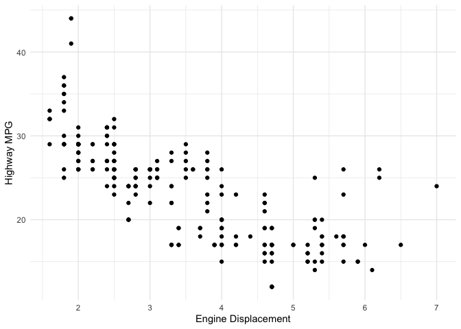
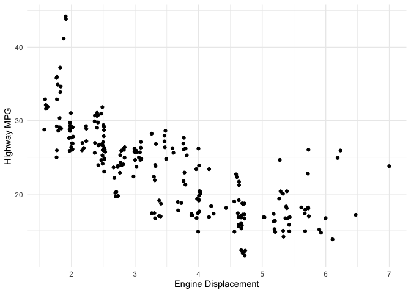

```r
library(tidyverse) #used for visualization, summarization, and basic wrangling
library(ggridges) #used for making density ridge plots
library(broom) #used for "prettier" and easier to work with model output
library(fivethirtyeight) #datasets
```


# Data Visualization

Usually one of the first things we want to do with new data is visualize it. If you haven't wanted to do this in the past, you'll want to do it now because it's going to be so easy! We will use functions from a package called `ggplot2` to create  our visualizations. This package is based on a visualization framework called the ["Grammar of Graphics"](https://www.amazon.com/Grammar-Graphics-Statistics-Computing/dp/0387245448). We will only discuss a few key details of the framework: data, geometric objects, and aesthetic attributes. The main idea is that "A statistical graphic is a mapping of data variables to aesthetic attributes of geometric objects."

1. Data: Our data set that contains variables (the columns) with many observations (the rows).  
2. Geometric objects: What we observe on our plot - points, lines, bars, etc. 
3. Aesthetic attributes: parts of the geometric object that we observe: x/y position, color, shape, size, etc.

In general, a basic plot can be created using the following template, where everything between the `<>` would be modified to fit your needs.

```
ggplot(data = <DATA>) +
  <GEOM_FUNCTION>(mapping = aes(<MAPPINGS>))
```

The ggplot2 [cheatsheet](https://www.rstudio.com/resources/cheatsheets/) is a good reference that I would encourage you to have open as we go through examples. 

We will also be doing some basic data summaries using the `dplyr` package. Both `dplyr` and `ggplot2` are part of the `tidyverse` package, which is a collection of packages that are useful in data visualization and manipulation. 

If you haven't done so already, you need to install the `tidyverse` package. You only need to do this once. You can either go to the Packages tab and click Install. Type `tidyverse` and follow the prompts. Or else, *in the console*, type `install.packages("tidyverse")`. 

Then you load the library by running a `library()` statement as shown above. You need to do this in every markdown file where you use functions from this package. I recommend putting these at the very top of your documents. Also note that I've added `warning=FALSE, message=FALSE` to the code chunk options, next to the `r`. This will prevent messages and warnings from being printed out.

Once you have done that, we can begin exploring the data. We will use the `mpg` data throughout. Before we get started, take a moment to explore that data and see what is there.


```r
data(mpg)
summary(mpg)
```

```
##  manufacturer          model               displ            year     
##  Length:234         Length:234         Min.   :1.600   Min.   :1999  
##  Class :character   Class :character   1st Qu.:2.400   1st Qu.:1999  
##  Mode  :character   Mode  :character   Median :3.300   Median :2004  
##                                        Mean   :3.472   Mean   :2004  
##                                        3rd Qu.:4.600   3rd Qu.:2008  
##                                        Max.   :7.000   Max.   :2008  
##       cyl           trans               drv                 cty       
##  Min.   :4.000   Length:234         Length:234         Min.   : 9.00  
##  1st Qu.:4.000   Class :character   Class :character   1st Qu.:14.00  
##  Median :6.000   Mode  :character   Mode  :character   Median :17.00  
##  Mean   :5.889                                         Mean   :16.86  
##  3rd Qu.:8.000                                         3rd Qu.:19.00  
##  Max.   :8.000                                         Max.   :35.00  
##       hwy             fl               class          
##  Min.   :12.00   Length:234         Length:234        
##  1st Qu.:18.00   Class :character   Class :character  
##  Median :24.00   Mode  :character   Mode  :character  
##  Mean   :23.44                                        
##  3rd Qu.:27.00                                        
##  Max.   :44.00
```


## Univariate visualization/summarization of quantitative variables

**Research questions:** What is the range of highway miles per gallon (`hwy`)? What are typical highway mpg? Are highway mpg's variable across vehicles?

As you visualize quantitative variables, keep in mind:

- **Center**: Where is the center of the distribution? What is a typical value of the variable?
- **Variability**: How spread out are the values? A lot or a little?
- **Shape**: How are values distributed along the observed range? Is the distribution symmetric, right-skewed (tail is longer on the right, pulled further out to the right), left-skewed, bimodal, or uniform (flat)?
- **Outliers**: Are there any outliers, i.e. values that are unusually large/small relative to the bulk of other values?
- **Context**: In the context of your research, what do you learn from the plot or table? How would you describe your findings to a broad audience?

We will often talk about the *distribution* of a variable. This is the values the variables take and how often. You should incorporate the answers to the questions above in your description of a distribution. You should also use numerical summaries, which we'll talk about shortly. Think about trying to describe the distribution to someone who doesn't have the picture in front of them.

### Histograms

Histograms are constructed by (1) dividing up the observed range of the variable into "bins" of equal width and (2) counting up the number of cases that fall into each bin. Try out the code below. Notice a couple things. First, it has removed missing values. Second, it's telling you that it has chosen the number of bins for you: 30. 


```r
ggplot(data = mpg) +
  geom_histogram(aes(x = hwy))
```

<!-- -->

We can customize plots in various ways, like I did below, but the most important part is creating a plot that allows us to see the distribution of our variable of interest, `hwy` in this case.  


```r
ggplot(data = mpg) +
  geom_histogram(aes(x = hwy), bins = 20, fill = "lightblue") +
  labs(x = "Highway MPG", y = "Number of vehicles") +
  theme_minimal() 
```

<!-- -->

### Measures of Center and Spread

Numerical measures of the center and spread can help us better understand the distribution of a quantitative variable. Try the following code to compute the mean, median, standard deviation (SD), and IQR of `hwy`. With these additional statistics, how would you describe the distribution of `hwy`?


```r
mpg %>%
  summarize(
    mean_hwy = mean(hwy),
    median_hwy = median(hwy),
    sd_hwy = sd(hwy),
    IQR_hwy = IQR(hwy)
  )
```

<div data-pagedtable="false">
  <script data-pagedtable-source type="application/json">
{"columns":[{"label":["mean_hwy"],"name":[1],"type":["dbl"],"align":["right"]},{"label":["median_hwy"],"name":[2],"type":["dbl"],"align":["right"]},{"label":["sd_hwy"],"name":[3],"type":["dbl"],"align":["right"]},{"label":["IQR_hwy"],"name":[4],"type":["dbl"],"align":["right"]}],"data":[{"1":"23.44017","2":"24","3":"5.954643","4":"9"}],"options":{"columns":{"min":{},"max":[10]},"rows":{"min":[10],"max":[10]},"pages":{}}}
  </script>
</div>


### YOUR TURN (have a problem for them to try on their own)


## Multivariate visualization/summarization

We noticed that there was variability across vehicles but didn't investigate *why*. Are there other variables that might explain some of the variation? Which variables might have stronger or weaker relationships? How can we visualize these relationships?

We're interested in the relationship between:

**Response/dependent/outcome variable**: the variable whose variability we would like to explain (education or income)

**Predictors/explanatory variables/independent variables/covariates**: variables that might explain some of the variability in the response 


Our goal is to construct visualizations that allow us to examine the following features of the relationships among these variables:

- Relationship *trends* (form and direction of the relationship, eg. positive and linear)   
- Relationship *strength* (degree of variability from the trend or how tight the points are around the envisioned trend)    

- *Outliers* in the relationship

### Quantitative vs. quantitative: scatterplots

Examine the following plot that shows the relationship between `hwy` and `displ` (engine displacement). Comment on:
        
* the form of the relationship (line/curve/other)
* the strength of the relationship (weak/moderate/strong)
* the direction of the relationship (positive/negative)
* outliers 


```r
ggplot(data = mpg) +
  geom_point(aes(x = displ, y = hwy)) +
  labs(x = "Engine Displacement", y = "Highway MPG") +
  theme_minimal()
```

<!-- -->

The strength of the *linear* relationship between two quantitative variables is measured by the **correlation coefficient**. The code below will compute this.


```r
mpg %>% 
  summarize(corr = cor(displ, hwy))
```

<div data-pagedtable="false">
  <script data-pagedtable-source type="application/json">
{"columns":[{"label":["corr"],"name":[1],"type":["dbl"],"align":["right"]}],"data":[{"1":"-0.76602"}],"options":{"columns":{"min":{},"max":[10]},"rows":{"min":[10],"max":[10]},"pages":{}}}
  </script>
</div>


### YOUR TURN!!

### More complex scatterplots

We can jitter the points, adding a little bit of noise to each point, in order to see if they are overplotted. Do you prefer this plot?


```r
ggplot(data = mpg) +
  geom_jitter(aes(x = displ, y = hwy)) + #noice the code change here
  labs(x = "Engine Displacement", y = "Highway MPG") +
  theme_minimal()
```

<!-- -->

We can add an `alpha` argument, which controls the transparency of points. This can help if points are overplotted or if there is an overwhelming amount of data. 


```r
ggplot(data = mpg) +
  geom_point(aes(x = displ, y = hwy), alpha = .2) +
  labs(x = "Engine Displacement", y = "Highway MPG") +
  theme_minimal()
```

<!-- -->

We can make the points smaller in size. This can also help when there is a large amount of data. 


```r
ggplot(data = mpg) +
  geom_point(aes(x = displ, y = hwy), size = .5) +
  labs(x = "Engine Displacement", y = "Highway MPG") +
  theme_minimal()
```

<!-- -->

Sometimes you may want to use a combination of these options


```r
ggplot(data = diamonds) +
  geom_jitter(aes(x = carat, y = price), alpha = .2, size = .5) +
  labs(x = "Carats", y = "Price ($)") +
  theme_minimal()
```

<!-- -->

We also might be interested in the affect of a third variable while still wanting to look at the relationship between the two quantitative variables. If the third variable is categorical, we have a couple options. 

We can color the points by that variable.


```r
ggplot(data = mpg) +
  geom_jitter(aes(x = displ, y = hwy, color = drv)) +
  labs(x = "Engine Displacement", y = "Highway MPG", color = "Drive") +
  theme_minimal()
```

<!-- -->

Or we can facet by that variable.


```r
ggplot(data = mpg) +
  geom_jitter(aes(x = displ, y = hwy)) +
  facet_wrap(vars(drv)) +
  labs(x = "Engine Displacement", y = "Highway MPG") +
  theme_minimal()
```

<!-- -->

### Quantitative vs. categorical: side-by-side boxplots and density "ridge" plots

Examine the side-by-side boxplot below. What are some observations you would make?


```r
ggplot(data = mpg) +
  geom_boxplot(aes(x = drv, y = hwy)) +
  labs(x = "Drive", y = "Highway MPG") +
  theme_minimal()
```

<!-- -->

We could also examine this relationship using density plots. Notice that the x and y axis are the opposite of what they were in the boxplot. What do you observe here? Anything you didn't observe in the boxplot?


```r
ggplot(data = mpg) +
  geom_density_ridges(aes(x = hwy, y = drv)) +
  labs(x = "Highway MPG", y = "Drive") +
  theme_minimal()
```

<!-- -->

### Your turn! 

# Simple Linear Regression (SLR): Creating models, interpreting models, point prediction

We are going to discuss different types of linear models, their notation in R, how to interpret the model coefficients, and how to use them for prediction.

What does it mean to fit a model to data? We are looking for a mathematical equation to represent the "general" relationship between a *response variable* and *explanatory variables*. We know it won't be perfect, but we would like something useful. In this course, we focus on linear models. They take the form:

$$
\hat{y} = \hat{\beta}_0 + \hat{\beta}_1 x_1 + \hat{\beta}_2 x_2 + ... + \hat{\beta}_p x_p.
$$

The "hats" on top of the $y$ and the $\beta$s are to indicate that those quantities are estimates obtained from data. The $\beta$s will be numbers. The above is just a more complex version of the traditional equation of a line:

$$
y = mx + b
$$

The resulting model equation has many different names: model equation (or specifically linear model equation or just model), fitted model, least squares regression line, multiple regression line, estimated line, etc. These all mean the same thing.

The model has two main uses:

1. Prediction: to find the *predicted value* (also called *predicted response*, *fitted value*, *model value*, and a few other things) which is the value the response variable takes when you plug in the values of the explanatory variables. Or to predict values of $y$ when it is unknown.

2. Explanation: to explain the relationship between the explanatory variables and the response variable, ie. how $y$ relates to each of $x_1$, $x_2$, ...,$x_p$. The coefficients ($\hat{\beta}_1$, $\hat{\beta}_2$, ..., $\hat{\beta}_p$) tell us about that. 

We will use the `lm` function (which stands for linear model) to fit models. This function requires two arguments: the model equation and the data. The model equation is written in the form `y ~ x1 + x2`, where `y` is the response and `x1` and `x2` are the explanatory variables. More variables can be added by using the `+` sign to separate them. Here is a generic example


```r
lm(y ~ x1 + x2, data=the_data)
```

## Linear regression with one quantitative explanatory variable

Let's look at an example.


```r
lm_displ <- lm(hwy ~ displ, data=mpg)

lm_displ
```

```
## 
## Call:
## lm(formula = hwy ~ displ, data = mpg)
## 
## Coefficients:
## (Intercept)        displ  
##      35.698       -3.531
```

Notice a couple things:

1. I have saved this model to an object named `lm_displ`.  
2. The output gives us the intercept, $\hat{\beta}_0$ and the slope  or coefficient for the `displ` term, $\hat{\beta}_1$.


We can obtain more output (which we'll want when we start doing inference), using the `tidy()` function.


```r
tidy(lm_displ)
```

<div data-pagedtable="false">
  <script data-pagedtable-source type="application/json">
{"columns":[{"label":["term"],"name":[1],"type":["chr"],"align":["left"]},{"label":["estimate"],"name":[2],"type":["dbl"],"align":["right"]},{"label":["std.error"],"name":[3],"type":["dbl"],"align":["right"]},{"label":["statistic"],"name":[4],"type":["dbl"],"align":["right"]},{"label":["p.value"],"name":[5],"type":["dbl"],"align":["right"]}],"data":[{"1":"(Intercept)","2":"35.697651","3":"0.7203676","4":"49.55477","5":"2.123519e-125"},{"1":"displ","2":"-3.530589","3":"0.1945137","4":"-18.15085","5":"2.038974e-46"}],"options":{"columns":{"min":{},"max":[10]},"rows":{"min":[10],"max":[10]},"pages":{}}}
  </script>
</div>

For now, we are just interested in the *term* and *estimate* columns. The *term* column is the term/variable in the model equation. The column titled *estimate* gives the estimated coefficients of the variables/terms (ie. the $\hat{\beta}$s. 

We could write out the equation above as:

$$
\hat{hwy} = 35.70 - 3.53 displ
$$

### Explanation

1. How do you interpret the intercept, 35.70?  
2. How do you interpret the slope, -3.53?


\
\
\
\
\
\
\
\
\
\
\
\
\
\
\
\
\

In general, in a simple linear regression with one quantitative explanatory variable, the intercept is the *average* response when the explanatory variable(s) is equal to zero. The slope is the *average* change in the response variable for a one unit increase in the explanatory variable. 

### Prediction

How would you find the predicted highway miles per gallon for a vehicle with an engine displacement of 4.5 litres?

\
\
\
\
\
\
\
\
\
\
\
\
\
\
\
\

We can use the `augment()` function to help us do this, too.

We an use it to find the predicted responses for all the data used to fit this model:


```r
augment(lm_displ)
```

<div data-pagedtable="false">
  <script data-pagedtable-source type="application/json">
{"columns":[{"label":["hwy"],"name":[1],"type":["int"],"align":["right"]},{"label":["displ"],"name":[2],"type":["dbl"],"align":["right"]},{"label":[".fitted"],"name":[3],"type":["dbl"],"align":["right"]},{"label":[".se.fit"],"name":[4],"type":["dbl"],"align":["right"]},{"label":[".resid"],"name":[5],"type":["dbl"],"align":["right"]},{"label":[".hat"],"name":[6],"type":["dbl"],"align":["right"]},{"label":[".sigma"],"name":[7],"type":["dbl"],"align":["right"]},{"label":[".cooksd"],"name":[8],"type":["dbl"],"align":["right"]},{"label":[".std.resid"],"name":[9],"type":["dbl"],"align":["right"]}],"data":[{"1":"29","2":"1.8","3":"29.34259","4":"0.4106462","5":"-0.34259120","6":"0.011459924","7":"3.844212","8":"4.676940e-05","9":"-0.08982602"},{"1":"29","2":"1.8","3":"29.34259","4":"0.4106462","5":"-0.34259120","6":"0.011459924","7":"3.844212","8":"4.676940e-05","9":"-0.08982602"},{"1":"31","2":"2.0","3":"28.63647","4":"0.3805816","5":"2.36352656","6":"0.009843324","7":"3.841101","8":"1.905773e-03","9":"0.61920098"},{"1":"30","2":"2.0","3":"28.63647","4":"0.3805816","5":"1.36352656","6":"0.009843324","7":"3.843222","8":"6.342747e-04","9":"0.35721917"},{"1":"26","2":"2.8","3":"25.81200","4":"0.2827706","5":"0.18799761","6":"0.005433937","7":"3.844259","8":"6.597330e-06","9":"0.04914265"},{"1":"26","2":"2.8","3":"25.81200","4":"0.2827706","5":"0.18799761","6":"0.005433937","7":"3.844259","8":"6.597330e-06","9":"0.04914265"},{"1":"27","2":"3.1","3":"24.75283","4":"0.2609861","5":"2.24717425","6":"0.004628934","7":"3.841421","8":"8.016793e-04","9":"0.58717473"},{"1":"26","2":"1.8","3":"29.34259","4":"0.4106462","5":"-3.34259120","6":"0.011459924","7":"3.837910","8":"4.452213e-03","9":"-0.87641386"},{"1":"25","2":"1.8","3":"29.34259","4":"0.4106462","5":"-4.34259120","6":"0.011459924","7":"3.833523","8":"7.514625e-03","9":"-1.13860980"},{"1":"28","2":"2.0","3":"28.63647","4":"0.3805816","5":"-0.63647344","6":"0.009843324","7":"3.844049","8":"1.382009e-04","9":"-0.16674447"},{"1":"27","2":"2.0","3":"28.63647","4":"0.3805816","5":"-1.63647344","6":"0.009843324","7":"3.842756","8":"9.136253e-04","9":"-0.42872629"},{"1":"25","2":"2.8","3":"25.81200","4":"0.2827706","5":"-0.81200239","6":"0.005433937","7":"3.843906","8":"1.230774e-04","9":"-0.21225777"},{"1":"25","2":"2.8","3":"25.81200","4":"0.2827706","5":"-0.81200239","6":"0.005433937","7":"3.843906","8":"1.230774e-04","9":"-0.21225777"},{"1":"25","2":"3.1","3":"24.75283","4":"0.2609861","5":"0.24717425","6":"0.004628934","7":"3.844244","8":"9.699148e-06","9":"0.06458532"},{"1":"25","2":"3.1","3":"24.75283","4":"0.2609861","5":"0.24717425","6":"0.004628934","7":"3.844244","8":"9.699148e-06","9":"0.06458532"},{"1":"24","2":"2.8","3":"25.81200","4":"0.2827706","5":"-1.81200239","6":"0.005433937","7":"3.842420","8":"6.128880e-04","9":"-0.47365820"},{"1":"25","2":"3.1","3":"24.75283","4":"0.2609861","5":"0.24717425","6":"0.004628934","7":"3.844244","8":"9.699148e-06","9":"0.06458532"},{"1":"23","2":"4.2","3":"20.86918","4":"0.2880056","5":"2.13082193","6":"0.005637001","7":"3.841707","8":"8.795666e-04","9":"0.55705463"},{"1":"20","2":"5.3","3":"16.98553","4":"0.4351354","5":"3.01446962","6":"0.012867526","7":"3.839092","8":"4.077390e-03","9":"0.79094503"},{"1":"15","2":"5.3","3":"16.98553","4":"0.4351354","5":"-1.98553038","6":"0.012867526","7":"3.842030","8":"1.768941e-03","9":"-0.52096905"},{"1":"20","2":"5.3","3":"16.98553","4":"0.4351354","5":"3.01446962","6":"0.012867526","7":"3.839092","8":"4.077390e-03","9":"0.79094503"},{"1":"17","2":"5.7","3":"15.57329","4":"0.5007329","5":"1.42670514","6":"0.017039566","7":"3.843113","8":"1.219751e-03","9":"0.37513650"},{"1":"17","2":"6.0","3":"14.51412","4":"0.5520162","5":"2.48588179","6":"0.020708561","7":"3.840724","8":"4.534226e-03","9":"0.65485870"},{"1":"26","2":"5.7","3":"15.57329","4":"0.5007329","5":"10.42670514","6":"0.017039566","7":"3.781493","8":"6.514737e-02","9":"2.74158796"},{"1":"23","2":"5.7","3":"15.57329","4":"0.5007329","5":"7.42670514","6":"0.017039566","7":"3.812554","8":"3.305179e-02","9":"1.95277080"},{"1":"26","2":"6.2","3":"13.80800","4":"0.5869393","5":"12.19199955","6":"0.023411684","7":"3.757602","8":"1.239869e-01","9":"3.21619436"},{"1":"25","2":"6.2","3":"13.80800","4":"0.5869393","5":"11.19199955","6":"0.023411684","7":"3.771369","8":"1.044819e-01","9":"2.95239888"},{"1":"24","2":"7.0","3":"10.98353","4":"0.7306639","5":"13.01647059","6":"0.036281188","7":"3.743983","8":"2.248969e-01","9":"3.45653679"},{"1":"19","2":"5.3","3":"16.98553","4":"0.4351354","5":"2.01446962","6":"0.012867526","7":"3.841964","8":"1.820882e-03","9":"0.52856221"},{"1":"14","2":"5.3","3":"16.98553","4":"0.4351354","5":"-2.98553038","6":"0.012867526","7":"3.839192","8":"3.999479e-03","9":"-0.78335187"},{"1":"15","2":"5.7","3":"15.57329","4":"0.5007329","5":"-0.57329486","6":"0.017039566","7":"3.844091","8":"1.969513e-04","9":"-0.15074161"},{"1":"17","2":"6.5","3":"12.74882","4":"0.6401851","5":"4.25117619","6":"0.027852059","7":"3.833797","8":"1.809785e-02","9":"1.12399928"},{"1":"27","2":"2.4","3":"27.22424","4":"0.3261090","5":"-0.22423792","6":"0.007227228","7":"3.844250","8":"1.252871e-05","9":"-0.05866880"},{"1":"30","2":"2.4","3":"27.22424","4":"0.3261090","5":"2.77576208","6":"0.007227228","7":"3.839907","8":"1.919786e-03","9":"0.72624043"},{"1":"26","2":"3.1","3":"24.75283","4":"0.2609861","5":"1.24717425","6":"0.004628934","7":"3.843399","8":"2.469343e-04","9":"0.32588002"},{"1":"29","2":"3.5","3":"23.34059","4":"0.2508262","5":"5.65940977","6":"0.004275550","7":"3.826125","8":"4.693233e-03","9":"1.47851136"},{"1":"26","2":"3.6","3":"22.98753","4":"0.2520031","5":"3.01246865","6":"0.004315767","7":"3.839144","8":"1.342382e-03","9":"0.78701830"},{"1":"24","2":"2.4","3":"27.22424","4":"0.3261090","5":"-3.22423792","6":"0.007227228","7":"3.838379","8":"2.590255e-03","9":"-0.84357803"},{"1":"24","2":"3.0","3":"25.10588","4":"0.2670309","5":"-1.10588463","6":"0.004845843","7":"3.843587","8":"2.033408e-04","9":"-0.28899329"},{"1":"22","2":"3.3","3":"24.04671","4":"0.2529829","5":"-2.04670799","6":"0.004349391","7":"3.841909","8":"6.245145e-04","9":"-0.53471887"},{"1":"22","2":"3.3","3":"24.04671","4":"0.2529829","5":"-2.04670799","6":"0.004349391","7":"3.841909","8":"6.245145e-04","9":"-0.53471887"},{"1":"24","2":"3.3","3":"24.04671","4":"0.2529829","5":"-0.04670799","6":"0.004349391","7":"3.844278","8":"3.252469e-07","9":"-0.01220284"},{"1":"24","2":"3.3","3":"24.04671","4":"0.2529829","5":"-0.04670799","6":"0.004349391","7":"3.844278","8":"3.252469e-07","9":"-0.01220284"},{"1":"17","2":"3.3","3":"24.04671","4":"0.2529829","5":"-7.04670799","6":"0.004349391","7":"3.816095","8":"7.402924e-03","9":"-1.84100897"},{"1":"22","2":"3.8","3":"22.28141","4":"0.2587649","5":"-0.28141359","6":"0.004550477","7":"3.844234","8":"1.235733e-05","9":"-0.07352898"},{"1":"21","2":"3.8","3":"22.28141","4":"0.2587649","5":"-1.28141359","6":"0.004550477","7":"3.843350","8":"2.562202e-04","9":"-0.33481339"},{"1":"23","2":"3.8","3":"22.28141","4":"0.2587649","5":"0.71858641","6":"0.004550477","7":"3.843987","8":"8.057358e-05","9":"0.18775542"},{"1":"23","2":"4.0","3":"21.57530","4":"0.2709978","5":"1.42470417","6":"0.004990888","7":"3.843130","8":"3.476877e-04","9":"0.37233536"},{"1":"19","2":"3.7","3":"22.63447","4":"0.2546646","5":"-3.63447247","6":"0.004407409","7":"3.836801","8":"1.995809e-03","9":"-0.94956274"},{"1":"18","2":"3.7","3":"22.63447","4":"0.2546646","5":"-4.63447247","6":"0.004407409","7":"3.832113","8":"3.245166e-03","9":"-1.21082837"},{"1":"17","2":"3.9","3":"21.92835","4":"0.2642370","5":"-4.92835471","6":"0.004744970","7":"3.830513","8":"3.953528e-03","9":"-1.28782804"},{"1":"17","2":"3.9","3":"21.92835","4":"0.2642370","5":"-4.92835471","6":"0.004744970","7":"3.830513","8":"3.953528e-03","9":"-1.28782804"},{"1":"19","2":"4.7","3":"19.10388","4":"0.3463498","5":"-0.10388366","6":"0.008152224","7":"3.844273","8":"3.038763e-06","9":"-0.02719242"},{"1":"19","2":"4.7","3":"19.10388","4":"0.3463498","5":"-0.10388366","6":"0.008152224","7":"3.844273","8":"3.038763e-06","9":"-0.02719242"},{"1":"12","2":"4.7","3":"19.10388","4":"0.3463498","5":"-7.10388366","6":"0.008152224","7":"3.815524","8":"1.421000e-02","9":"-1.85950110"},{"1":"17","2":"5.2","3":"17.33859","4":"0.4193888","5":"-0.33858926","6":"0.011953079","7":"3.844214","8":"4.769658e-05","9":"-0.08879888"},{"1":"15","2":"5.2","3":"17.33859","4":"0.4193888","5":"-2.33858926","6":"0.011953079","7":"3.841161","8":"2.275353e-03","9":"-0.61332162"},{"1":"17","2":"3.9","3":"21.92835","4":"0.2642370","5":"-4.92835471","6":"0.004744970","7":"3.830513","8":"3.953528e-03","9":"-1.28782804"},{"1":"17","2":"4.7","3":"19.10388","4":"0.3463498","5":"-2.10388366","6":"0.008152224","7":"3.841765","8":"1.246366e-03","9":"-0.55070918"},{"1":"12","2":"4.7","3":"19.10388","4":"0.3463498","5":"-7.10388366","6":"0.008152224","7":"3.815524","8":"1.421000e-02","9":"-1.85950110"},{"1":"17","2":"4.7","3":"19.10388","4":"0.3463498","5":"-2.10388366","6":"0.008152224","7":"3.841765","8":"1.246366e-03","9":"-0.55070918"},{"1":"16","2":"5.2","3":"17.33859","4":"0.4193888","5":"-1.33858926","6":"0.011953079","7":"3.843258","8":"7.454792e-04","9":"-0.35106025"},{"1":"18","2":"5.7","3":"15.57329","4":"0.5007329","5":"2.42670514","6":"0.017039566","7":"3.840904","8":"3.528878e-03","9":"0.63807555"},{"1":"15","2":"5.9","3":"14.86718","4":"0.5347608","5":"0.13282290","6":"0.019434137","7":"3.844269","8":"1.211641e-05","9":"0.03496695"},{"1":"16","2":"4.7","3":"19.10388","4":"0.3463498","5":"-3.10388366","6":"0.008152224","7":"3.838806","8":"2.712771e-03","9":"-0.81246757"},{"1":"12","2":"4.7","3":"19.10388","4":"0.3463498","5":"-7.10388366","6":"0.008152224","7":"3.815524","8":"1.421000e-02","9":"-1.85950110"},{"1":"17","2":"4.7","3":"19.10388","4":"0.3463498","5":"-2.10388366","6":"0.008152224","7":"3.841765","8":"1.246366e-03","9":"-0.55070918"},{"1":"17","2":"4.7","3":"19.10388","4":"0.3463498","5":"-2.10388366","6":"0.008152224","7":"3.841765","8":"1.246366e-03","9":"-0.55070918"},{"1":"16","2":"4.7","3":"19.10388","4":"0.3463498","5":"-3.10388366","6":"0.008152224","7":"3.838806","8":"2.712771e-03","9":"-0.81246757"},{"1":"12","2":"4.7","3":"19.10388","4":"0.3463498","5":"-7.10388366","6":"0.008152224","7":"3.815524","8":"1.421000e-02","9":"-1.85950110"},{"1":"15","2":"5.2","3":"17.33859","4":"0.4193888","5":"-2.33858926","6":"0.011953079","7":"3.841161","8":"2.275353e-03","9":"-0.61332162"},{"1":"16","2":"5.2","3":"17.33859","4":"0.4193888","5":"-1.33858926","6":"0.011953079","7":"3.843258","8":"7.454792e-04","9":"-0.35106025"},{"1":"17","2":"5.7","3":"15.57329","4":"0.5007329","5":"1.42670514","6":"0.017039566","7":"3.843113","8":"1.219751e-03","9":"0.37513650"},{"1":"15","2":"5.9","3":"14.86718","4":"0.5347608","5":"0.13282290","6":"0.019434137","7":"3.844269","8":"1.211641e-05","9":"0.03496695"},{"1":"17","2":"4.6","3":"19.45694","4":"0.3332305","5":"-2.45694254","6":"0.007546329","7":"3.840853","8":"1.571526e-03","9":"-0.64292896"},{"1":"17","2":"5.4","3":"16.63247","4":"0.4511712","5":"0.36752850","6":"0.013833398","7":"3.844202","8":"6.528698e-05","9":"0.09648038"},{"1":"18","2":"5.4","3":"16.63247","4":"0.4511712","5":"1.36752850","6":"0.013833398","7":"3.843211","8":"9.038935e-04","9":"0.35899165"},{"1":"17","2":"4.0","3":"21.57530","4":"0.2709978","5":"-4.57529583","6":"0.004990888","7":"3.832415","8":"3.585736e-03","9":"-1.19571798"},{"1":"19","2":"4.0","3":"21.57530","4":"0.2709978","5":"-2.57529583","6":"0.004990888","7":"3.840524","8":"1.136042e-03","9":"-0.67303354"},{"1":"17","2":"4.0","3":"21.57530","4":"0.2709978","5":"-4.57529583","6":"0.004990888","7":"3.832415","8":"3.585736e-03","9":"-1.19571798"},{"1":"19","2":"4.0","3":"21.57530","4":"0.2709978","5":"-2.57529583","6":"0.004990888","7":"3.840524","8":"1.136042e-03","9":"-0.67303354"},{"1":"19","2":"4.6","3":"19.45694","4":"0.3332305","5":"-0.45694254","6":"0.007546329","7":"3.844160","8":"5.435690e-05","9":"-0.11957202"},{"1":"17","2":"5.0","3":"18.04471","4":"0.3889027","5":"-1.04470702","6":"0.010278461","7":"3.843658","8":"3.891413e-04","9":"-0.27375440"},{"1":"17","2":"4.2","3":"20.86918","4":"0.2880056","5":"-3.86917807","6":"0.005637001","7":"3.835793","8":"2.900093e-03","9":"-1.01150806"},{"1":"17","2":"4.2","3":"20.86918","4":"0.2880056","5":"-3.86917807","6":"0.005637001","7":"3.835793","8":"2.900093e-03","9":"-1.01150806"},{"1":"16","2":"4.6","3":"19.45694","4":"0.3332305","5":"-3.45694254","6":"0.007546329","7":"3.837493","8":"3.111113e-03","9":"-0.90460743"},{"1":"16","2":"4.6","3":"19.45694","4":"0.3332305","5":"-3.45694254","6":"0.007546329","7":"3.837493","8":"3.111113e-03","9":"-0.90460743"},{"1":"17","2":"4.6","3":"19.45694","4":"0.3332305","5":"-2.45694254","6":"0.007546329","7":"3.840853","8":"1.571526e-03","9":"-0.64292896"},{"1":"15","2":"5.4","3":"16.63247","4":"0.4511712","5":"-1.63247150","6":"0.013833398","7":"3.842757","8":"1.288059e-03","9":"-0.42854218"},{"1":"17","2":"5.4","3":"16.63247","4":"0.4511712","5":"0.36752850","6":"0.013833398","7":"3.844202","8":"6.528698e-05","9":"0.09648038"},{"1":"26","2":"3.8","3":"22.28141","4":"0.2587649","5":"3.71858641","6":"0.004550477","7":"3.836450","8":"2.157697e-03","9":"0.97160864"},{"1":"25","2":"3.8","3":"22.28141","4":"0.2587649","5":"2.71858641","6":"0.004550477","7":"3.840096","8":"1.153243e-03","9":"0.71032423"},{"1":"26","2":"4.0","3":"21.57530","4":"0.2709978","5":"4.42470417","6":"0.004990888","7":"3.833184","8":"3.353578e-03","9":"1.15636203"},{"1":"24","2":"4.0","3":"21.57530","4":"0.2709978","5":"2.42470417","6":"0.004990888","7":"3.840951","8":"1.007065e-03","9":"0.63367758"},{"1":"21","2":"4.6","3":"19.45694","4":"0.3332305","5":"1.54305746","6":"0.007546329","7":"3.842928","8":"6.198629e-04","9":"0.40378491"},{"1":"22","2":"4.6","3":"19.45694","4":"0.3332305","5":"2.54305746","6":"0.007546329","7":"3.840608","8":"1.683619e-03","9":"0.66546338"},{"1":"23","2":"4.6","3":"19.45694","4":"0.3332305","5":"3.54305746","6":"0.007546329","7":"3.837151","8":"3.268044e-03","9":"0.92714185"},{"1":"22","2":"4.6","3":"19.45694","4":"0.3332305","5":"2.54305746","6":"0.007546329","7":"3.840608","8":"1.683619e-03","9":"0.66546338"},{"1":"20","2":"5.4","3":"16.63247","4":"0.4511712","5":"3.36752850","6":"0.013833398","7":"3.837799","8":"5.481092e-03","9":"0.88401421"},{"1":"33","2":"1.6","3":"30.04871","4":"0.4420916","5":"2.95129104","6":"0.013282225","7":"3.839306","8":"4.037618e-03","9":"0.77453077"},{"1":"32","2":"1.6","3":"30.04871","4":"0.4420916","5":"1.95129104","6":"0.013282225","7":"3.842106","8":"1.765002e-03","9":"0.51209282"},{"1":"32","2":"1.6","3":"30.04871","4":"0.4420916","5":"1.95129104","6":"0.013282225","7":"3.842106","8":"1.765002e-03","9":"0.51209282"},{"1":"29","2":"1.6","3":"30.04871","4":"0.4420916","5":"-1.04870896","6":"0.013282225","7":"3.843651","8":"5.098132e-04","9":"-0.27522103"},{"1":"32","2":"1.6","3":"30.04871","4":"0.4420916","5":"1.95129104","6":"0.013282225","7":"3.842106","8":"1.765002e-03","9":"0.51209282"},{"1":"34","2":"1.8","3":"29.34259","4":"0.4106462","5":"4.65740880","6":"0.011459924","7":"3.831904","8":"8.643669e-03","9":"1.22115370"},{"1":"36","2":"1.8","3":"29.34259","4":"0.4106462","5":"6.65740880","6":"0.011459924","7":"3.818951","8":"1.766119e-02","9":"1.74554559"},{"1":"36","2":"1.8","3":"29.34259","4":"0.4106462","5":"6.65740880","6":"0.011459924","7":"3.818951","8":"1.766119e-02","9":"1.74554559"},{"1":"29","2":"2.0","3":"28.63647","4":"0.3805816","5":"0.36352656","6":"0.009843324","7":"3.844204","8":"4.508400e-05","9":"0.09523735"},{"1":"26","2":"2.4","3":"27.22424","4":"0.3261090","5":"-1.22423792","6":"0.007227228","7":"3.843429","8":"3.734392e-04","9":"-0.32030521"},{"1":"27","2":"2.4","3":"27.22424","4":"0.3261090","5":"-0.22423792","6":"0.007227228","7":"3.844250","8":"1.252871e-05","9":"-0.05866880"},{"1":"30","2":"2.4","3":"27.22424","4":"0.3261090","5":"2.77576208","6":"0.007227228","7":"3.839907","8":"1.919786e-03","9":"0.72624043"},{"1":"31","2":"2.4","3":"27.22424","4":"0.3261090","5":"3.77576208","6":"0.007227228","7":"3.836185","8":"3.552201e-03","9":"0.98787684"},{"1":"26","2":"2.5","3":"26.87118","4":"0.3140303","5":"-0.87117904","6":"0.006701768","7":"3.843849","8":"1.751706e-04","9":"-0.22787186"},{"1":"26","2":"2.5","3":"26.87118","4":"0.3140303","5":"-0.87117904","6":"0.006701768","7":"3.843849","8":"1.751706e-04","9":"-0.22787186"},{"1":"28","2":"3.3","3":"24.04671","4":"0.2529829","5":"3.95329201","6":"0.004349391","7":"3.835431","8":"2.329960e-03","9":"1.03282924"},{"1":"26","2":"2.0","3":"28.63647","4":"0.3805816","5":"-2.63647344","6":"0.009843324","7":"3.840324","8":"2.371357e-03","9":"-0.69070810"},{"1":"29","2":"2.0","3":"28.63647","4":"0.3805816","5":"0.36352656","6":"0.009843324","7":"3.844204","8":"4.508400e-05","9":"0.09523735"},{"1":"28","2":"2.0","3":"28.63647","4":"0.3805816","5":"-0.63647344","6":"0.009843324","7":"3.844049","8":"1.382009e-04","9":"-0.16674447"},{"1":"27","2":"2.0","3":"28.63647","4":"0.3805816","5":"-1.63647344","6":"0.009843324","7":"3.842756","8":"9.136253e-04","9":"-0.42872629"},{"1":"24","2":"2.7","3":"26.16506","4":"0.2922689","5":"-2.16506128","6":"0.005805122","7":"3.841623","8":"9.354593e-04","9":"-0.56605358"},{"1":"24","2":"2.7","3":"26.16506","4":"0.2922689","5":"-2.16506128","6":"0.005805122","7":"3.841623","8":"9.354593e-04","9":"-0.56605358"},{"1":"24","2":"2.7","3":"26.16506","4":"0.2922689","5":"-2.16506128","6":"0.005805122","7":"3.841623","8":"9.354593e-04","9":"-0.56605358"},{"1":"22","2":"3.0","3":"25.10588","4":"0.2670309","5":"-3.10588463","6":"0.004845843","7":"3.838817","8":"1.603893e-03","9":"-0.81163964"},{"1":"19","2":"3.7","3":"22.63447","4":"0.2546646","5":"-3.63447247","6":"0.004407409","7":"3.836801","8":"1.995809e-03","9":"-0.94956274"},{"1":"20","2":"4.0","3":"21.57530","4":"0.2709978","5":"-1.57529583","6":"0.004990888","7":"3.842874","8":"4.250737e-04","9":"-0.41169131"},{"1":"17","2":"4.7","3":"19.10388","4":"0.3463498","5":"-2.10388366","6":"0.008152224","7":"3.841765","8":"1.246366e-03","9":"-0.55070918"},{"1":"12","2":"4.7","3":"19.10388","4":"0.3463498","5":"-7.10388366","6":"0.008152224","7":"3.815524","8":"1.421000e-02","9":"-1.85950110"},{"1":"19","2":"4.7","3":"19.10388","4":"0.3463498","5":"-0.10388366","6":"0.008152224","7":"3.844273","8":"3.038763e-06","9":"-0.02719242"},{"1":"18","2":"5.7","3":"15.57329","4":"0.5007329","5":"2.42670514","6":"0.017039566","7":"3.840904","8":"3.528878e-03","9":"0.63807555"},{"1":"14","2":"6.1","3":"14.16106","4":"0.5694133","5":"-0.16105933","6":"0.022034410","7":"3.844264","8":"2.030684e-05","9":"-0.04245680"},{"1":"15","2":"4.0","3":"21.57530","4":"0.2709978","5":"-6.57529583","6":"0.004990888","7":"3.819736","8":"7.405776e-03","9":"-1.71840243"},{"1":"18","2":"4.2","3":"20.86918","4":"0.2880056","5":"-2.86917807","6":"0.005637001","7":"3.839615","8":"1.594738e-03","9":"-0.75008095"},{"1":"18","2":"4.4","3":"20.16306","4":"0.3090008","5":"-2.16306030","6":"0.006488814","7":"3.841626","8":"1.045137e-03","9":"-0.56572498"},{"1":"15","2":"4.6","3":"19.45694","4":"0.3332305","5":"-4.45694254","6":"0.007546329","7":"3.832993","8":"5.171369e-03","9":"-1.16628590"},{"1":"17","2":"5.4","3":"16.63247","4":"0.4511712","5":"0.36752850","6":"0.013833398","7":"3.844202","8":"6.528698e-05","9":"0.09648038"},{"1":"16","2":"5.4","3":"16.63247","4":"0.4511712","5":"-0.63247150","6":"0.013833398","7":"3.844051","8":"1.933421e-04","9":"-0.16603090"},{"1":"18","2":"5.4","3":"16.63247","4":"0.4511712","5":"1.36752850","6":"0.013833398","7":"3.843211","8":"9.038935e-04","9":"0.35899165"},{"1":"17","2":"4.0","3":"21.57530","4":"0.2709978","5":"-4.57529583","6":"0.004990888","7":"3.832415","8":"3.585736e-03","9":"-1.19571798"},{"1":"19","2":"4.0","3":"21.57530","4":"0.2709978","5":"-2.57529583","6":"0.004990888","7":"3.840524","8":"1.136042e-03","9":"-0.67303354"},{"1":"19","2":"4.6","3":"19.45694","4":"0.3332305","5":"-0.45694254","6":"0.007546329","7":"3.844160","8":"5.435690e-05","9":"-0.11957202"},{"1":"17","2":"5.0","3":"18.04471","4":"0.3889027","5":"-1.04470702","6":"0.010278461","7":"3.843658","8":"3.891413e-04","9":"-0.27375440"},{"1":"29","2":"2.4","3":"27.22424","4":"0.3261090","5":"1.77576208","6":"0.007227228","7":"3.842490","8":"7.857020e-04","9":"0.46460402"},{"1":"27","2":"2.4","3":"27.22424","4":"0.3261090","5":"-0.22423792","6":"0.007227228","7":"3.844250","8":"1.252871e-05","9":"-0.05866880"},{"1":"31","2":"2.5","3":"26.87118","4":"0.3140303","5":"4.12882096","6":"0.006701768","7":"3.834604","8":"3.934580e-03","9":"1.07996413"},{"1":"32","2":"2.5","3":"26.87118","4":"0.3140303","5":"5.12882096","6":"0.006701768","7":"3.829339","8":"6.071295e-03","9":"1.34153132"},{"1":"27","2":"3.5","3":"23.34059","4":"0.2508262","5":"3.65940977","6":"0.004275550","7":"3.836699","8":"1.962239e-03","9":"0.95601469"},{"1":"26","2":"3.5","3":"23.34059","4":"0.2508262","5":"2.65940977","6":"0.004275550","7":"3.840278","8":"1.036335e-03","9":"0.69476636"},{"1":"26","2":"3.0","3":"25.10588","4":"0.2670309","5":"0.89411537","6":"0.004845843","7":"3.843827","8":"1.329205e-04","9":"0.23365307"},{"1":"25","2":"3.0","3":"25.10588","4":"0.2670309","5":"-0.10588463","6":"0.004845843","7":"3.844273","8":"1.864106e-06","9":"-0.02767011"},{"1":"25","2":"3.5","3":"23.34059","4":"0.2508262","5":"1.65940977","6":"0.004275550","7":"3.842722","8":"4.034941e-04","9":"0.43351803"},{"1":"17","2":"3.3","3":"24.04671","4":"0.2529829","5":"-7.04670799","6":"0.004349391","7":"3.816095","8":"7.402924e-03","9":"-1.84100897"},{"1":"17","2":"3.3","3":"24.04671","4":"0.2529829","5":"-7.04670799","6":"0.004349391","7":"3.816095","8":"7.402924e-03","9":"-1.84100897"},{"1":"20","2":"4.0","3":"21.57530","4":"0.2709978","5":"-1.57529583","6":"0.004990888","7":"3.842874","8":"4.250737e-04","9":"-0.41169131"},{"1":"18","2":"5.6","3":"15.92635","4":"0.4839946","5":"2.07364626","6":"0.015919418","7":"3.841818","8":"2.401881e-03","9":"0.54493218"},{"1":"26","2":"3.1","3":"24.75283","4":"0.2609861","5":"1.24717425","6":"0.004628934","7":"3.843399","8":"2.469343e-04","9":"0.32588002"},{"1":"26","2":"3.8","3":"22.28141","4":"0.2587649","5":"3.71858641","6":"0.004550477","7":"3.836450","8":"2.157697e-03","9":"0.97160864"},{"1":"27","2":"3.8","3":"22.28141","4":"0.2587649","5":"4.71858641","6":"0.004550477","7":"3.831665","8":"3.474230e-03","9":"1.23289304"},{"1":"28","2":"3.8","3":"22.28141","4":"0.2587649","5":"5.71858641","6":"0.004550477","7":"3.825737","8":"5.102841e-03","9":"1.49417745"},{"1":"25","2":"5.3","3":"16.98553","4":"0.4351354","5":"8.01446962","6":"0.012867526","7":"3.807466","8":"2.882106e-02","9":"2.10285912"},{"1":"25","2":"2.5","3":"26.87118","4":"0.3140303","5":"-1.87117904","6":"0.006701768","7":"3.842294","8":"8.081220e-04","9":"-0.48943906"},{"1":"24","2":"2.5","3":"26.87118","4":"0.3140303","5":"-2.87117904","6":"0.006701768","7":"3.839603","8":"1.902685e-03","9":"-0.75100625"},{"1":"27","2":"2.5","3":"26.87118","4":"0.3140303","5":"0.12882096","6":"0.006701768","7":"3.844270","8":"3.830182e-06","9":"0.03369534"},{"1":"25","2":"2.5","3":"26.87118","4":"0.3140303","5":"-1.87117904","6":"0.006701768","7":"3.842294","8":"8.081220e-04","9":"-0.48943906"},{"1":"26","2":"2.5","3":"26.87118","4":"0.3140303","5":"-0.87117904","6":"0.006701768","7":"3.843849","8":"1.751706e-04","9":"-0.22787186"},{"1":"23","2":"2.5","3":"26.87118","4":"0.3140303","5":"-3.87117904","6":"0.006701768","7":"3.835775","8":"3.458858e-03","9":"-1.01257345"},{"1":"26","2":"2.2","3":"27.93036","4":"0.3522517","5":"-1.93035568","6":"0.008432426","7":"3.842162","8":"1.085922e-03","9":"-0.50535817"},{"1":"26","2":"2.2","3":"27.93036","4":"0.3522517","5":"-1.93035568","6":"0.008432426","7":"3.842162","8":"1.085922e-03","9":"-0.50535817"},{"1":"26","2":"2.5","3":"26.87118","4":"0.3140303","5":"-0.87117904","6":"0.006701768","7":"3.843849","8":"1.751706e-04","9":"-0.22787186"},{"1":"26","2":"2.5","3":"26.87118","4":"0.3140303","5":"-0.87117904","6":"0.006701768","7":"3.843849","8":"1.751706e-04","9":"-0.22787186"},{"1":"25","2":"2.5","3":"26.87118","4":"0.3140303","5":"-1.87117904","6":"0.006701768","7":"3.842294","8":"8.081220e-04","9":"-0.48943906"},{"1":"27","2":"2.5","3":"26.87118","4":"0.3140303","5":"0.12882096","6":"0.006701768","7":"3.844270","8":"3.830182e-06","9":"0.03369534"},{"1":"25","2":"2.5","3":"26.87118","4":"0.3140303","5":"-1.87117904","6":"0.006701768","7":"3.842294","8":"8.081220e-04","9":"-0.48943906"},{"1":"27","2":"2.5","3":"26.87118","4":"0.3140303","5":"0.12882096","6":"0.006701768","7":"3.844270","8":"3.830182e-06","9":"0.03369534"},{"1":"20","2":"2.7","3":"26.16506","4":"0.2922689","5":"-6.16506128","6":"0.005805122","7":"3.822693","8":"7.585065e-03","9":"-1.61185046"},{"1":"20","2":"2.7","3":"26.16506","4":"0.2922689","5":"-6.16506128","6":"0.005805122","7":"3.822693","8":"7.585065e-03","9":"-1.61185046"},{"1":"19","2":"3.4","3":"23.69365","4":"0.2511547","5":"-4.69364911","6":"0.004286758","7":"3.831801","8":"3.236666e-03","9":"-1.22621490"},{"1":"17","2":"3.4","3":"23.69365","4":"0.2511547","5":"-6.69364911","6":"0.004286758","7":"3.818859","8":"6.582676e-03","9":"-1.74871450"},{"1":"20","2":"4.0","3":"21.57530","4":"0.2709978","5":"-1.57529583","6":"0.004990888","7":"3.842874","8":"4.250737e-04","9":"-0.41169131"},{"1":"17","2":"4.7","3":"19.10388","4":"0.3463498","5":"-2.10388366","6":"0.008152224","7":"3.841765","8":"1.246366e-03","9":"-0.55070918"},{"1":"29","2":"2.2","3":"27.93036","4":"0.3522517","5":"1.06964432","6":"0.008432426","7":"3.843629","8":"3.334286e-04","9":"0.28002792"},{"1":"27","2":"2.2","3":"27.93036","4":"0.3522517","5":"-0.93035568","6":"0.008432426","7":"3.843787","8":"2.522448e-04","9":"-0.24356280"},{"1":"31","2":"2.4","3":"27.22424","4":"0.3261090","5":"3.77576208","6":"0.007227228","7":"3.836185","8":"3.552201e-03","9":"0.98787684"},{"1":"31","2":"2.4","3":"27.22424","4":"0.3261090","5":"3.77576208","6":"0.007227228","7":"3.836185","8":"3.552201e-03","9":"0.98787684"},{"1":"26","2":"3.0","3":"25.10588","4":"0.2670309","5":"0.89411537","6":"0.004845843","7":"3.843827","8":"1.329205e-04","9":"0.23365307"},{"1":"26","2":"3.0","3":"25.10588","4":"0.2670309","5":"0.89411537","6":"0.004845843","7":"3.843827","8":"1.329205e-04","9":"0.23365307"},{"1":"28","2":"3.5","3":"23.34059","4":"0.2508262","5":"4.65940977","6":"0.004275550","7":"3.831983","8":"3.181205e-03","9":"1.21726303"},{"1":"27","2":"2.2","3":"27.93036","4":"0.3522517","5":"-0.93035568","6":"0.008432426","7":"3.843787","8":"2.522448e-04","9":"-0.24356280"},{"1":"29","2":"2.2","3":"27.93036","4":"0.3522517","5":"1.06964432","6":"0.008432426","7":"3.843629","8":"3.334286e-04","9":"0.28002792"},{"1":"31","2":"2.4","3":"27.22424","4":"0.3261090","5":"3.77576208","6":"0.007227228","7":"3.836185","8":"3.552201e-03","9":"0.98787684"},{"1":"31","2":"2.4","3":"27.22424","4":"0.3261090","5":"3.77576208","6":"0.007227228","7":"3.836185","8":"3.552201e-03","9":"0.98787684"},{"1":"26","2":"3.0","3":"25.10588","4":"0.2670309","5":"0.89411537","6":"0.004845843","7":"3.843827","8":"1.329205e-04","9":"0.23365307"},{"1":"26","2":"3.0","3":"25.10588","4":"0.2670309","5":"0.89411537","6":"0.004845843","7":"3.843827","8":"1.329205e-04","9":"0.23365307"},{"1":"27","2":"3.3","3":"24.04671","4":"0.2529829","5":"2.95329201","6":"0.004349391","7":"3.839343","8":"1.300300e-03","9":"0.77157122"},{"1":"30","2":"1.8","3":"29.34259","4":"0.4106462","5":"0.65740880","6":"0.011459924","7":"3.844033","8":"1.722187e-04","9":"0.17236992"},{"1":"33","2":"1.8","3":"29.34259","4":"0.4106462","5":"3.65740880","6":"0.011459924","7":"3.836652","8":"5.330358e-03","9":"0.95895775"},{"1":"35","2":"1.8","3":"29.34259","4":"0.4106462","5":"5.65740880","6":"0.011459924","7":"3.826006","8":"1.275394e-02","9":"1.48334964"},{"1":"37","2":"1.8","3":"29.34259","4":"0.4106462","5":"7.65740880","6":"0.011459924","7":"3.810735","8":"2.336539e-02","9":"2.00774153"},{"1":"35","2":"1.8","3":"29.34259","4":"0.4106462","5":"5.65740880","6":"0.011459924","7":"3.826006","8":"1.275394e-02","9":"1.48334964"},{"1":"15","2":"4.7","3":"19.10388","4":"0.3463498","5":"-4.10388366","6":"0.008152224","7":"3.834706","8":"4.742337e-03","9":"-1.07422595"},{"1":"18","2":"5.7","3":"15.57329","4":"0.5007329","5":"2.42670514","6":"0.017039566","7":"3.840904","8":"3.528878e-03","9":"0.63807555"},{"1":"20","2":"2.7","3":"26.16506","4":"0.2922689","5":"-6.16506128","6":"0.005805122","7":"3.822693","8":"7.585065e-03","9":"-1.61185046"},{"1":"20","2":"2.7","3":"26.16506","4":"0.2922689","5":"-6.16506128","6":"0.005805122","7":"3.822693","8":"7.585065e-03","9":"-1.61185046"},{"1":"22","2":"2.7","3":"26.16506","4":"0.2922689","5":"-4.16506128","6":"0.005805122","7":"3.834442","8":"3.462002e-03","9":"-1.08895202"},{"1":"17","2":"3.4","3":"23.69365","4":"0.2511547","5":"-6.69364911","6":"0.004286758","7":"3.818859","8":"6.582676e-03","9":"-1.74871450"},{"1":"19","2":"3.4","3":"23.69365","4":"0.2511547","5":"-4.69364911","6":"0.004286758","7":"3.831801","8":"3.236666e-03","9":"-1.22621490"},{"1":"18","2":"4.0","3":"21.57530","4":"0.2709978","5":"-3.57529583","6":"0.004990888","7":"3.837039","8":"2.189596e-03","9":"-0.93437576"},{"1":"20","2":"4.0","3":"21.57530","4":"0.2709978","5":"-1.57529583","6":"0.004990888","7":"3.842874","8":"4.250737e-04","9":"-0.41169131"},{"1":"29","2":"2.0","3":"28.63647","4":"0.3805816","5":"0.36352656","6":"0.009843324","7":"3.844204","8":"4.508400e-05","9":"0.09523735"},{"1":"26","2":"2.0","3":"28.63647","4":"0.3805816","5":"-2.63647344","6":"0.009843324","7":"3.840324","8":"2.371357e-03","9":"-0.69070810"},{"1":"29","2":"2.0","3":"28.63647","4":"0.3805816","5":"0.36352656","6":"0.009843324","7":"3.844204","8":"4.508400e-05","9":"0.09523735"},{"1":"29","2":"2.0","3":"28.63647","4":"0.3805816","5":"0.36352656","6":"0.009843324","7":"3.844204","8":"4.508400e-05","9":"0.09523735"},{"1":"24","2":"2.8","3":"25.81200","4":"0.2827706","5":"-1.81200239","6":"0.005433937","7":"3.842420","8":"6.128880e-04","9":"-0.47365820"},{"1":"44","2":"1.9","3":"28.98953","4":"0.3954212","5":"15.01046768","6":"0.010625911","7":"3.713842","8":"8.310933e-02","9":"3.93402457"},{"1":"29","2":"2.0","3":"28.63647","4":"0.3805816","5":"0.36352656","6":"0.009843324","7":"3.844204","8":"4.508400e-05","9":"0.09523735"},{"1":"26","2":"2.0","3":"28.63647","4":"0.3805816","5":"-2.63647344","6":"0.009843324","7":"3.840324","8":"2.371357e-03","9":"-0.69070810"},{"1":"29","2":"2.0","3":"28.63647","4":"0.3805816","5":"0.36352656","6":"0.009843324","7":"3.844204","8":"4.508400e-05","9":"0.09523735"},{"1":"29","2":"2.0","3":"28.63647","4":"0.3805816","5":"0.36352656","6":"0.009843324","7":"3.844204","8":"4.508400e-05","9":"0.09523735"},{"1":"29","2":"2.5","3":"26.87118","4":"0.3140303","5":"2.12882096","6":"0.006701768","7":"3.841709","8":"1.045983e-03","9":"0.55682973"},{"1":"29","2":"2.5","3":"26.87118","4":"0.3140303","5":"2.12882096","6":"0.006701768","7":"3.841709","8":"1.045983e-03","9":"0.55682973"},{"1":"23","2":"2.8","3":"25.81200","4":"0.2827706","5":"-2.81200239","6":"0.005433937","7":"3.839800","8":"1.476029e-03","9":"-0.73505863"},{"1":"24","2":"2.8","3":"25.81200","4":"0.2827706","5":"-1.81200239","6":"0.005433937","7":"3.842420","8":"6.128880e-04","9":"-0.47365820"},{"1":"44","2":"1.9","3":"28.98953","4":"0.3954212","5":"15.01046768","6":"0.010625911","7":"3.713842","8":"8.310933e-02","9":"3.93402457"},{"1":"41","2":"1.9","3":"28.98953","4":"0.3954212","5":"12.01046768","6":"0.010625911","7":"3.761291","8":"5.320852e-02","9":"3.14776834"},{"1":"29","2":"2.0","3":"28.63647","4":"0.3805816","5":"0.36352656","6":"0.009843324","7":"3.844204","8":"4.508400e-05","9":"0.09523735"},{"1":"26","2":"2.0","3":"28.63647","4":"0.3805816","5":"-2.63647344","6":"0.009843324","7":"3.840324","8":"2.371357e-03","9":"-0.69070810"},{"1":"28","2":"2.5","3":"26.87118","4":"0.3140303","5":"1.12882096","6":"0.006701768","7":"3.843557","8":"2.941009e-04","9":"0.29526254"},{"1":"29","2":"2.5","3":"26.87118","4":"0.3140303","5":"2.12882096","6":"0.006701768","7":"3.841709","8":"1.045983e-03","9":"0.55682973"},{"1":"29","2":"1.8","3":"29.34259","4":"0.4106462","5":"-0.34259120","6":"0.011459924","7":"3.844212","8":"4.676940e-05","9":"-0.08982602"},{"1":"29","2":"1.8","3":"29.34259","4":"0.4106462","5":"-0.34259120","6":"0.011459924","7":"3.844212","8":"4.676940e-05","9":"-0.08982602"},{"1":"28","2":"2.0","3":"28.63647","4":"0.3805816","5":"-0.63647344","6":"0.009843324","7":"3.844049","8":"1.382009e-04","9":"-0.16674447"},{"1":"29","2":"2.0","3":"28.63647","4":"0.3805816","5":"0.36352656","6":"0.009843324","7":"3.844204","8":"4.508400e-05","9":"0.09523735"},{"1":"26","2":"2.8","3":"25.81200","4":"0.2827706","5":"0.18799761","6":"0.005433937","7":"3.844259","8":"6.597330e-06","9":"0.04914265"},{"1":"26","2":"2.8","3":"25.81200","4":"0.2827706","5":"0.18799761","6":"0.005433937","7":"3.844259","8":"6.597330e-06","9":"0.04914265"},{"1":"26","2":"3.6","3":"22.98753","4":"0.2520031","5":"3.01246865","6":"0.004315767","7":"3.839144","8":"1.342382e-03","9":"0.78701830"}],"options":{"columns":{"min":{},"max":[10]},"rows":{"min":[10],"max":[10]},"pages":{}}}
  </script>
</div>

This dataset contains the response variable, all explanatory variables, and some additional information. One piece of additional information is the variable *.fitted*. These are the predicted (fitted) values. 

Sometimes we want all the variables in our original dataset, plus these new variables. We can get that, by adding a `data = ` argument to the `augment()` function. 


```r
augment(lm_displ, data = mpg)
```

<div data-pagedtable="false">
  <script data-pagedtable-source type="application/json">
{"columns":[{"label":["manufacturer"],"name":[1],"type":["chr"],"align":["left"]},{"label":["model"],"name":[2],"type":["chr"],"align":["left"]},{"label":["displ"],"name":[3],"type":["dbl"],"align":["right"]},{"label":["year"],"name":[4],"type":["int"],"align":["right"]},{"label":["cyl"],"name":[5],"type":["int"],"align":["right"]},{"label":["trans"],"name":[6],"type":["chr"],"align":["left"]},{"label":["drv"],"name":[7],"type":["chr"],"align":["left"]},{"label":["cty"],"name":[8],"type":["int"],"align":["right"]},{"label":["hwy"],"name":[9],"type":["int"],"align":["right"]},{"label":["fl"],"name":[10],"type":["chr"],"align":["left"]},{"label":["class"],"name":[11],"type":["chr"],"align":["left"]},{"label":[".fitted"],"name":[12],"type":["dbl"],"align":["right"]},{"label":[".se.fit"],"name":[13],"type":["dbl"],"align":["right"]},{"label":[".resid"],"name":[14],"type":["dbl"],"align":["right"]},{"label":[".hat"],"name":[15],"type":["dbl"],"align":["right"]},{"label":[".sigma"],"name":[16],"type":["dbl"],"align":["right"]},{"label":[".cooksd"],"name":[17],"type":["dbl"],"align":["right"]},{"label":[".std.resid"],"name":[18],"type":["dbl"],"align":["right"]}],"data":[{"1":"audi","2":"a4","3":"1.8","4":"1999","5":"4","6":"auto(l5)","7":"f","8":"18","9":"29","10":"p","11":"compact","12":"29.34259","13":"0.4106462","14":"-0.34259120","15":"0.011459924","16":"3.844212","17":"4.676940e-05","18":"-0.08982602"},{"1":"audi","2":"a4","3":"1.8","4":"1999","5":"4","6":"manual(m5)","7":"f","8":"21","9":"29","10":"p","11":"compact","12":"29.34259","13":"0.4106462","14":"-0.34259120","15":"0.011459924","16":"3.844212","17":"4.676940e-05","18":"-0.08982602"},{"1":"audi","2":"a4","3":"2.0","4":"2008","5":"4","6":"manual(m6)","7":"f","8":"20","9":"31","10":"p","11":"compact","12":"28.63647","13":"0.3805816","14":"2.36352656","15":"0.009843324","16":"3.841101","17":"1.905773e-03","18":"0.61920098"},{"1":"audi","2":"a4","3":"2.0","4":"2008","5":"4","6":"auto(av)","7":"f","8":"21","9":"30","10":"p","11":"compact","12":"28.63647","13":"0.3805816","14":"1.36352656","15":"0.009843324","16":"3.843222","17":"6.342747e-04","18":"0.35721917"},{"1":"audi","2":"a4","3":"2.8","4":"1999","5":"6","6":"auto(l5)","7":"f","8":"16","9":"26","10":"p","11":"compact","12":"25.81200","13":"0.2827706","14":"0.18799761","15":"0.005433937","16":"3.844259","17":"6.597330e-06","18":"0.04914265"},{"1":"audi","2":"a4","3":"2.8","4":"1999","5":"6","6":"manual(m5)","7":"f","8":"18","9":"26","10":"p","11":"compact","12":"25.81200","13":"0.2827706","14":"0.18799761","15":"0.005433937","16":"3.844259","17":"6.597330e-06","18":"0.04914265"},{"1":"audi","2":"a4","3":"3.1","4":"2008","5":"6","6":"auto(av)","7":"f","8":"18","9":"27","10":"p","11":"compact","12":"24.75283","13":"0.2609861","14":"2.24717425","15":"0.004628934","16":"3.841421","17":"8.016793e-04","18":"0.58717473"},{"1":"audi","2":"a4 quattro","3":"1.8","4":"1999","5":"4","6":"manual(m5)","7":"4","8":"18","9":"26","10":"p","11":"compact","12":"29.34259","13":"0.4106462","14":"-3.34259120","15":"0.011459924","16":"3.837910","17":"4.452213e-03","18":"-0.87641386"},{"1":"audi","2":"a4 quattro","3":"1.8","4":"1999","5":"4","6":"auto(l5)","7":"4","8":"16","9":"25","10":"p","11":"compact","12":"29.34259","13":"0.4106462","14":"-4.34259120","15":"0.011459924","16":"3.833523","17":"7.514625e-03","18":"-1.13860980"},{"1":"audi","2":"a4 quattro","3":"2.0","4":"2008","5":"4","6":"manual(m6)","7":"4","8":"20","9":"28","10":"p","11":"compact","12":"28.63647","13":"0.3805816","14":"-0.63647344","15":"0.009843324","16":"3.844049","17":"1.382009e-04","18":"-0.16674447"},{"1":"audi","2":"a4 quattro","3":"2.0","4":"2008","5":"4","6":"auto(s6)","7":"4","8":"19","9":"27","10":"p","11":"compact","12":"28.63647","13":"0.3805816","14":"-1.63647344","15":"0.009843324","16":"3.842756","17":"9.136253e-04","18":"-0.42872629"},{"1":"audi","2":"a4 quattro","3":"2.8","4":"1999","5":"6","6":"auto(l5)","7":"4","8":"15","9":"25","10":"p","11":"compact","12":"25.81200","13":"0.2827706","14":"-0.81200239","15":"0.005433937","16":"3.843906","17":"1.230774e-04","18":"-0.21225777"},{"1":"audi","2":"a4 quattro","3":"2.8","4":"1999","5":"6","6":"manual(m5)","7":"4","8":"17","9":"25","10":"p","11":"compact","12":"25.81200","13":"0.2827706","14":"-0.81200239","15":"0.005433937","16":"3.843906","17":"1.230774e-04","18":"-0.21225777"},{"1":"audi","2":"a4 quattro","3":"3.1","4":"2008","5":"6","6":"auto(s6)","7":"4","8":"17","9":"25","10":"p","11":"compact","12":"24.75283","13":"0.2609861","14":"0.24717425","15":"0.004628934","16":"3.844244","17":"9.699148e-06","18":"0.06458532"},{"1":"audi","2":"a4 quattro","3":"3.1","4":"2008","5":"6","6":"manual(m6)","7":"4","8":"15","9":"25","10":"p","11":"compact","12":"24.75283","13":"0.2609861","14":"0.24717425","15":"0.004628934","16":"3.844244","17":"9.699148e-06","18":"0.06458532"},{"1":"audi","2":"a6 quattro","3":"2.8","4":"1999","5":"6","6":"auto(l5)","7":"4","8":"15","9":"24","10":"p","11":"midsize","12":"25.81200","13":"0.2827706","14":"-1.81200239","15":"0.005433937","16":"3.842420","17":"6.128880e-04","18":"-0.47365820"},{"1":"audi","2":"a6 quattro","3":"3.1","4":"2008","5":"6","6":"auto(s6)","7":"4","8":"17","9":"25","10":"p","11":"midsize","12":"24.75283","13":"0.2609861","14":"0.24717425","15":"0.004628934","16":"3.844244","17":"9.699148e-06","18":"0.06458532"},{"1":"audi","2":"a6 quattro","3":"4.2","4":"2008","5":"8","6":"auto(s6)","7":"4","8":"16","9":"23","10":"p","11":"midsize","12":"20.86918","13":"0.2880056","14":"2.13082193","15":"0.005637001","16":"3.841707","17":"8.795666e-04","18":"0.55705463"},{"1":"chevrolet","2":"c1500 suburban 2wd","3":"5.3","4":"2008","5":"8","6":"auto(l4)","7":"r","8":"14","9":"20","10":"r","11":"suv","12":"16.98553","13":"0.4351354","14":"3.01446962","15":"0.012867526","16":"3.839092","17":"4.077390e-03","18":"0.79094503"},{"1":"chevrolet","2":"c1500 suburban 2wd","3":"5.3","4":"2008","5":"8","6":"auto(l4)","7":"r","8":"11","9":"15","10":"e","11":"suv","12":"16.98553","13":"0.4351354","14":"-1.98553038","15":"0.012867526","16":"3.842030","17":"1.768941e-03","18":"-0.52096905"},{"1":"chevrolet","2":"c1500 suburban 2wd","3":"5.3","4":"2008","5":"8","6":"auto(l4)","7":"r","8":"14","9":"20","10":"r","11":"suv","12":"16.98553","13":"0.4351354","14":"3.01446962","15":"0.012867526","16":"3.839092","17":"4.077390e-03","18":"0.79094503"},{"1":"chevrolet","2":"c1500 suburban 2wd","3":"5.7","4":"1999","5":"8","6":"auto(l4)","7":"r","8":"13","9":"17","10":"r","11":"suv","12":"15.57329","13":"0.5007329","14":"1.42670514","15":"0.017039566","16":"3.843113","17":"1.219751e-03","18":"0.37513650"},{"1":"chevrolet","2":"c1500 suburban 2wd","3":"6.0","4":"2008","5":"8","6":"auto(l4)","7":"r","8":"12","9":"17","10":"r","11":"suv","12":"14.51412","13":"0.5520162","14":"2.48588179","15":"0.020708561","16":"3.840724","17":"4.534226e-03","18":"0.65485870"},{"1":"chevrolet","2":"corvette","3":"5.7","4":"1999","5":"8","6":"manual(m6)","7":"r","8":"16","9":"26","10":"p","11":"2seater","12":"15.57329","13":"0.5007329","14":"10.42670514","15":"0.017039566","16":"3.781493","17":"6.514737e-02","18":"2.74158796"},{"1":"chevrolet","2":"corvette","3":"5.7","4":"1999","5":"8","6":"auto(l4)","7":"r","8":"15","9":"23","10":"p","11":"2seater","12":"15.57329","13":"0.5007329","14":"7.42670514","15":"0.017039566","16":"3.812554","17":"3.305179e-02","18":"1.95277080"},{"1":"chevrolet","2":"corvette","3":"6.2","4":"2008","5":"8","6":"manual(m6)","7":"r","8":"16","9":"26","10":"p","11":"2seater","12":"13.80800","13":"0.5869393","14":"12.19199955","15":"0.023411684","16":"3.757602","17":"1.239869e-01","18":"3.21619436"},{"1":"chevrolet","2":"corvette","3":"6.2","4":"2008","5":"8","6":"auto(s6)","7":"r","8":"15","9":"25","10":"p","11":"2seater","12":"13.80800","13":"0.5869393","14":"11.19199955","15":"0.023411684","16":"3.771369","17":"1.044819e-01","18":"2.95239888"},{"1":"chevrolet","2":"corvette","3":"7.0","4":"2008","5":"8","6":"manual(m6)","7":"r","8":"15","9":"24","10":"p","11":"2seater","12":"10.98353","13":"0.7306639","14":"13.01647059","15":"0.036281188","16":"3.743983","17":"2.248969e-01","18":"3.45653679"},{"1":"chevrolet","2":"k1500 tahoe 4wd","3":"5.3","4":"2008","5":"8","6":"auto(l4)","7":"4","8":"14","9":"19","10":"r","11":"suv","12":"16.98553","13":"0.4351354","14":"2.01446962","15":"0.012867526","16":"3.841964","17":"1.820882e-03","18":"0.52856221"},{"1":"chevrolet","2":"k1500 tahoe 4wd","3":"5.3","4":"2008","5":"8","6":"auto(l4)","7":"4","8":"11","9":"14","10":"e","11":"suv","12":"16.98553","13":"0.4351354","14":"-2.98553038","15":"0.012867526","16":"3.839192","17":"3.999479e-03","18":"-0.78335187"},{"1":"chevrolet","2":"k1500 tahoe 4wd","3":"5.7","4":"1999","5":"8","6":"auto(l4)","7":"4","8":"11","9":"15","10":"r","11":"suv","12":"15.57329","13":"0.5007329","14":"-0.57329486","15":"0.017039566","16":"3.844091","17":"1.969513e-04","18":"-0.15074161"},{"1":"chevrolet","2":"k1500 tahoe 4wd","3":"6.5","4":"1999","5":"8","6":"auto(l4)","7":"4","8":"14","9":"17","10":"d","11":"suv","12":"12.74882","13":"0.6401851","14":"4.25117619","15":"0.027852059","16":"3.833797","17":"1.809785e-02","18":"1.12399928"},{"1":"chevrolet","2":"malibu","3":"2.4","4":"1999","5":"4","6":"auto(l4)","7":"f","8":"19","9":"27","10":"r","11":"midsize","12":"27.22424","13":"0.3261090","14":"-0.22423792","15":"0.007227228","16":"3.844250","17":"1.252871e-05","18":"-0.05866880"},{"1":"chevrolet","2":"malibu","3":"2.4","4":"2008","5":"4","6":"auto(l4)","7":"f","8":"22","9":"30","10":"r","11":"midsize","12":"27.22424","13":"0.3261090","14":"2.77576208","15":"0.007227228","16":"3.839907","17":"1.919786e-03","18":"0.72624043"},{"1":"chevrolet","2":"malibu","3":"3.1","4":"1999","5":"6","6":"auto(l4)","7":"f","8":"18","9":"26","10":"r","11":"midsize","12":"24.75283","13":"0.2609861","14":"1.24717425","15":"0.004628934","16":"3.843399","17":"2.469343e-04","18":"0.32588002"},{"1":"chevrolet","2":"malibu","3":"3.5","4":"2008","5":"6","6":"auto(l4)","7":"f","8":"18","9":"29","10":"r","11":"midsize","12":"23.34059","13":"0.2508262","14":"5.65940977","15":"0.004275550","16":"3.826125","17":"4.693233e-03","18":"1.47851136"},{"1":"chevrolet","2":"malibu","3":"3.6","4":"2008","5":"6","6":"auto(s6)","7":"f","8":"17","9":"26","10":"r","11":"midsize","12":"22.98753","13":"0.2520031","14":"3.01246865","15":"0.004315767","16":"3.839144","17":"1.342382e-03","18":"0.78701830"},{"1":"dodge","2":"caravan 2wd","3":"2.4","4":"1999","5":"4","6":"auto(l3)","7":"f","8":"18","9":"24","10":"r","11":"minivan","12":"27.22424","13":"0.3261090","14":"-3.22423792","15":"0.007227228","16":"3.838379","17":"2.590255e-03","18":"-0.84357803"},{"1":"dodge","2":"caravan 2wd","3":"3.0","4":"1999","5":"6","6":"auto(l4)","7":"f","8":"17","9":"24","10":"r","11":"minivan","12":"25.10588","13":"0.2670309","14":"-1.10588463","15":"0.004845843","16":"3.843587","17":"2.033408e-04","18":"-0.28899329"},{"1":"dodge","2":"caravan 2wd","3":"3.3","4":"1999","5":"6","6":"auto(l4)","7":"f","8":"16","9":"22","10":"r","11":"minivan","12":"24.04671","13":"0.2529829","14":"-2.04670799","15":"0.004349391","16":"3.841909","17":"6.245145e-04","18":"-0.53471887"},{"1":"dodge","2":"caravan 2wd","3":"3.3","4":"1999","5":"6","6":"auto(l4)","7":"f","8":"16","9":"22","10":"r","11":"minivan","12":"24.04671","13":"0.2529829","14":"-2.04670799","15":"0.004349391","16":"3.841909","17":"6.245145e-04","18":"-0.53471887"},{"1":"dodge","2":"caravan 2wd","3":"3.3","4":"2008","5":"6","6":"auto(l4)","7":"f","8":"17","9":"24","10":"r","11":"minivan","12":"24.04671","13":"0.2529829","14":"-0.04670799","15":"0.004349391","16":"3.844278","17":"3.252469e-07","18":"-0.01220284"},{"1":"dodge","2":"caravan 2wd","3":"3.3","4":"2008","5":"6","6":"auto(l4)","7":"f","8":"17","9":"24","10":"r","11":"minivan","12":"24.04671","13":"0.2529829","14":"-0.04670799","15":"0.004349391","16":"3.844278","17":"3.252469e-07","18":"-0.01220284"},{"1":"dodge","2":"caravan 2wd","3":"3.3","4":"2008","5":"6","6":"auto(l4)","7":"f","8":"11","9":"17","10":"e","11":"minivan","12":"24.04671","13":"0.2529829","14":"-7.04670799","15":"0.004349391","16":"3.816095","17":"7.402924e-03","18":"-1.84100897"},{"1":"dodge","2":"caravan 2wd","3":"3.8","4":"1999","5":"6","6":"auto(l4)","7":"f","8":"15","9":"22","10":"r","11":"minivan","12":"22.28141","13":"0.2587649","14":"-0.28141359","15":"0.004550477","16":"3.844234","17":"1.235733e-05","18":"-0.07352898"},{"1":"dodge","2":"caravan 2wd","3":"3.8","4":"1999","5":"6","6":"auto(l4)","7":"f","8":"15","9":"21","10":"r","11":"minivan","12":"22.28141","13":"0.2587649","14":"-1.28141359","15":"0.004550477","16":"3.843350","17":"2.562202e-04","18":"-0.33481339"},{"1":"dodge","2":"caravan 2wd","3":"3.8","4":"2008","5":"6","6":"auto(l6)","7":"f","8":"16","9":"23","10":"r","11":"minivan","12":"22.28141","13":"0.2587649","14":"0.71858641","15":"0.004550477","16":"3.843987","17":"8.057358e-05","18":"0.18775542"},{"1":"dodge","2":"caravan 2wd","3":"4.0","4":"2008","5":"6","6":"auto(l6)","7":"f","8":"16","9":"23","10":"r","11":"minivan","12":"21.57530","13":"0.2709978","14":"1.42470417","15":"0.004990888","16":"3.843130","17":"3.476877e-04","18":"0.37233536"},{"1":"dodge","2":"dakota pickup 4wd","3":"3.7","4":"2008","5":"6","6":"manual(m6)","7":"4","8":"15","9":"19","10":"r","11":"pickup","12":"22.63447","13":"0.2546646","14":"-3.63447247","15":"0.004407409","16":"3.836801","17":"1.995809e-03","18":"-0.94956274"},{"1":"dodge","2":"dakota pickup 4wd","3":"3.7","4":"2008","5":"6","6":"auto(l4)","7":"4","8":"14","9":"18","10":"r","11":"pickup","12":"22.63447","13":"0.2546646","14":"-4.63447247","15":"0.004407409","16":"3.832113","17":"3.245166e-03","18":"-1.21082837"},{"1":"dodge","2":"dakota pickup 4wd","3":"3.9","4":"1999","5":"6","6":"auto(l4)","7":"4","8":"13","9":"17","10":"r","11":"pickup","12":"21.92835","13":"0.2642370","14":"-4.92835471","15":"0.004744970","16":"3.830513","17":"3.953528e-03","18":"-1.28782804"},{"1":"dodge","2":"dakota pickup 4wd","3":"3.9","4":"1999","5":"6","6":"manual(m5)","7":"4","8":"14","9":"17","10":"r","11":"pickup","12":"21.92835","13":"0.2642370","14":"-4.92835471","15":"0.004744970","16":"3.830513","17":"3.953528e-03","18":"-1.28782804"},{"1":"dodge","2":"dakota pickup 4wd","3":"4.7","4":"2008","5":"8","6":"auto(l5)","7":"4","8":"14","9":"19","10":"r","11":"pickup","12":"19.10388","13":"0.3463498","14":"-0.10388366","15":"0.008152224","16":"3.844273","17":"3.038763e-06","18":"-0.02719242"},{"1":"dodge","2":"dakota pickup 4wd","3":"4.7","4":"2008","5":"8","6":"auto(l5)","7":"4","8":"14","9":"19","10":"r","11":"pickup","12":"19.10388","13":"0.3463498","14":"-0.10388366","15":"0.008152224","16":"3.844273","17":"3.038763e-06","18":"-0.02719242"},{"1":"dodge","2":"dakota pickup 4wd","3":"4.7","4":"2008","5":"8","6":"auto(l5)","7":"4","8":"9","9":"12","10":"e","11":"pickup","12":"19.10388","13":"0.3463498","14":"-7.10388366","15":"0.008152224","16":"3.815524","17":"1.421000e-02","18":"-1.85950110"},{"1":"dodge","2":"dakota pickup 4wd","3":"5.2","4":"1999","5":"8","6":"manual(m5)","7":"4","8":"11","9":"17","10":"r","11":"pickup","12":"17.33859","13":"0.4193888","14":"-0.33858926","15":"0.011953079","16":"3.844214","17":"4.769658e-05","18":"-0.08879888"},{"1":"dodge","2":"dakota pickup 4wd","3":"5.2","4":"1999","5":"8","6":"auto(l4)","7":"4","8":"11","9":"15","10":"r","11":"pickup","12":"17.33859","13":"0.4193888","14":"-2.33858926","15":"0.011953079","16":"3.841161","17":"2.275353e-03","18":"-0.61332162"},{"1":"dodge","2":"durango 4wd","3":"3.9","4":"1999","5":"6","6":"auto(l4)","7":"4","8":"13","9":"17","10":"r","11":"suv","12":"21.92835","13":"0.2642370","14":"-4.92835471","15":"0.004744970","16":"3.830513","17":"3.953528e-03","18":"-1.28782804"},{"1":"dodge","2":"durango 4wd","3":"4.7","4":"2008","5":"8","6":"auto(l5)","7":"4","8":"13","9":"17","10":"r","11":"suv","12":"19.10388","13":"0.3463498","14":"-2.10388366","15":"0.008152224","16":"3.841765","17":"1.246366e-03","18":"-0.55070918"},{"1":"dodge","2":"durango 4wd","3":"4.7","4":"2008","5":"8","6":"auto(l5)","7":"4","8":"9","9":"12","10":"e","11":"suv","12":"19.10388","13":"0.3463498","14":"-7.10388366","15":"0.008152224","16":"3.815524","17":"1.421000e-02","18":"-1.85950110"},{"1":"dodge","2":"durango 4wd","3":"4.7","4":"2008","5":"8","6":"auto(l5)","7":"4","8":"13","9":"17","10":"r","11":"suv","12":"19.10388","13":"0.3463498","14":"-2.10388366","15":"0.008152224","16":"3.841765","17":"1.246366e-03","18":"-0.55070918"},{"1":"dodge","2":"durango 4wd","3":"5.2","4":"1999","5":"8","6":"auto(l4)","7":"4","8":"11","9":"16","10":"r","11":"suv","12":"17.33859","13":"0.4193888","14":"-1.33858926","15":"0.011953079","16":"3.843258","17":"7.454792e-04","18":"-0.35106025"},{"1":"dodge","2":"durango 4wd","3":"5.7","4":"2008","5":"8","6":"auto(l5)","7":"4","8":"13","9":"18","10":"r","11":"suv","12":"15.57329","13":"0.5007329","14":"2.42670514","15":"0.017039566","16":"3.840904","17":"3.528878e-03","18":"0.63807555"},{"1":"dodge","2":"durango 4wd","3":"5.9","4":"1999","5":"8","6":"auto(l4)","7":"4","8":"11","9":"15","10":"r","11":"suv","12":"14.86718","13":"0.5347608","14":"0.13282290","15":"0.019434137","16":"3.844269","17":"1.211641e-05","18":"0.03496695"},{"1":"dodge","2":"ram 1500 pickup 4wd","3":"4.7","4":"2008","5":"8","6":"manual(m6)","7":"4","8":"12","9":"16","10":"r","11":"pickup","12":"19.10388","13":"0.3463498","14":"-3.10388366","15":"0.008152224","16":"3.838806","17":"2.712771e-03","18":"-0.81246757"},{"1":"dodge","2":"ram 1500 pickup 4wd","3":"4.7","4":"2008","5":"8","6":"auto(l5)","7":"4","8":"9","9":"12","10":"e","11":"pickup","12":"19.10388","13":"0.3463498","14":"-7.10388366","15":"0.008152224","16":"3.815524","17":"1.421000e-02","18":"-1.85950110"},{"1":"dodge","2":"ram 1500 pickup 4wd","3":"4.7","4":"2008","5":"8","6":"auto(l5)","7":"4","8":"13","9":"17","10":"r","11":"pickup","12":"19.10388","13":"0.3463498","14":"-2.10388366","15":"0.008152224","16":"3.841765","17":"1.246366e-03","18":"-0.55070918"},{"1":"dodge","2":"ram 1500 pickup 4wd","3":"4.7","4":"2008","5":"8","6":"auto(l5)","7":"4","8":"13","9":"17","10":"r","11":"pickup","12":"19.10388","13":"0.3463498","14":"-2.10388366","15":"0.008152224","16":"3.841765","17":"1.246366e-03","18":"-0.55070918"},{"1":"dodge","2":"ram 1500 pickup 4wd","3":"4.7","4":"2008","5":"8","6":"manual(m6)","7":"4","8":"12","9":"16","10":"r","11":"pickup","12":"19.10388","13":"0.3463498","14":"-3.10388366","15":"0.008152224","16":"3.838806","17":"2.712771e-03","18":"-0.81246757"},{"1":"dodge","2":"ram 1500 pickup 4wd","3":"4.7","4":"2008","5":"8","6":"manual(m6)","7":"4","8":"9","9":"12","10":"e","11":"pickup","12":"19.10388","13":"0.3463498","14":"-7.10388366","15":"0.008152224","16":"3.815524","17":"1.421000e-02","18":"-1.85950110"},{"1":"dodge","2":"ram 1500 pickup 4wd","3":"5.2","4":"1999","5":"8","6":"auto(l4)","7":"4","8":"11","9":"15","10":"r","11":"pickup","12":"17.33859","13":"0.4193888","14":"-2.33858926","15":"0.011953079","16":"3.841161","17":"2.275353e-03","18":"-0.61332162"},{"1":"dodge","2":"ram 1500 pickup 4wd","3":"5.2","4":"1999","5":"8","6":"manual(m5)","7":"4","8":"11","9":"16","10":"r","11":"pickup","12":"17.33859","13":"0.4193888","14":"-1.33858926","15":"0.011953079","16":"3.843258","17":"7.454792e-04","18":"-0.35106025"},{"1":"dodge","2":"ram 1500 pickup 4wd","3":"5.7","4":"2008","5":"8","6":"auto(l5)","7":"4","8":"13","9":"17","10":"r","11":"pickup","12":"15.57329","13":"0.5007329","14":"1.42670514","15":"0.017039566","16":"3.843113","17":"1.219751e-03","18":"0.37513650"},{"1":"dodge","2":"ram 1500 pickup 4wd","3":"5.9","4":"1999","5":"8","6":"auto(l4)","7":"4","8":"11","9":"15","10":"r","11":"pickup","12":"14.86718","13":"0.5347608","14":"0.13282290","15":"0.019434137","16":"3.844269","17":"1.211641e-05","18":"0.03496695"},{"1":"ford","2":"expedition 2wd","3":"4.6","4":"1999","5":"8","6":"auto(l4)","7":"r","8":"11","9":"17","10":"r","11":"suv","12":"19.45694","13":"0.3332305","14":"-2.45694254","15":"0.007546329","16":"3.840853","17":"1.571526e-03","18":"-0.64292896"},{"1":"ford","2":"expedition 2wd","3":"5.4","4":"1999","5":"8","6":"auto(l4)","7":"r","8":"11","9":"17","10":"r","11":"suv","12":"16.63247","13":"0.4511712","14":"0.36752850","15":"0.013833398","16":"3.844202","17":"6.528698e-05","18":"0.09648038"},{"1":"ford","2":"expedition 2wd","3":"5.4","4":"2008","5":"8","6":"auto(l6)","7":"r","8":"12","9":"18","10":"r","11":"suv","12":"16.63247","13":"0.4511712","14":"1.36752850","15":"0.013833398","16":"3.843211","17":"9.038935e-04","18":"0.35899165"},{"1":"ford","2":"explorer 4wd","3":"4.0","4":"1999","5":"6","6":"auto(l5)","7":"4","8":"14","9":"17","10":"r","11":"suv","12":"21.57530","13":"0.2709978","14":"-4.57529583","15":"0.004990888","16":"3.832415","17":"3.585736e-03","18":"-1.19571798"},{"1":"ford","2":"explorer 4wd","3":"4.0","4":"1999","5":"6","6":"manual(m5)","7":"4","8":"15","9":"19","10":"r","11":"suv","12":"21.57530","13":"0.2709978","14":"-2.57529583","15":"0.004990888","16":"3.840524","17":"1.136042e-03","18":"-0.67303354"},{"1":"ford","2":"explorer 4wd","3":"4.0","4":"1999","5":"6","6":"auto(l5)","7":"4","8":"14","9":"17","10":"r","11":"suv","12":"21.57530","13":"0.2709978","14":"-4.57529583","15":"0.004990888","16":"3.832415","17":"3.585736e-03","18":"-1.19571798"},{"1":"ford","2":"explorer 4wd","3":"4.0","4":"2008","5":"6","6":"auto(l5)","7":"4","8":"13","9":"19","10":"r","11":"suv","12":"21.57530","13":"0.2709978","14":"-2.57529583","15":"0.004990888","16":"3.840524","17":"1.136042e-03","18":"-0.67303354"},{"1":"ford","2":"explorer 4wd","3":"4.6","4":"2008","5":"8","6":"auto(l6)","7":"4","8":"13","9":"19","10":"r","11":"suv","12":"19.45694","13":"0.3332305","14":"-0.45694254","15":"0.007546329","16":"3.844160","17":"5.435690e-05","18":"-0.11957202"},{"1":"ford","2":"explorer 4wd","3":"5.0","4":"1999","5":"8","6":"auto(l4)","7":"4","8":"13","9":"17","10":"r","11":"suv","12":"18.04471","13":"0.3889027","14":"-1.04470702","15":"0.010278461","16":"3.843658","17":"3.891413e-04","18":"-0.27375440"},{"1":"ford","2":"f150 pickup 4wd","3":"4.2","4":"1999","5":"6","6":"auto(l4)","7":"4","8":"14","9":"17","10":"r","11":"pickup","12":"20.86918","13":"0.2880056","14":"-3.86917807","15":"0.005637001","16":"3.835793","17":"2.900093e-03","18":"-1.01150806"},{"1":"ford","2":"f150 pickup 4wd","3":"4.2","4":"1999","5":"6","6":"manual(m5)","7":"4","8":"14","9":"17","10":"r","11":"pickup","12":"20.86918","13":"0.2880056","14":"-3.86917807","15":"0.005637001","16":"3.835793","17":"2.900093e-03","18":"-1.01150806"},{"1":"ford","2":"f150 pickup 4wd","3":"4.6","4":"1999","5":"8","6":"manual(m5)","7":"4","8":"13","9":"16","10":"r","11":"pickup","12":"19.45694","13":"0.3332305","14":"-3.45694254","15":"0.007546329","16":"3.837493","17":"3.111113e-03","18":"-0.90460743"},{"1":"ford","2":"f150 pickup 4wd","3":"4.6","4":"1999","5":"8","6":"auto(l4)","7":"4","8":"13","9":"16","10":"r","11":"pickup","12":"19.45694","13":"0.3332305","14":"-3.45694254","15":"0.007546329","16":"3.837493","17":"3.111113e-03","18":"-0.90460743"},{"1":"ford","2":"f150 pickup 4wd","3":"4.6","4":"2008","5":"8","6":"auto(l4)","7":"4","8":"13","9":"17","10":"r","11":"pickup","12":"19.45694","13":"0.3332305","14":"-2.45694254","15":"0.007546329","16":"3.840853","17":"1.571526e-03","18":"-0.64292896"},{"1":"ford","2":"f150 pickup 4wd","3":"5.4","4":"1999","5":"8","6":"auto(l4)","7":"4","8":"11","9":"15","10":"r","11":"pickup","12":"16.63247","13":"0.4511712","14":"-1.63247150","15":"0.013833398","16":"3.842757","17":"1.288059e-03","18":"-0.42854218"},{"1":"ford","2":"f150 pickup 4wd","3":"5.4","4":"2008","5":"8","6":"auto(l4)","7":"4","8":"13","9":"17","10":"r","11":"pickup","12":"16.63247","13":"0.4511712","14":"0.36752850","15":"0.013833398","16":"3.844202","17":"6.528698e-05","18":"0.09648038"},{"1":"ford","2":"mustang","3":"3.8","4":"1999","5":"6","6":"manual(m5)","7":"r","8":"18","9":"26","10":"r","11":"subcompact","12":"22.28141","13":"0.2587649","14":"3.71858641","15":"0.004550477","16":"3.836450","17":"2.157697e-03","18":"0.97160864"},{"1":"ford","2":"mustang","3":"3.8","4":"1999","5":"6","6":"auto(l4)","7":"r","8":"18","9":"25","10":"r","11":"subcompact","12":"22.28141","13":"0.2587649","14":"2.71858641","15":"0.004550477","16":"3.840096","17":"1.153243e-03","18":"0.71032423"},{"1":"ford","2":"mustang","3":"4.0","4":"2008","5":"6","6":"manual(m5)","7":"r","8":"17","9":"26","10":"r","11":"subcompact","12":"21.57530","13":"0.2709978","14":"4.42470417","15":"0.004990888","16":"3.833184","17":"3.353578e-03","18":"1.15636203"},{"1":"ford","2":"mustang","3":"4.0","4":"2008","5":"6","6":"auto(l5)","7":"r","8":"16","9":"24","10":"r","11":"subcompact","12":"21.57530","13":"0.2709978","14":"2.42470417","15":"0.004990888","16":"3.840951","17":"1.007065e-03","18":"0.63367758"},{"1":"ford","2":"mustang","3":"4.6","4":"1999","5":"8","6":"auto(l4)","7":"r","8":"15","9":"21","10":"r","11":"subcompact","12":"19.45694","13":"0.3332305","14":"1.54305746","15":"0.007546329","16":"3.842928","17":"6.198629e-04","18":"0.40378491"},{"1":"ford","2":"mustang","3":"4.6","4":"1999","5":"8","6":"manual(m5)","7":"r","8":"15","9":"22","10":"r","11":"subcompact","12":"19.45694","13":"0.3332305","14":"2.54305746","15":"0.007546329","16":"3.840608","17":"1.683619e-03","18":"0.66546338"},{"1":"ford","2":"mustang","3":"4.6","4":"2008","5":"8","6":"manual(m5)","7":"r","8":"15","9":"23","10":"r","11":"subcompact","12":"19.45694","13":"0.3332305","14":"3.54305746","15":"0.007546329","16":"3.837151","17":"3.268044e-03","18":"0.92714185"},{"1":"ford","2":"mustang","3":"4.6","4":"2008","5":"8","6":"auto(l5)","7":"r","8":"15","9":"22","10":"r","11":"subcompact","12":"19.45694","13":"0.3332305","14":"2.54305746","15":"0.007546329","16":"3.840608","17":"1.683619e-03","18":"0.66546338"},{"1":"ford","2":"mustang","3":"5.4","4":"2008","5":"8","6":"manual(m6)","7":"r","8":"14","9":"20","10":"p","11":"subcompact","12":"16.63247","13":"0.4511712","14":"3.36752850","15":"0.013833398","16":"3.837799","17":"5.481092e-03","18":"0.88401421"},{"1":"honda","2":"civic","3":"1.6","4":"1999","5":"4","6":"manual(m5)","7":"f","8":"28","9":"33","10":"r","11":"subcompact","12":"30.04871","13":"0.4420916","14":"2.95129104","15":"0.013282225","16":"3.839306","17":"4.037618e-03","18":"0.77453077"},{"1":"honda","2":"civic","3":"1.6","4":"1999","5":"4","6":"auto(l4)","7":"f","8":"24","9":"32","10":"r","11":"subcompact","12":"30.04871","13":"0.4420916","14":"1.95129104","15":"0.013282225","16":"3.842106","17":"1.765002e-03","18":"0.51209282"},{"1":"honda","2":"civic","3":"1.6","4":"1999","5":"4","6":"manual(m5)","7":"f","8":"25","9":"32","10":"r","11":"subcompact","12":"30.04871","13":"0.4420916","14":"1.95129104","15":"0.013282225","16":"3.842106","17":"1.765002e-03","18":"0.51209282"},{"1":"honda","2":"civic","3":"1.6","4":"1999","5":"4","6":"manual(m5)","7":"f","8":"23","9":"29","10":"p","11":"subcompact","12":"30.04871","13":"0.4420916","14":"-1.04870896","15":"0.013282225","16":"3.843651","17":"5.098132e-04","18":"-0.27522103"},{"1":"honda","2":"civic","3":"1.6","4":"1999","5":"4","6":"auto(l4)","7":"f","8":"24","9":"32","10":"r","11":"subcompact","12":"30.04871","13":"0.4420916","14":"1.95129104","15":"0.013282225","16":"3.842106","17":"1.765002e-03","18":"0.51209282"},{"1":"honda","2":"civic","3":"1.8","4":"2008","5":"4","6":"manual(m5)","7":"f","8":"26","9":"34","10":"r","11":"subcompact","12":"29.34259","13":"0.4106462","14":"4.65740880","15":"0.011459924","16":"3.831904","17":"8.643669e-03","18":"1.22115370"},{"1":"honda","2":"civic","3":"1.8","4":"2008","5":"4","6":"auto(l5)","7":"f","8":"25","9":"36","10":"r","11":"subcompact","12":"29.34259","13":"0.4106462","14":"6.65740880","15":"0.011459924","16":"3.818951","17":"1.766119e-02","18":"1.74554559"},{"1":"honda","2":"civic","3":"1.8","4":"2008","5":"4","6":"auto(l5)","7":"f","8":"24","9":"36","10":"c","11":"subcompact","12":"29.34259","13":"0.4106462","14":"6.65740880","15":"0.011459924","16":"3.818951","17":"1.766119e-02","18":"1.74554559"},{"1":"honda","2":"civic","3":"2.0","4":"2008","5":"4","6":"manual(m6)","7":"f","8":"21","9":"29","10":"p","11":"subcompact","12":"28.63647","13":"0.3805816","14":"0.36352656","15":"0.009843324","16":"3.844204","17":"4.508400e-05","18":"0.09523735"},{"1":"hyundai","2":"sonata","3":"2.4","4":"1999","5":"4","6":"auto(l4)","7":"f","8":"18","9":"26","10":"r","11":"midsize","12":"27.22424","13":"0.3261090","14":"-1.22423792","15":"0.007227228","16":"3.843429","17":"3.734392e-04","18":"-0.32030521"},{"1":"hyundai","2":"sonata","3":"2.4","4":"1999","5":"4","6":"manual(m5)","7":"f","8":"18","9":"27","10":"r","11":"midsize","12":"27.22424","13":"0.3261090","14":"-0.22423792","15":"0.007227228","16":"3.844250","17":"1.252871e-05","18":"-0.05866880"},{"1":"hyundai","2":"sonata","3":"2.4","4":"2008","5":"4","6":"auto(l4)","7":"f","8":"21","9":"30","10":"r","11":"midsize","12":"27.22424","13":"0.3261090","14":"2.77576208","15":"0.007227228","16":"3.839907","17":"1.919786e-03","18":"0.72624043"},{"1":"hyundai","2":"sonata","3":"2.4","4":"2008","5":"4","6":"manual(m5)","7":"f","8":"21","9":"31","10":"r","11":"midsize","12":"27.22424","13":"0.3261090","14":"3.77576208","15":"0.007227228","16":"3.836185","17":"3.552201e-03","18":"0.98787684"},{"1":"hyundai","2":"sonata","3":"2.5","4":"1999","5":"6","6":"auto(l4)","7":"f","8":"18","9":"26","10":"r","11":"midsize","12":"26.87118","13":"0.3140303","14":"-0.87117904","15":"0.006701768","16":"3.843849","17":"1.751706e-04","18":"-0.22787186"},{"1":"hyundai","2":"sonata","3":"2.5","4":"1999","5":"6","6":"manual(m5)","7":"f","8":"18","9":"26","10":"r","11":"midsize","12":"26.87118","13":"0.3140303","14":"-0.87117904","15":"0.006701768","16":"3.843849","17":"1.751706e-04","18":"-0.22787186"},{"1":"hyundai","2":"sonata","3":"3.3","4":"2008","5":"6","6":"auto(l5)","7":"f","8":"19","9":"28","10":"r","11":"midsize","12":"24.04671","13":"0.2529829","14":"3.95329201","15":"0.004349391","16":"3.835431","17":"2.329960e-03","18":"1.03282924"},{"1":"hyundai","2":"tiburon","3":"2.0","4":"1999","5":"4","6":"auto(l4)","7":"f","8":"19","9":"26","10":"r","11":"subcompact","12":"28.63647","13":"0.3805816","14":"-2.63647344","15":"0.009843324","16":"3.840324","17":"2.371357e-03","18":"-0.69070810"},{"1":"hyundai","2":"tiburon","3":"2.0","4":"1999","5":"4","6":"manual(m5)","7":"f","8":"19","9":"29","10":"r","11":"subcompact","12":"28.63647","13":"0.3805816","14":"0.36352656","15":"0.009843324","16":"3.844204","17":"4.508400e-05","18":"0.09523735"},{"1":"hyundai","2":"tiburon","3":"2.0","4":"2008","5":"4","6":"manual(m5)","7":"f","8":"20","9":"28","10":"r","11":"subcompact","12":"28.63647","13":"0.3805816","14":"-0.63647344","15":"0.009843324","16":"3.844049","17":"1.382009e-04","18":"-0.16674447"},{"1":"hyundai","2":"tiburon","3":"2.0","4":"2008","5":"4","6":"auto(l4)","7":"f","8":"20","9":"27","10":"r","11":"subcompact","12":"28.63647","13":"0.3805816","14":"-1.63647344","15":"0.009843324","16":"3.842756","17":"9.136253e-04","18":"-0.42872629"},{"1":"hyundai","2":"tiburon","3":"2.7","4":"2008","5":"6","6":"auto(l4)","7":"f","8":"17","9":"24","10":"r","11":"subcompact","12":"26.16506","13":"0.2922689","14":"-2.16506128","15":"0.005805122","16":"3.841623","17":"9.354593e-04","18":"-0.56605358"},{"1":"hyundai","2":"tiburon","3":"2.7","4":"2008","5":"6","6":"manual(m6)","7":"f","8":"16","9":"24","10":"r","11":"subcompact","12":"26.16506","13":"0.2922689","14":"-2.16506128","15":"0.005805122","16":"3.841623","17":"9.354593e-04","18":"-0.56605358"},{"1":"hyundai","2":"tiburon","3":"2.7","4":"2008","5":"6","6":"manual(m5)","7":"f","8":"17","9":"24","10":"r","11":"subcompact","12":"26.16506","13":"0.2922689","14":"-2.16506128","15":"0.005805122","16":"3.841623","17":"9.354593e-04","18":"-0.56605358"},{"1":"jeep","2":"grand cherokee 4wd","3":"3.0","4":"2008","5":"6","6":"auto(l5)","7":"4","8":"17","9":"22","10":"d","11":"suv","12":"25.10588","13":"0.2670309","14":"-3.10588463","15":"0.004845843","16":"3.838817","17":"1.603893e-03","18":"-0.81163964"},{"1":"jeep","2":"grand cherokee 4wd","3":"3.7","4":"2008","5":"6","6":"auto(l5)","7":"4","8":"15","9":"19","10":"r","11":"suv","12":"22.63447","13":"0.2546646","14":"-3.63447247","15":"0.004407409","16":"3.836801","17":"1.995809e-03","18":"-0.94956274"},{"1":"jeep","2":"grand cherokee 4wd","3":"4.0","4":"1999","5":"6","6":"auto(l4)","7":"4","8":"15","9":"20","10":"r","11":"suv","12":"21.57530","13":"0.2709978","14":"-1.57529583","15":"0.004990888","16":"3.842874","17":"4.250737e-04","18":"-0.41169131"},{"1":"jeep","2":"grand cherokee 4wd","3":"4.7","4":"1999","5":"8","6":"auto(l4)","7":"4","8":"14","9":"17","10":"r","11":"suv","12":"19.10388","13":"0.3463498","14":"-2.10388366","15":"0.008152224","16":"3.841765","17":"1.246366e-03","18":"-0.55070918"},{"1":"jeep","2":"grand cherokee 4wd","3":"4.7","4":"2008","5":"8","6":"auto(l5)","7":"4","8":"9","9":"12","10":"e","11":"suv","12":"19.10388","13":"0.3463498","14":"-7.10388366","15":"0.008152224","16":"3.815524","17":"1.421000e-02","18":"-1.85950110"},{"1":"jeep","2":"grand cherokee 4wd","3":"4.7","4":"2008","5":"8","6":"auto(l5)","7":"4","8":"14","9":"19","10":"r","11":"suv","12":"19.10388","13":"0.3463498","14":"-0.10388366","15":"0.008152224","16":"3.844273","17":"3.038763e-06","18":"-0.02719242"},{"1":"jeep","2":"grand cherokee 4wd","3":"5.7","4":"2008","5":"8","6":"auto(l5)","7":"4","8":"13","9":"18","10":"r","11":"suv","12":"15.57329","13":"0.5007329","14":"2.42670514","15":"0.017039566","16":"3.840904","17":"3.528878e-03","18":"0.63807555"},{"1":"jeep","2":"grand cherokee 4wd","3":"6.1","4":"2008","5":"8","6":"auto(l5)","7":"4","8":"11","9":"14","10":"p","11":"suv","12":"14.16106","13":"0.5694133","14":"-0.16105933","15":"0.022034410","16":"3.844264","17":"2.030684e-05","18":"-0.04245680"},{"1":"land rover","2":"range rover","3":"4.0","4":"1999","5":"8","6":"auto(l4)","7":"4","8":"11","9":"15","10":"p","11":"suv","12":"21.57530","13":"0.2709978","14":"-6.57529583","15":"0.004990888","16":"3.819736","17":"7.405776e-03","18":"-1.71840243"},{"1":"land rover","2":"range rover","3":"4.2","4":"2008","5":"8","6":"auto(s6)","7":"4","8":"12","9":"18","10":"r","11":"suv","12":"20.86918","13":"0.2880056","14":"-2.86917807","15":"0.005637001","16":"3.839615","17":"1.594738e-03","18":"-0.75008095"},{"1":"land rover","2":"range rover","3":"4.4","4":"2008","5":"8","6":"auto(s6)","7":"4","8":"12","9":"18","10":"r","11":"suv","12":"20.16306","13":"0.3090008","14":"-2.16306030","15":"0.006488814","16":"3.841626","17":"1.045137e-03","18":"-0.56572498"},{"1":"land rover","2":"range rover","3":"4.6","4":"1999","5":"8","6":"auto(l4)","7":"4","8":"11","9":"15","10":"p","11":"suv","12":"19.45694","13":"0.3332305","14":"-4.45694254","15":"0.007546329","16":"3.832993","17":"5.171369e-03","18":"-1.16628590"},{"1":"lincoln","2":"navigator 2wd","3":"5.4","4":"1999","5":"8","6":"auto(l4)","7":"r","8":"11","9":"17","10":"r","11":"suv","12":"16.63247","13":"0.4511712","14":"0.36752850","15":"0.013833398","16":"3.844202","17":"6.528698e-05","18":"0.09648038"},{"1":"lincoln","2":"navigator 2wd","3":"5.4","4":"1999","5":"8","6":"auto(l4)","7":"r","8":"11","9":"16","10":"p","11":"suv","12":"16.63247","13":"0.4511712","14":"-0.63247150","15":"0.013833398","16":"3.844051","17":"1.933421e-04","18":"-0.16603090"},{"1":"lincoln","2":"navigator 2wd","3":"5.4","4":"2008","5":"8","6":"auto(l6)","7":"r","8":"12","9":"18","10":"r","11":"suv","12":"16.63247","13":"0.4511712","14":"1.36752850","15":"0.013833398","16":"3.843211","17":"9.038935e-04","18":"0.35899165"},{"1":"mercury","2":"mountaineer 4wd","3":"4.0","4":"1999","5":"6","6":"auto(l5)","7":"4","8":"14","9":"17","10":"r","11":"suv","12":"21.57530","13":"0.2709978","14":"-4.57529583","15":"0.004990888","16":"3.832415","17":"3.585736e-03","18":"-1.19571798"},{"1":"mercury","2":"mountaineer 4wd","3":"4.0","4":"2008","5":"6","6":"auto(l5)","7":"4","8":"13","9":"19","10":"r","11":"suv","12":"21.57530","13":"0.2709978","14":"-2.57529583","15":"0.004990888","16":"3.840524","17":"1.136042e-03","18":"-0.67303354"},{"1":"mercury","2":"mountaineer 4wd","3":"4.6","4":"2008","5":"8","6":"auto(l6)","7":"4","8":"13","9":"19","10":"r","11":"suv","12":"19.45694","13":"0.3332305","14":"-0.45694254","15":"0.007546329","16":"3.844160","17":"5.435690e-05","18":"-0.11957202"},{"1":"mercury","2":"mountaineer 4wd","3":"5.0","4":"1999","5":"8","6":"auto(l4)","7":"4","8":"13","9":"17","10":"r","11":"suv","12":"18.04471","13":"0.3889027","14":"-1.04470702","15":"0.010278461","16":"3.843658","17":"3.891413e-04","18":"-0.27375440"},{"1":"nissan","2":"altima","3":"2.4","4":"1999","5":"4","6":"manual(m5)","7":"f","8":"21","9":"29","10":"r","11":"compact","12":"27.22424","13":"0.3261090","14":"1.77576208","15":"0.007227228","16":"3.842490","17":"7.857020e-04","18":"0.46460402"},{"1":"nissan","2":"altima","3":"2.4","4":"1999","5":"4","6":"auto(l4)","7":"f","8":"19","9":"27","10":"r","11":"compact","12":"27.22424","13":"0.3261090","14":"-0.22423792","15":"0.007227228","16":"3.844250","17":"1.252871e-05","18":"-0.05866880"},{"1":"nissan","2":"altima","3":"2.5","4":"2008","5":"4","6":"auto(av)","7":"f","8":"23","9":"31","10":"r","11":"midsize","12":"26.87118","13":"0.3140303","14":"4.12882096","15":"0.006701768","16":"3.834604","17":"3.934580e-03","18":"1.07996413"},{"1":"nissan","2":"altima","3":"2.5","4":"2008","5":"4","6":"manual(m6)","7":"f","8":"23","9":"32","10":"r","11":"midsize","12":"26.87118","13":"0.3140303","14":"5.12882096","15":"0.006701768","16":"3.829339","17":"6.071295e-03","18":"1.34153132"},{"1":"nissan","2":"altima","3":"3.5","4":"2008","5":"6","6":"manual(m6)","7":"f","8":"19","9":"27","10":"p","11":"midsize","12":"23.34059","13":"0.2508262","14":"3.65940977","15":"0.004275550","16":"3.836699","17":"1.962239e-03","18":"0.95601469"},{"1":"nissan","2":"altima","3":"3.5","4":"2008","5":"6","6":"auto(av)","7":"f","8":"19","9":"26","10":"p","11":"midsize","12":"23.34059","13":"0.2508262","14":"2.65940977","15":"0.004275550","16":"3.840278","17":"1.036335e-03","18":"0.69476636"},{"1":"nissan","2":"maxima","3":"3.0","4":"1999","5":"6","6":"auto(l4)","7":"f","8":"18","9":"26","10":"r","11":"midsize","12":"25.10588","13":"0.2670309","14":"0.89411537","15":"0.004845843","16":"3.843827","17":"1.329205e-04","18":"0.23365307"},{"1":"nissan","2":"maxima","3":"3.0","4":"1999","5":"6","6":"manual(m5)","7":"f","8":"19","9":"25","10":"r","11":"midsize","12":"25.10588","13":"0.2670309","14":"-0.10588463","15":"0.004845843","16":"3.844273","17":"1.864106e-06","18":"-0.02767011"},{"1":"nissan","2":"maxima","3":"3.5","4":"2008","5":"6","6":"auto(av)","7":"f","8":"19","9":"25","10":"p","11":"midsize","12":"23.34059","13":"0.2508262","14":"1.65940977","15":"0.004275550","16":"3.842722","17":"4.034941e-04","18":"0.43351803"},{"1":"nissan","2":"pathfinder 4wd","3":"3.3","4":"1999","5":"6","6":"auto(l4)","7":"4","8":"14","9":"17","10":"r","11":"suv","12":"24.04671","13":"0.2529829","14":"-7.04670799","15":"0.004349391","16":"3.816095","17":"7.402924e-03","18":"-1.84100897"},{"1":"nissan","2":"pathfinder 4wd","3":"3.3","4":"1999","5":"6","6":"manual(m5)","7":"4","8":"15","9":"17","10":"r","11":"suv","12":"24.04671","13":"0.2529829","14":"-7.04670799","15":"0.004349391","16":"3.816095","17":"7.402924e-03","18":"-1.84100897"},{"1":"nissan","2":"pathfinder 4wd","3":"4.0","4":"2008","5":"6","6":"auto(l5)","7":"4","8":"14","9":"20","10":"p","11":"suv","12":"21.57530","13":"0.2709978","14":"-1.57529583","15":"0.004990888","16":"3.842874","17":"4.250737e-04","18":"-0.41169131"},{"1":"nissan","2":"pathfinder 4wd","3":"5.6","4":"2008","5":"8","6":"auto(s5)","7":"4","8":"12","9":"18","10":"p","11":"suv","12":"15.92635","13":"0.4839946","14":"2.07364626","15":"0.015919418","16":"3.841818","17":"2.401881e-03","18":"0.54493218"},{"1":"pontiac","2":"grand prix","3":"3.1","4":"1999","5":"6","6":"auto(l4)","7":"f","8":"18","9":"26","10":"r","11":"midsize","12":"24.75283","13":"0.2609861","14":"1.24717425","15":"0.004628934","16":"3.843399","17":"2.469343e-04","18":"0.32588002"},{"1":"pontiac","2":"grand prix","3":"3.8","4":"1999","5":"6","6":"auto(l4)","7":"f","8":"16","9":"26","10":"p","11":"midsize","12":"22.28141","13":"0.2587649","14":"3.71858641","15":"0.004550477","16":"3.836450","17":"2.157697e-03","18":"0.97160864"},{"1":"pontiac","2":"grand prix","3":"3.8","4":"1999","5":"6","6":"auto(l4)","7":"f","8":"17","9":"27","10":"r","11":"midsize","12":"22.28141","13":"0.2587649","14":"4.71858641","15":"0.004550477","16":"3.831665","17":"3.474230e-03","18":"1.23289304"},{"1":"pontiac","2":"grand prix","3":"3.8","4":"2008","5":"6","6":"auto(l4)","7":"f","8":"18","9":"28","10":"r","11":"midsize","12":"22.28141","13":"0.2587649","14":"5.71858641","15":"0.004550477","16":"3.825737","17":"5.102841e-03","18":"1.49417745"},{"1":"pontiac","2":"grand prix","3":"5.3","4":"2008","5":"8","6":"auto(s4)","7":"f","8":"16","9":"25","10":"p","11":"midsize","12":"16.98553","13":"0.4351354","14":"8.01446962","15":"0.012867526","16":"3.807466","17":"2.882106e-02","18":"2.10285912"},{"1":"subaru","2":"forester awd","3":"2.5","4":"1999","5":"4","6":"manual(m5)","7":"4","8":"18","9":"25","10":"r","11":"suv","12":"26.87118","13":"0.3140303","14":"-1.87117904","15":"0.006701768","16":"3.842294","17":"8.081220e-04","18":"-0.48943906"},{"1":"subaru","2":"forester awd","3":"2.5","4":"1999","5":"4","6":"auto(l4)","7":"4","8":"18","9":"24","10":"r","11":"suv","12":"26.87118","13":"0.3140303","14":"-2.87117904","15":"0.006701768","16":"3.839603","17":"1.902685e-03","18":"-0.75100625"},{"1":"subaru","2":"forester awd","3":"2.5","4":"2008","5":"4","6":"manual(m5)","7":"4","8":"20","9":"27","10":"r","11":"suv","12":"26.87118","13":"0.3140303","14":"0.12882096","15":"0.006701768","16":"3.844270","17":"3.830182e-06","18":"0.03369534"},{"1":"subaru","2":"forester awd","3":"2.5","4":"2008","5":"4","6":"manual(m5)","7":"4","8":"19","9":"25","10":"p","11":"suv","12":"26.87118","13":"0.3140303","14":"-1.87117904","15":"0.006701768","16":"3.842294","17":"8.081220e-04","18":"-0.48943906"},{"1":"subaru","2":"forester awd","3":"2.5","4":"2008","5":"4","6":"auto(l4)","7":"4","8":"20","9":"26","10":"r","11":"suv","12":"26.87118","13":"0.3140303","14":"-0.87117904","15":"0.006701768","16":"3.843849","17":"1.751706e-04","18":"-0.22787186"},{"1":"subaru","2":"forester awd","3":"2.5","4":"2008","5":"4","6":"auto(l4)","7":"4","8":"18","9":"23","10":"p","11":"suv","12":"26.87118","13":"0.3140303","14":"-3.87117904","15":"0.006701768","16":"3.835775","17":"3.458858e-03","18":"-1.01257345"},{"1":"subaru","2":"impreza awd","3":"2.2","4":"1999","5":"4","6":"auto(l4)","7":"4","8":"21","9":"26","10":"r","11":"subcompact","12":"27.93036","13":"0.3522517","14":"-1.93035568","15":"0.008432426","16":"3.842162","17":"1.085922e-03","18":"-0.50535817"},{"1":"subaru","2":"impreza awd","3":"2.2","4":"1999","5":"4","6":"manual(m5)","7":"4","8":"19","9":"26","10":"r","11":"subcompact","12":"27.93036","13":"0.3522517","14":"-1.93035568","15":"0.008432426","16":"3.842162","17":"1.085922e-03","18":"-0.50535817"},{"1":"subaru","2":"impreza awd","3":"2.5","4":"1999","5":"4","6":"manual(m5)","7":"4","8":"19","9":"26","10":"r","11":"subcompact","12":"26.87118","13":"0.3140303","14":"-0.87117904","15":"0.006701768","16":"3.843849","17":"1.751706e-04","18":"-0.22787186"},{"1":"subaru","2":"impreza awd","3":"2.5","4":"1999","5":"4","6":"auto(l4)","7":"4","8":"19","9":"26","10":"r","11":"subcompact","12":"26.87118","13":"0.3140303","14":"-0.87117904","15":"0.006701768","16":"3.843849","17":"1.751706e-04","18":"-0.22787186"},{"1":"subaru","2":"impreza awd","3":"2.5","4":"2008","5":"4","6":"auto(s4)","7":"4","8":"20","9":"25","10":"p","11":"compact","12":"26.87118","13":"0.3140303","14":"-1.87117904","15":"0.006701768","16":"3.842294","17":"8.081220e-04","18":"-0.48943906"},{"1":"subaru","2":"impreza awd","3":"2.5","4":"2008","5":"4","6":"auto(s4)","7":"4","8":"20","9":"27","10":"r","11":"compact","12":"26.87118","13":"0.3140303","14":"0.12882096","15":"0.006701768","16":"3.844270","17":"3.830182e-06","18":"0.03369534"},{"1":"subaru","2":"impreza awd","3":"2.5","4":"2008","5":"4","6":"manual(m5)","7":"4","8":"19","9":"25","10":"p","11":"compact","12":"26.87118","13":"0.3140303","14":"-1.87117904","15":"0.006701768","16":"3.842294","17":"8.081220e-04","18":"-0.48943906"},{"1":"subaru","2":"impreza awd","3":"2.5","4":"2008","5":"4","6":"manual(m5)","7":"4","8":"20","9":"27","10":"r","11":"compact","12":"26.87118","13":"0.3140303","14":"0.12882096","15":"0.006701768","16":"3.844270","17":"3.830182e-06","18":"0.03369534"},{"1":"toyota","2":"4runner 4wd","3":"2.7","4":"1999","5":"4","6":"manual(m5)","7":"4","8":"15","9":"20","10":"r","11":"suv","12":"26.16506","13":"0.2922689","14":"-6.16506128","15":"0.005805122","16":"3.822693","17":"7.585065e-03","18":"-1.61185046"},{"1":"toyota","2":"4runner 4wd","3":"2.7","4":"1999","5":"4","6":"auto(l4)","7":"4","8":"16","9":"20","10":"r","11":"suv","12":"26.16506","13":"0.2922689","14":"-6.16506128","15":"0.005805122","16":"3.822693","17":"7.585065e-03","18":"-1.61185046"},{"1":"toyota","2":"4runner 4wd","3":"3.4","4":"1999","5":"6","6":"auto(l4)","7":"4","8":"15","9":"19","10":"r","11":"suv","12":"23.69365","13":"0.2511547","14":"-4.69364911","15":"0.004286758","16":"3.831801","17":"3.236666e-03","18":"-1.22621490"},{"1":"toyota","2":"4runner 4wd","3":"3.4","4":"1999","5":"6","6":"manual(m5)","7":"4","8":"15","9":"17","10":"r","11":"suv","12":"23.69365","13":"0.2511547","14":"-6.69364911","15":"0.004286758","16":"3.818859","17":"6.582676e-03","18":"-1.74871450"},{"1":"toyota","2":"4runner 4wd","3":"4.0","4":"2008","5":"6","6":"auto(l5)","7":"4","8":"16","9":"20","10":"r","11":"suv","12":"21.57530","13":"0.2709978","14":"-1.57529583","15":"0.004990888","16":"3.842874","17":"4.250737e-04","18":"-0.41169131"},{"1":"toyota","2":"4runner 4wd","3":"4.7","4":"2008","5":"8","6":"auto(l5)","7":"4","8":"14","9":"17","10":"r","11":"suv","12":"19.10388","13":"0.3463498","14":"-2.10388366","15":"0.008152224","16":"3.841765","17":"1.246366e-03","18":"-0.55070918"},{"1":"toyota","2":"camry","3":"2.2","4":"1999","5":"4","6":"manual(m5)","7":"f","8":"21","9":"29","10":"r","11":"midsize","12":"27.93036","13":"0.3522517","14":"1.06964432","15":"0.008432426","16":"3.843629","17":"3.334286e-04","18":"0.28002792"},{"1":"toyota","2":"camry","3":"2.2","4":"1999","5":"4","6":"auto(l4)","7":"f","8":"21","9":"27","10":"r","11":"midsize","12":"27.93036","13":"0.3522517","14":"-0.93035568","15":"0.008432426","16":"3.843787","17":"2.522448e-04","18":"-0.24356280"},{"1":"toyota","2":"camry","3":"2.4","4":"2008","5":"4","6":"manual(m5)","7":"f","8":"21","9":"31","10":"r","11":"midsize","12":"27.22424","13":"0.3261090","14":"3.77576208","15":"0.007227228","16":"3.836185","17":"3.552201e-03","18":"0.98787684"},{"1":"toyota","2":"camry","3":"2.4","4":"2008","5":"4","6":"auto(l5)","7":"f","8":"21","9":"31","10":"r","11":"midsize","12":"27.22424","13":"0.3261090","14":"3.77576208","15":"0.007227228","16":"3.836185","17":"3.552201e-03","18":"0.98787684"},{"1":"toyota","2":"camry","3":"3.0","4":"1999","5":"6","6":"auto(l4)","7":"f","8":"18","9":"26","10":"r","11":"midsize","12":"25.10588","13":"0.2670309","14":"0.89411537","15":"0.004845843","16":"3.843827","17":"1.329205e-04","18":"0.23365307"},{"1":"toyota","2":"camry","3":"3.0","4":"1999","5":"6","6":"manual(m5)","7":"f","8":"18","9":"26","10":"r","11":"midsize","12":"25.10588","13":"0.2670309","14":"0.89411537","15":"0.004845843","16":"3.843827","17":"1.329205e-04","18":"0.23365307"},{"1":"toyota","2":"camry","3":"3.5","4":"2008","5":"6","6":"auto(s6)","7":"f","8":"19","9":"28","10":"r","11":"midsize","12":"23.34059","13":"0.2508262","14":"4.65940977","15":"0.004275550","16":"3.831983","17":"3.181205e-03","18":"1.21726303"},{"1":"toyota","2":"camry solara","3":"2.2","4":"1999","5":"4","6":"auto(l4)","7":"f","8":"21","9":"27","10":"r","11":"compact","12":"27.93036","13":"0.3522517","14":"-0.93035568","15":"0.008432426","16":"3.843787","17":"2.522448e-04","18":"-0.24356280"},{"1":"toyota","2":"camry solara","3":"2.2","4":"1999","5":"4","6":"manual(m5)","7":"f","8":"21","9":"29","10":"r","11":"compact","12":"27.93036","13":"0.3522517","14":"1.06964432","15":"0.008432426","16":"3.843629","17":"3.334286e-04","18":"0.28002792"},{"1":"toyota","2":"camry solara","3":"2.4","4":"2008","5":"4","6":"manual(m5)","7":"f","8":"21","9":"31","10":"r","11":"compact","12":"27.22424","13":"0.3261090","14":"3.77576208","15":"0.007227228","16":"3.836185","17":"3.552201e-03","18":"0.98787684"},{"1":"toyota","2":"camry solara","3":"2.4","4":"2008","5":"4","6":"auto(s5)","7":"f","8":"22","9":"31","10":"r","11":"compact","12":"27.22424","13":"0.3261090","14":"3.77576208","15":"0.007227228","16":"3.836185","17":"3.552201e-03","18":"0.98787684"},{"1":"toyota","2":"camry solara","3":"3.0","4":"1999","5":"6","6":"auto(l4)","7":"f","8":"18","9":"26","10":"r","11":"compact","12":"25.10588","13":"0.2670309","14":"0.89411537","15":"0.004845843","16":"3.843827","17":"1.329205e-04","18":"0.23365307"},{"1":"toyota","2":"camry solara","3":"3.0","4":"1999","5":"6","6":"manual(m5)","7":"f","8":"18","9":"26","10":"r","11":"compact","12":"25.10588","13":"0.2670309","14":"0.89411537","15":"0.004845843","16":"3.843827","17":"1.329205e-04","18":"0.23365307"},{"1":"toyota","2":"camry solara","3":"3.3","4":"2008","5":"6","6":"auto(s5)","7":"f","8":"18","9":"27","10":"r","11":"compact","12":"24.04671","13":"0.2529829","14":"2.95329201","15":"0.004349391","16":"3.839343","17":"1.300300e-03","18":"0.77157122"},{"1":"toyota","2":"corolla","3":"1.8","4":"1999","5":"4","6":"auto(l3)","7":"f","8":"24","9":"30","10":"r","11":"compact","12":"29.34259","13":"0.4106462","14":"0.65740880","15":"0.011459924","16":"3.844033","17":"1.722187e-04","18":"0.17236992"},{"1":"toyota","2":"corolla","3":"1.8","4":"1999","5":"4","6":"auto(l4)","7":"f","8":"24","9":"33","10":"r","11":"compact","12":"29.34259","13":"0.4106462","14":"3.65740880","15":"0.011459924","16":"3.836652","17":"5.330358e-03","18":"0.95895775"},{"1":"toyota","2":"corolla","3":"1.8","4":"1999","5":"4","6":"manual(m5)","7":"f","8":"26","9":"35","10":"r","11":"compact","12":"29.34259","13":"0.4106462","14":"5.65740880","15":"0.011459924","16":"3.826006","17":"1.275394e-02","18":"1.48334964"},{"1":"toyota","2":"corolla","3":"1.8","4":"2008","5":"4","6":"manual(m5)","7":"f","8":"28","9":"37","10":"r","11":"compact","12":"29.34259","13":"0.4106462","14":"7.65740880","15":"0.011459924","16":"3.810735","17":"2.336539e-02","18":"2.00774153"},{"1":"toyota","2":"corolla","3":"1.8","4":"2008","5":"4","6":"auto(l4)","7":"f","8":"26","9":"35","10":"r","11":"compact","12":"29.34259","13":"0.4106462","14":"5.65740880","15":"0.011459924","16":"3.826006","17":"1.275394e-02","18":"1.48334964"},{"1":"toyota","2":"land cruiser wagon 4wd","3":"4.7","4":"1999","5":"8","6":"auto(l4)","7":"4","8":"11","9":"15","10":"r","11":"suv","12":"19.10388","13":"0.3463498","14":"-4.10388366","15":"0.008152224","16":"3.834706","17":"4.742337e-03","18":"-1.07422595"},{"1":"toyota","2":"land cruiser wagon 4wd","3":"5.7","4":"2008","5":"8","6":"auto(s6)","7":"4","8":"13","9":"18","10":"r","11":"suv","12":"15.57329","13":"0.5007329","14":"2.42670514","15":"0.017039566","16":"3.840904","17":"3.528878e-03","18":"0.63807555"},{"1":"toyota","2":"toyota tacoma 4wd","3":"2.7","4":"1999","5":"4","6":"manual(m5)","7":"4","8":"15","9":"20","10":"r","11":"pickup","12":"26.16506","13":"0.2922689","14":"-6.16506128","15":"0.005805122","16":"3.822693","17":"7.585065e-03","18":"-1.61185046"},{"1":"toyota","2":"toyota tacoma 4wd","3":"2.7","4":"1999","5":"4","6":"auto(l4)","7":"4","8":"16","9":"20","10":"r","11":"pickup","12":"26.16506","13":"0.2922689","14":"-6.16506128","15":"0.005805122","16":"3.822693","17":"7.585065e-03","18":"-1.61185046"},{"1":"toyota","2":"toyota tacoma 4wd","3":"2.7","4":"2008","5":"4","6":"manual(m5)","7":"4","8":"17","9":"22","10":"r","11":"pickup","12":"26.16506","13":"0.2922689","14":"-4.16506128","15":"0.005805122","16":"3.834442","17":"3.462002e-03","18":"-1.08895202"},{"1":"toyota","2":"toyota tacoma 4wd","3":"3.4","4":"1999","5":"6","6":"manual(m5)","7":"4","8":"15","9":"17","10":"r","11":"pickup","12":"23.69365","13":"0.2511547","14":"-6.69364911","15":"0.004286758","16":"3.818859","17":"6.582676e-03","18":"-1.74871450"},{"1":"toyota","2":"toyota tacoma 4wd","3":"3.4","4":"1999","5":"6","6":"auto(l4)","7":"4","8":"15","9":"19","10":"r","11":"pickup","12":"23.69365","13":"0.2511547","14":"-4.69364911","15":"0.004286758","16":"3.831801","17":"3.236666e-03","18":"-1.22621490"},{"1":"toyota","2":"toyota tacoma 4wd","3":"4.0","4":"2008","5":"6","6":"manual(m6)","7":"4","8":"15","9":"18","10":"r","11":"pickup","12":"21.57530","13":"0.2709978","14":"-3.57529583","15":"0.004990888","16":"3.837039","17":"2.189596e-03","18":"-0.93437576"},{"1":"toyota","2":"toyota tacoma 4wd","3":"4.0","4":"2008","5":"6","6":"auto(l5)","7":"4","8":"16","9":"20","10":"r","11":"pickup","12":"21.57530","13":"0.2709978","14":"-1.57529583","15":"0.004990888","16":"3.842874","17":"4.250737e-04","18":"-0.41169131"},{"1":"volkswagen","2":"gti","3":"2.0","4":"1999","5":"4","6":"manual(m5)","7":"f","8":"21","9":"29","10":"r","11":"compact","12":"28.63647","13":"0.3805816","14":"0.36352656","15":"0.009843324","16":"3.844204","17":"4.508400e-05","18":"0.09523735"},{"1":"volkswagen","2":"gti","3":"2.0","4":"1999","5":"4","6":"auto(l4)","7":"f","8":"19","9":"26","10":"r","11":"compact","12":"28.63647","13":"0.3805816","14":"-2.63647344","15":"0.009843324","16":"3.840324","17":"2.371357e-03","18":"-0.69070810"},{"1":"volkswagen","2":"gti","3":"2.0","4":"2008","5":"4","6":"manual(m6)","7":"f","8":"21","9":"29","10":"p","11":"compact","12":"28.63647","13":"0.3805816","14":"0.36352656","15":"0.009843324","16":"3.844204","17":"4.508400e-05","18":"0.09523735"},{"1":"volkswagen","2":"gti","3":"2.0","4":"2008","5":"4","6":"auto(s6)","7":"f","8":"22","9":"29","10":"p","11":"compact","12":"28.63647","13":"0.3805816","14":"0.36352656","15":"0.009843324","16":"3.844204","17":"4.508400e-05","18":"0.09523735"},{"1":"volkswagen","2":"gti","3":"2.8","4":"1999","5":"6","6":"manual(m5)","7":"f","8":"17","9":"24","10":"r","11":"compact","12":"25.81200","13":"0.2827706","14":"-1.81200239","15":"0.005433937","16":"3.842420","17":"6.128880e-04","18":"-0.47365820"},{"1":"volkswagen","2":"jetta","3":"1.9","4":"1999","5":"4","6":"manual(m5)","7":"f","8":"33","9":"44","10":"d","11":"compact","12":"28.98953","13":"0.3954212","14":"15.01046768","15":"0.010625911","16":"3.713842","17":"8.310933e-02","18":"3.93402457"},{"1":"volkswagen","2":"jetta","3":"2.0","4":"1999","5":"4","6":"manual(m5)","7":"f","8":"21","9":"29","10":"r","11":"compact","12":"28.63647","13":"0.3805816","14":"0.36352656","15":"0.009843324","16":"3.844204","17":"4.508400e-05","18":"0.09523735"},{"1":"volkswagen","2":"jetta","3":"2.0","4":"1999","5":"4","6":"auto(l4)","7":"f","8":"19","9":"26","10":"r","11":"compact","12":"28.63647","13":"0.3805816","14":"-2.63647344","15":"0.009843324","16":"3.840324","17":"2.371357e-03","18":"-0.69070810"},{"1":"volkswagen","2":"jetta","3":"2.0","4":"2008","5":"4","6":"auto(s6)","7":"f","8":"22","9":"29","10":"p","11":"compact","12":"28.63647","13":"0.3805816","14":"0.36352656","15":"0.009843324","16":"3.844204","17":"4.508400e-05","18":"0.09523735"},{"1":"volkswagen","2":"jetta","3":"2.0","4":"2008","5":"4","6":"manual(m6)","7":"f","8":"21","9":"29","10":"p","11":"compact","12":"28.63647","13":"0.3805816","14":"0.36352656","15":"0.009843324","16":"3.844204","17":"4.508400e-05","18":"0.09523735"},{"1":"volkswagen","2":"jetta","3":"2.5","4":"2008","5":"5","6":"auto(s6)","7":"f","8":"21","9":"29","10":"r","11":"compact","12":"26.87118","13":"0.3140303","14":"2.12882096","15":"0.006701768","16":"3.841709","17":"1.045983e-03","18":"0.55682973"},{"1":"volkswagen","2":"jetta","3":"2.5","4":"2008","5":"5","6":"manual(m5)","7":"f","8":"21","9":"29","10":"r","11":"compact","12":"26.87118","13":"0.3140303","14":"2.12882096","15":"0.006701768","16":"3.841709","17":"1.045983e-03","18":"0.55682973"},{"1":"volkswagen","2":"jetta","3":"2.8","4":"1999","5":"6","6":"auto(l4)","7":"f","8":"16","9":"23","10":"r","11":"compact","12":"25.81200","13":"0.2827706","14":"-2.81200239","15":"0.005433937","16":"3.839800","17":"1.476029e-03","18":"-0.73505863"},{"1":"volkswagen","2":"jetta","3":"2.8","4":"1999","5":"6","6":"manual(m5)","7":"f","8":"17","9":"24","10":"r","11":"compact","12":"25.81200","13":"0.2827706","14":"-1.81200239","15":"0.005433937","16":"3.842420","17":"6.128880e-04","18":"-0.47365820"},{"1":"volkswagen","2":"new beetle","3":"1.9","4":"1999","5":"4","6":"manual(m5)","7":"f","8":"35","9":"44","10":"d","11":"subcompact","12":"28.98953","13":"0.3954212","14":"15.01046768","15":"0.010625911","16":"3.713842","17":"8.310933e-02","18":"3.93402457"},{"1":"volkswagen","2":"new beetle","3":"1.9","4":"1999","5":"4","6":"auto(l4)","7":"f","8":"29","9":"41","10":"d","11":"subcompact","12":"28.98953","13":"0.3954212","14":"12.01046768","15":"0.010625911","16":"3.761291","17":"5.320852e-02","18":"3.14776834"},{"1":"volkswagen","2":"new beetle","3":"2.0","4":"1999","5":"4","6":"manual(m5)","7":"f","8":"21","9":"29","10":"r","11":"subcompact","12":"28.63647","13":"0.3805816","14":"0.36352656","15":"0.009843324","16":"3.844204","17":"4.508400e-05","18":"0.09523735"},{"1":"volkswagen","2":"new beetle","3":"2.0","4":"1999","5":"4","6":"auto(l4)","7":"f","8":"19","9":"26","10":"r","11":"subcompact","12":"28.63647","13":"0.3805816","14":"-2.63647344","15":"0.009843324","16":"3.840324","17":"2.371357e-03","18":"-0.69070810"},{"1":"volkswagen","2":"new beetle","3":"2.5","4":"2008","5":"5","6":"manual(m5)","7":"f","8":"20","9":"28","10":"r","11":"subcompact","12":"26.87118","13":"0.3140303","14":"1.12882096","15":"0.006701768","16":"3.843557","17":"2.941009e-04","18":"0.29526254"},{"1":"volkswagen","2":"new beetle","3":"2.5","4":"2008","5":"5","6":"auto(s6)","7":"f","8":"20","9":"29","10":"r","11":"subcompact","12":"26.87118","13":"0.3140303","14":"2.12882096","15":"0.006701768","16":"3.841709","17":"1.045983e-03","18":"0.55682973"},{"1":"volkswagen","2":"passat","3":"1.8","4":"1999","5":"4","6":"manual(m5)","7":"f","8":"21","9":"29","10":"p","11":"midsize","12":"29.34259","13":"0.4106462","14":"-0.34259120","15":"0.011459924","16":"3.844212","17":"4.676940e-05","18":"-0.08982602"},{"1":"volkswagen","2":"passat","3":"1.8","4":"1999","5":"4","6":"auto(l5)","7":"f","8":"18","9":"29","10":"p","11":"midsize","12":"29.34259","13":"0.4106462","14":"-0.34259120","15":"0.011459924","16":"3.844212","17":"4.676940e-05","18":"-0.08982602"},{"1":"volkswagen","2":"passat","3":"2.0","4":"2008","5":"4","6":"auto(s6)","7":"f","8":"19","9":"28","10":"p","11":"midsize","12":"28.63647","13":"0.3805816","14":"-0.63647344","15":"0.009843324","16":"3.844049","17":"1.382009e-04","18":"-0.16674447"},{"1":"volkswagen","2":"passat","3":"2.0","4":"2008","5":"4","6":"manual(m6)","7":"f","8":"21","9":"29","10":"p","11":"midsize","12":"28.63647","13":"0.3805816","14":"0.36352656","15":"0.009843324","16":"3.844204","17":"4.508400e-05","18":"0.09523735"},{"1":"volkswagen","2":"passat","3":"2.8","4":"1999","5":"6","6":"auto(l5)","7":"f","8":"16","9":"26","10":"p","11":"midsize","12":"25.81200","13":"0.2827706","14":"0.18799761","15":"0.005433937","16":"3.844259","17":"6.597330e-06","18":"0.04914265"},{"1":"volkswagen","2":"passat","3":"2.8","4":"1999","5":"6","6":"manual(m5)","7":"f","8":"18","9":"26","10":"p","11":"midsize","12":"25.81200","13":"0.2827706","14":"0.18799761","15":"0.005433937","16":"3.844259","17":"6.597330e-06","18":"0.04914265"},{"1":"volkswagen","2":"passat","3":"3.6","4":"2008","5":"6","6":"auto(s6)","7":"f","8":"17","9":"26","10":"p","11":"midsize","12":"22.98753","13":"0.2520031","14":"3.01246865","15":"0.004315767","16":"3.839144","17":"1.342382e-03","18":"0.78701830"}],"options":{"columns":{"min":{},"max":[10]},"rows":{"min":[10],"max":[10]},"pages":{}}}
  </script>
</div>

We can also use `augment() ` to predict unknown or future values, like predicting the highway MPG for a displacement of 4.5. We need to add a `newdata = ` argument to the function and give it a dataset as an argument. Because there is just one value, we can create the dataset "on the fly." The `tibble()` function can be used to create a dataset. If we wanted multiple predictions, we separate them with commas inside the `c()`. Be sure the variable is named EXACTLY as the variable name appears in the original dataset.


```r
augment(lm_displ, 
        newdata = tibble(displ = c(4.5)))
```

<div data-pagedtable="false">
  <script data-pagedtable-source type="application/json">
{"columns":[{"label":["displ"],"name":[1],"type":["dbl"],"align":["right"]},{"label":[".fitted"],"name":[2],"type":["dbl"],"align":["right"]},{"label":[".se.fit"],"name":[3],"type":["dbl"],"align":["right"]}],"data":[{"1":"4.5","2":"19.81","3":"0.3207548"}],"options":{"columns":{"min":{},"max":[10]},"rows":{"min":[10],"max":[10]},"pages":{}}}
  </script>
</div>

```r
#example of more than one prediction
augment(lm_displ, 
        newdata = tibble(displ = c(3, 3.5, 4.0, 4.5, 5.0, 5.5)))
```

<div data-pagedtable="false">
  <script data-pagedtable-source type="application/json">
{"columns":[{"label":["displ"],"name":[1],"type":["dbl"],"align":["right"]},{"label":[".fitted"],"name":[2],"type":["dbl"],"align":["right"]},{"label":[".se.fit"],"name":[3],"type":["dbl"],"align":["right"]}],"data":[{"1":"3.0","2":"25.10588","3":"0.2670309"},{"1":"3.5","2":"23.34059","3":"0.2508262"},{"1":"4.0","2":"21.57530","3":"0.2709978"},{"1":"4.5","2":"19.81000","3":"0.3207548"},{"1":"5.0","2":"18.04471","3":"0.3889027"},{"1":"5.5","2":"16.27941","3":"0.4674663"}],"options":{"columns":{"min":{},"max":[10]},"rows":{"min":[10],"max":[10]},"pages":{}}}
  </script>
</div>

We can also use this to plot our fitted line on the plot of the original data.


```r
#The pipe, %>%, allows us to pass data to the next function. It is read, "and then."
augment(lm_displ, data = mpg) %>% 
  ggplot() +
  geom_jitter(aes(x = displ, y = hwy)) + 
  geom_line(aes(x = displ, y = .fitted), color = "blue") + #the fitted line
  labs(x = "Engine Displacement", y = "Highway MPG") +
  theme_minimal()
```

<!-- -->

## Linear regression with one categorical (factor) variable

Now, let's examine a model that uses a categorical (factor) explanatory variable. 


```r
lm_drv <- lm(hwy ~ drv,
                 data=mpg)
tidy(lm_drv)
```

<div data-pagedtable="false">
  <script data-pagedtable-source type="application/json">
{"columns":[{"label":["term"],"name":[1],"type":["chr"],"align":["left"]},{"label":["estimate"],"name":[2],"type":["dbl"],"align":["right"]},{"label":["std.error"],"name":[3],"type":["dbl"],"align":["right"]},{"label":["statistic"],"name":[4],"type":["dbl"],"align":["right"]},{"label":["p.value"],"name":[5],"type":["dbl"],"align":["right"]}],"data":[{"1":"(Intercept)","2":"19.174757","3":"0.4036737","4":"47.500634","5":"3.396345e-121"},{"1":"drvf","2":"8.985620","3":"0.5668272","4":"15.852486","5":"8.578919e-39"},{"1":"drvr","2":"1.825243","3":"0.9134093","4":"1.998275","5":"4.685929e-02"}],"options":{"columns":{"min":{},"max":[10]},"rows":{"min":[10],"max":[10]},"pages":{}}}
  </script>
</div>

It did something. **WHAT did it do? Any ideas?** First, let's run the following code. How is what we see below related to what we see above?


```r
mpg %>% 
  group_by(drv) %>% 
  summarize(mean_hwy = mean(hwy))
```

<div data-pagedtable="false">
  <script data-pagedtable-source type="application/json">
{"columns":[{"label":["drv"],"name":[1],"type":["chr"],"align":["left"]},{"label":["mean_hwy"],"name":[2],"type":["dbl"],"align":["right"]}],"data":[{"1":"4","2":"19.17476"},{"1":"f","2":"28.16038"},{"1":"r","2":"21.00000"}],"options":{"columns":{"min":{},"max":[10]},"rows":{"min":[10],"max":[10]},"pages":{}}}
  </script>
</div>

Since R cannot use *drv* directly, since its values are words not numbers, it is creating 2 new variables: 

*drvf* is 1 if *drv* is *f* and 0 otherwise, and 
*drvr*  is 1 if *drv* is *r* and 0 otherwise.  

Let's write out the model equation:

$$
\hat{hwy} = 19.18 + 8.99drvf + 1.83drvr
$$

**QUESTIONS**

1. When will both *drvf* and *drvr* take a value of 0?  
2. What is the predicted value for a front wheel drive vehicle?  
3. What is the predicted value for a rear wheel drive vehicle?
4. What is the predicted value for a 4 wheel drive vehicle? 
5. Interpret each of the coefficients.


\
\
\
\
\
\
\
\
\
\
\
\
\
\
\
\

In general, in a simple linear regression with one categorical explanatory variable, the intercept is the *average* response when the explanatory variable is at the "baseline" or "reference" level. That is the level of the categorical variable that does not have a dummy variable created for it. Notice, that is also the average response when all other variables are zero, same as when we had one quantitative explanatory variable. 

The other coefficients are the difference in average response between the level of the indicator variable and the reference level. This is similar to "increasing the explanatory variable by one," but it doesn't really make sense to talk about it that way.

### Your turn!


# Hypothesis test for SLR


# Multiple Linear Regression: Creating models, interpreting models, point prediction

Often, we think more than one variable affects the response. We can include more than one variable in our model. We do that here, using both *drv* and *displ* to explain *hwy*. 


```r
lm_twovars <- lm(hwy ~ drv + displ,
                 data=mpg)
tidy(lm_twovars)
```

<div data-pagedtable="false">
  <script data-pagedtable-source type="application/json">
{"columns":[{"label":["term"],"name":[1],"type":["chr"],"align":["left"]},{"label":["estimate"],"name":[2],"type":["dbl"],"align":["right"]},{"label":["std.error"],"name":[3],"type":["dbl"],"align":["right"]},{"label":["statistic"],"name":[4],"type":["dbl"],"align":["right"]},{"label":["p.value"],"name":[5],"type":["dbl"],"align":["right"]}],"data":[{"1":"(Intercept)","2":"30.825437","3":"0.9239025","4":"33.364382","5":"4.209158e-90"},{"1":"drvf","2":"4.790598","3":"0.5296223","4":"9.045310","5":"6.399425e-17"},{"1":"drvr","2":"5.257865","3":"0.7335844","4":"7.167362","5":"1.031418e-11"},{"1":"displ","2":"-2.914085","3":"0.2182513","4":"-13.351970","5":"1.726916e-30"}],"options":{"columns":{"min":{},"max":[10]},"rows":{"min":[10],"max":[10]},"pages":{}}}
  </script>
</div>


# Comparing models using basic model selection techniques
